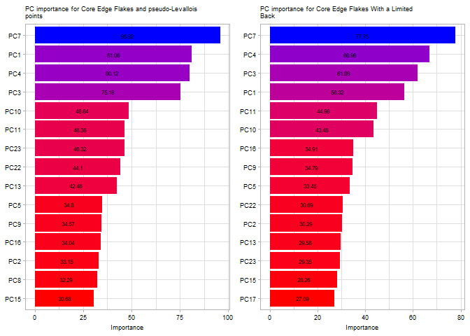
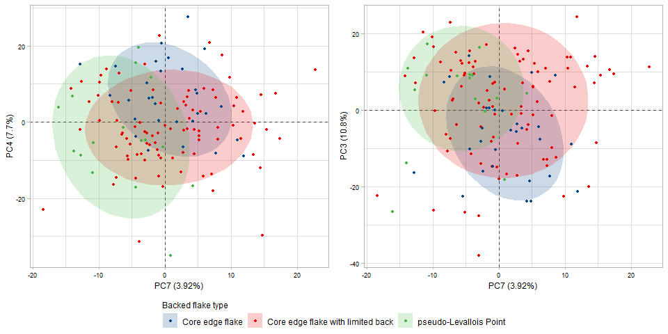
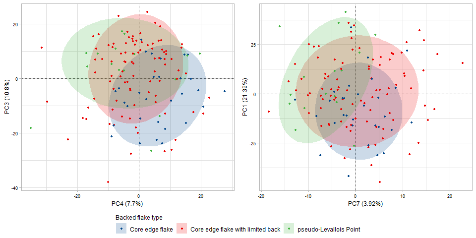

# A geometric morphometric approach to testing discrete categories of backed flakes from recurrent centripetal core reduction.

Guillermo Bustos-Pérez<sup>(1)</sup>  
Brad Gravina<sup>(2,3)</sup>  
Michel Brenet<sup>(3,4)</sup>  
Francesca Romagnoli<sup>(1)</sup>

<sup>(1)</sup>Universidad Autónoma de Madrid. Departamento de
Prehistoria y Arqueología, Campus de Cantoblanco, 28049 Madrid, Spain  
<sup>(2)</sup>Musée national de Préhistoire, MC, 1 rue du Musée, 24260
Les Eyzies de Tayac, France  
<sup>(3)</sup>UMR-5199 PACEA, Université de Bordeaux, Bâtiment B8, Allée
Geoffroy Saint Hilaire, CS 50023, 33615 PESSAC CEDEX, France  
<sup>(4)</sup>INRAP Grand Sud-Ouest, Centre mixte de recherches
archéologiques, Domaine de Campagne, 242460 Campagne, France

**Abstract**

Paleolithic lithic assemblages are usually dominated by flakes, which
display a high degree of morphological variability. When analyzing
Paleolithic lithic assemblages, it is common to classify flakes into
categories based on their morphological and technological features,
which are linked to the position of the flake in a reduction sequence
and how removals are organized in a given production method. For the
analysis of Middle Paleolithic lithic assemblages, two categories of
flakes are commonly used: core edge flakes and pseudo-Levallois points.
A third type, core edge flakes with a limited back, is also commonly
found in the archaeological literature, providing an alternative
category with a definition that does not match the two previous types
but shares many of their morphological and technological features. The
present study addresses whether these three flakes constitute discrete
categories based on their morphological and technological attributes.
Geometric morphometrics are employed on an experimental set composed of
the three categories of flakes to quantify morphological variation.
Machine learning models and principal components biplots are used to
test the discreteness of the categories. The results indicate that
geometric morphometrics succeed in capturing the morphological and
technological features that characterize each type of product.
Pseudo-Levallois points have the highest discreteness of the three
technological products, and while some degree of mixture exists between
core edge flakes and core edge flakes with a limited back, they are also
highly distinguishable. We conclude that the three categories are
discrete and can be employed in technological lists of products for the
analysis of lithic assemblages and that geometric morphometrics is
useful for testing for the validity of categories.

**Key words**: lithic analysis; lithic technology; geometric
morphometrics; machine learning; Middle Paleolithic; Levallois;
discoidal

## 1. Introduction

Lithic artifacts regularly constitute the most important and abundant
remains found on Paleolithic sites. When analyzing lithic assemblages,
in addition to taking metric measurements and noting attributes, it is
common to classify unmodified flakes according to their morphologies and
technological features. This is a crucial part of lithic analysis
because it classifies flakes into technological categories in the sense
that the retained features and morphology are indicative of the
production method by which they were generated. These technological
products usually reflect different knapping strategies, stages of
reduction as well as variations in the organization of removals and
surface exploitation. Well-known examples of technological
classifications of flakes include bipolar/on anvil flakes ([Callahan,
1996](#ref-callahan_bipolar_1996); [Hayden,
1980](#ref-hayden_confusion_1980)), overshot flakes ([Cotterell and
Kamminga, 1987](#ref-cotterell_formation_1987)), bifacial-thinning
flakes ([Raab et al., 1979](#ref-raab_debitage_1979)), byproducts of
blade production, such as core tablets or crested blades ([Pelegrin,
1995](#ref-pelegrin_technologie_1995); [Shea,
2013a](#ref-shea_upper_2013)), kombewa flakes ([Tixier et al.,
1980](#ref-tixier_prehistoire_1980); [Tixier and Turq,
1999](#ref-tixier_kombewa_1999)) and lateral tranchet blows
([Bourguignon, 1992](#ref-bourguignon_analyse_1992)). While the use of
technological categories is common and helps increase the resolution of
lithic analysis, it is important to bear in mind that lithic artifacts
are characterized by a high degree of morphological variability, which,
in many cases, results in overlapping features. Consequently, several
categories remain underused because of this high morphological
variability, their overlapping features, and their similar roles in the
volumetric management of the core along the reduction process.

The Middle Paleolithic in Western Europe is characterized by the
diversification of an increase in knapping methods, resulting in what
are generally flake-dominated assemblages ([Delagnes and Meignen,
2006](#ref-hovers_diversity_2006); [Kuhn, 2013](#ref-kuhn_roots_2013)).
For the analysis of Middle Paleolithic lithic assemblages, lists of
technological products are common and tend to reflect individual
knapping methods, the organization of flake removals, and their
morphology ([Duran and Abelanet, 2004](#ref-duran_mousterien_2004);
[Duran and Soler, 2006](#ref-duran_variabilite_2006); [Geneste,
1988](#ref-rigaud_les_1988); [Shea, 2013b](#ref-shea_middle_2013)).
These technological lists are usually dominated by categories of
technological products related to Levallois and discoidal knapping
methods ([Boëda, 1995](#ref-dibble_levallois:_1995),
[1993](#ref-boeda_debitage_1993); [Boëda et al.,
1990](#ref-boeda_identification_1990)), which constitute an important
part of Middle Paleolithic lithic variability. Various discoidal and
Levallois products have been identified and first appear approximately
at 400,000 ka, in a vast area from eastern Asia to the Atlantic coast of
Western Europe through Siberia and Central Asia, the Levant, Eastern and
Central Europe (see bibliography in [Romagnoli et al.,
2022](#ref-romagnoli_neanderthal_2022)), and Africa ([Adler et al.,
2014](#ref-adler_early_2014); [Blinkhorn et al.,
2021](#ref-blinkhorn_directional_2021)). The identification of discoidal
and Levallois products therefore appears widespread in lithic analysis
across various traditions of lithic studies and is designed to create a
comparable dataset, explore specific technological adaptations in
different ecological contexts, and discuss long-term techno-cultural
traditions and technological change. One special category of such
products are backed flakes that exhibit remnants of the core on one of
their lateral edges. Backed flakes are usually classified into two
technological categories: “core edge flakes” (*eclat débordant*) and
“pseudo-Levallois points.” A third category, “core edge flakes with a
limited back” (*éclat débordant à dos limité*), has also been defined
([Meignen, 1996](#ref-meignen_persistance_1996); [Meignen,
1993](#ref-meignen_les_1993); [Pasty et al.,
2004](#ref-pasty_etude_2004)), although its use is not widespread
([Duran and Abelanet, 2004](#ref-duran_mousterien_2004); [Duran and
Soler, 2006](#ref-duran_variabilite_2006); [Geneste,
1988](#ref-rigaud_les_1988); [Shea, 2013b](#ref-shea_middle_2013)). One
reason for this may be their overlapping features, morphology, and
having a similar role in core reduction compared to classic core edge
flakes. This usually results in their absorption into the group of core
edge flakes when technological lists of products are employed.

The present study seeks to evaluate whether “core edge flakes with a
limited back” are a discrete category that can be easily separated from
classic core edge flakes and pseudo-Levallois points based on their
morphological features. To test the discreteness of these categories, an
experimental sample of backed flakes produced by discoidal and recurrent
centripetal Levallois reduction is classified, following their
technological definitions. Geometric morphometrics on 3D meshes are
employed to quantify the morphological variability of the experimental
assemblage. To test for the discreteness of these categories, machine
learning algorithms are employed to classify the flakes according to
their technological category. Our hypothesis is that, although some
degree of overlap is expected due to the high degree of morphological
variability among lithic artifacts, machine learning models should
easily differentiate the above-mentioned categories from one another.
Testing this hypothesis would support the use of these backed flakes
categories in the classification of lithic assemblages.

The following code loads attribute data from the experimental assemblage
and packages employed for the analysis.

``` r
# Load packages
list.of.packages <- c("tidyverse", "caret", "Morpho")
lapply(list.of.packages, library, character.only = TRUE)
```

    ## [[1]]
    ##  [1] "forcats"   "stringr"   "dplyr"     "purrr"     "readr"     "tidyr"    
    ##  [7] "tibble"    "ggplot2"   "tidyverse" "stats"     "graphics"  "grDevices"
    ## [13] "utils"     "datasets"  "methods"   "base"     
    ## 
    ## [[2]]
    ##  [1] "caret"     "lattice"   "forcats"   "stringr"   "dplyr"     "purrr"    
    ##  [7] "readr"     "tidyr"     "tibble"    "ggplot2"   "tidyverse" "stats"    
    ## [13] "graphics"  "grDevices" "utils"     "datasets"  "methods"   "base"     
    ## 
    ## [[3]]
    ##  [1] "Morpho"    "caret"     "lattice"   "forcats"   "stringr"   "dplyr"    
    ##  [7] "purrr"     "readr"     "tidyr"     "tibble"    "ggplot2"   "tidyverse"
    ## [13] "stats"     "graphics"  "grDevices" "utils"     "datasets"  "methods"  
    ## [19] "base"

``` r
rm(list.of.packages)

# Load attribute data
Att <- read.csv("Data/Attributes data.csv")
```

## 2. Method

### 2.1 Experimental assemblage

The present study uses an experimental assemblage that was the result of
nine knapping sequences. Seven cores were knapped on Bergerac flint
([Fernandes et al., 2012](#ref-fernandes_silex_2012)) and two cores were
knapped on Miocene flint from South of Madrid ([Bustillo et al.,
2012](#ref-bustillo_caracterizacion_2012); [Bustillo and Pérez-Jiménez,
2005](#ref-bustillo_caracteristicas_2005)). Five cores were knapped
following the Discoid “sensu stricto” concept, which strongly
corresponds to Boëda’s original technological definition of the knapping
system ([Boëda, 1995](#ref-dibble_levallois:_1995),
[1994](#ref-boeda_concept_1994), [1993](#ref-boeda_debitage_1993)), and
five experimental cores were knapped following the Levallois recurrent
centripetal system ([Boëda, 1995](#ref-dibble_levallois:_1995),
[1994](#ref-boeda_concept_1994), [1993](#ref-boeda_debitage_1993);
[Lenoir and Turq, 1995](#ref-dibble_recurrent_1995)).

Six technological characteristics define the Levallois concept ([Boëda,
1994](#ref-boeda_concept_1994), [1993](#ref-boeda_debitage_1993)): (1)
the volume of the core is conceived as two convex asymmetric surfaces;
(2) these two surfaces are hierarchical and not interchangeable. They
maintain their roles as striking platforms and debitage (or
exploitation) surfaces, respectively, throughout the entire reduction
process; (3) the distal and lateral convexities of the debitage surface
are maintained to obtain predetermined flakes; (4) the fracture plane of
the predetermined products is parallel to the intersection between both
surfaces; (5) the striking platform is perpendicular to the overhang
(the core edge, at the intersection between the two core surfaces); (6)
the technique employed during the knapping process is direct hard-hammer
percussion. Depending on the organization of the debitage surface
Levallois cores are usually classified into the preferential method
(where a single predetermined Levallois flake is obtained from the
debitage surface) or recurrent methods (where several predetermined
flakes are produced from the debitage surface), with removals being
either unidirectional, bidirectional, or centripetal ([Boëda,
1995](#ref-dibble_levallois:_1995); [Boëda et al.,
1990](#ref-boeda_identification_1990); [Delagnes,
1995](#ref-dibble_variability_1995); [Delagnes and Meignen,
2006](#ref-hovers_diversity_2006)).

According to Boëda ([1995](#ref-dibble_levallois:_1995),
[1994](#ref-boeda_concept_1994), [1993](#ref-boeda_debitage_1993)),
there are six technological criteria that define the Discoid “sensu
stricto” method: (1) the volume of the core is conceived as two oblique
asymmetric convex surfaces delimited by an intersecting plane; (2) these
two surfaces are not hierarchical, with it being possible to alternate
between the roles of striking platforms and exploitation surfaces; (3)
the peripheral convexity of the debitage surface is managed to control
lateral and distal extractions, thus allowing for a degree of
predetermination; (4) the surfaces of the striking platforms are
oriented in such a way that the core edge is perpendicular to the
predetermined products; (5) the fracture planes of the products are
secant; (6) the technique employed is direct hard-hammer percussion.

A total of 139 unretouched backed flakes (independent of the type of
termination) were obtained from the different experimental reduction
sequences, 70 from discoidal reduction sequences and 69 from Levallois
recurrent centripetal reduction sequences. The following criteria were
followed for the classification of backed flakes:

Core edge flakes / *eclat débordant* ([Beyries and Boëda,
1983](#ref-beyries_etude_1983); [Boëda, 1993](#ref-boeda_debitage_1993);
[Boëda et al., 1990](#ref-boeda_identification_1990)) have a cutting
edge opposite and usually (although not always) parallel to an abrupt
margin. This abrupt margin, or backed edge (dos), commonly results from
the removal of a portion of the periphery of the core and can be plain,
bear the scars from previous removals, be cortical, or present a mix of
the three. Classic “core edge flakes” ([Boëda,
1993](#ref-boeda_debitage_1993); [Boëda et al.,
1990](#ref-boeda_identification_1990)), which are sometimes referred as
“core edge flakes with non-limited back” / *“éclat débordant à dos non
limité”* ([Duran, 2005](#ref-duran_lindustrie_2005); [Duran and Soler,
2006](#ref-duran_variabilite_2006)) have a morphological axis that
follows the axis of percussion, although it may deviate slightly
([Beyries and Boëda, 1983](#ref-beyries_etude_1983)).  
“Core edge flakes with a limited back” / *“éclat débordant à dos
limité”* share with core edge flakes the morphological feature of having
a cutting edge opposite a back. However, the main difference resides in
their having a morphological axis clearly offset in respect to the axis
of percussion ([Meignen, 1996](#ref-meignen_persistance_1996); [Meignen,
1993](#ref-meignen_les_1993); [Pasty et al.,
2004](#ref-pasty_etude_2004)). Because of this deviation from the axis
of percussion, the backed edge is usually not completely parallel and
does not span the entire length of the sharp edge.  
Pseudo-Levallois points ([Boëda, 1993](#ref-boeda_debitage_1993); [Boëda
et al., 1990](#ref-boeda_identification_1990); [Bordes,
1961](#ref-bordes_typologie_1961), [1953](#ref-bordes_notules_1953);
[Slimak, 2003](#ref-peresani_les_2003)) are backed products in which the
edge opposite the back has a triangular morphology. This triangular
morphology is usually the result of the convergence of two or more
removals. As with core edge flakes, the back usually results from the
removal of one of the lateral edges of the core and can be plain, retain
the scars from previous removals, or more rarely be cortical.
Pseudo-Levallois points share with core edge flakes with a limited back
the deviation of symmetry from the axis of percussion, but they are
clearly differentiable due to their triangular off-axis morphology.

The following table presents the distribution of backed flakes types,
following the previously established definitions. Due to the centripetal
nature of the knapping methods employed to generate the experimental
assemblage, most of the backed flakes fall within the definition of core
edge flakes with a limited back (66.91%). Cortex distribution according
to backed flake category shows that slightly (\~25%) or non-cortical
products dominate among the three categories, adding up to more than 65%
in the three cases (90% core edge flakes, 68.82% core edge flakes with a
limited back, and 87.5% pseudo-Levallois points).

``` r
Att %>% group_by(Strategy, ARTIFACTTYPE) %>% 
  summarise(
    Count = n(),
    Percent = (Count/139)*100)
```

    ## # A tibble: 6 x 4
    ## # Groups:   Strategy [2]
    ##   Strategy  ARTIFACTTYPE                Count Percent
    ##   <chr>     <chr>                       <int>   <dbl>
    ## 1 Discoid   Core Edge Flake                11    7.91
    ## 2 Discoid   Core edge with limited back    47   33.8 
    ## 3 Discoid   pseudo-Levallois Point         12    8.63
    ## 4 Levallois Core Edge Flake                19   13.7 
    ## 5 Levallois Core edge with limited back    46   33.1 
    ## 6 Levallois pseudo-Levallois Point          4    2.88


``` r
# Cortex per class
Att %>% group_by(ARTIFACTTYPE) %>% 
  count(CORTEX) %>% 
  mutate(Percentage = round(n/sum(n)*100, 2)) %>% 
  
  ggplot(aes(CORTEX, Percentage, fill = ARTIFACTTYPE)) +
  geom_col(position = "dodge") +
  ggsci::scale_fill_aaas(alpha = 0.95) +
  xlab(NULL) +
  geom_text(aes(label = paste0(Percentage, "%")), 
            vjust= -0.2, size = 2.65,
            position = position_dodge(.9)) +
  geom_text(aes(label = paste("n =", n)), 
            vjust= "top", size = 2.65,
            position = position_dodge(.9)) +
  labs(fill = NULL) +
  
  theme_classic() +
  theme(
    legend.position = "bottom",
    axis.text = element_text(color = "black", size = 8))
```


### 2.2 Geometric Morphometrics

All flakes were scanned with an Academia 20 structured light surface
scanner (Creaform 3D) at a 0.2 mm resolution. Flakes were scanned in two
parts, automatically aligned (or manually aligned in the case automatic
alignment failure), and exported in STL format. Cloudcompare 2.11.3
(<https://www.danielgm.net/cc/>) free software was employed to perform
additional cleaning, mesh sampling, surface reconstruction and
transformation into PLY files. Finally, all files were decimated to a
quality of 50,000 faces using the Rvcg R package ([Schlager,
2017](#ref-schlager_morpho_2017)).

The protocol for the digitalizing landmarks on flakes is based on
previous studies ([Archer et al., 2021](#ref-archer_quantifying_2021),
[2018](#ref-archer_geometric_2018)). This included the positioning of a
total of three fixed landmarks, 85 curve semi-landmarks, and 420 surface
semi-landmarks ([Bookstein, 1997a](#ref-bookstein_landmark_1997),
[1997b](#ref-bookstein_morphometric_1997); [Gunz et al.,
2005](#ref-gunz_semilandmarks_2005); [Gunz and Mitteroecker,
2013](#ref-gunz_semilandmarks_2013); [Mitteroecker and Gunz,
2009](#ref-mitteroecker_advances_2009)). This resulted in a total of 508
landmarks and semi-landmarks. The three fixed landmarks correspond to
both laterals of the platform and the percussion point. The 85 curve
semi-landmarks correspond to the internal and exterior curve outlines of
the platform (15 semi-landmarks each) and the edge of the flake (55
semi-landmarks). Sixty surface semi-landmarks correspond to the platform
surface. The dorsal and ventral surfaces of the flakes are defined by
180 semi-landmarks each. The workflow for digitalizing landmarks and
semi-landmarks included the creation of a template/atlas on an arbitrary
selected flake. After this, landmarks and semi-landmarks were positioned
in each specimen and relaxed to minimize bending energy ([Bookstein,
1997a](#ref-bookstein_landmark_1997),
[1997b](#ref-bookstein_morphometric_1997)). A complete workflow of
landmark and semi-landmark digitalization and relaxation to minimize
bending energy was created in Viewbox Version 4.1.0.12
(<http://www.dhal.com/viewbox.htm>), and the resulting point coordinates
were exported into .xlsx files.

Procrustes superimposition ([Kendall, 1984](#ref-kendall_shape_1984);
[Mitteroecker and Gunz, 2009](#ref-mitteroecker_advances_2009);
[O’Higgins, 2000](#ref-ohiggins_study_2000)) was performed using the
Morpho package ([Schlager, 2017](#ref-schlager_morpho_2017)) on RStudio
IDE ([R. C. Team, 2019](#ref-r_core_team_r_2019); [Rs. Team,
2019](#ref-rstudio_team_rstudio_2019)). After performing Procrustes
superimposition and obtaining a new set of coordinates, principal
component analysis (PCA) was performed to reduce the dimensionality of
the data ([James et al., 2013](#ref-james_introduction_2013); [Pearson,
1901](#ref-pearson_lines_1901)). There are multiple reasons to use
dimensionality reduction when dealing with high-dimension data on
classification: to avoid having more predictors than observations (p \>
n), avoid collinearity of predictors, reduce the dimensions of the
feature space, and avoid overfitting due to an excessive number of
degrees of freedom (simple structure with lower number of variables).
Principal component analysis achieves dimensionality reduction by
identifying the linear combinations that best represent the predictors
on an unsupervised manner. The principal components (PCs) of a PCA aim
to capture as high a variance as possible for the complete data ([James
et al., 2013](#ref-james_introduction_2013)), and PCs that capture the
highest variance need not necessarily be the best for classification.
For the present work, PCs that represent 95% of variance are selected as
predictors for training the machine learning models. The threshold of
95% of variance is arbitrarily selected because it balances retaining
most of the dataset variance with a reduced number of variables. The
identification of best PCs for classification is performed automatically
by the machine learning models using the caret package ([Kuhn,
2008](#ref-kuhn_building_2008)).


In addition to geometric morphometrics, the following attributes were
recorded for each of the flakes:

-   **Technological length:** measured in mm along the axis
    perpendicular to the striking platform.  
-   **Technological width:** measured in mm along the axis perpendicular
    to the technological width.  
-   **Maximum thickness of the flake**, measured in mm.  
-   **External platform angle (EPA):** measured in degrees with a manual
    goniometer.  
-   **Internal platform angle (IPA):** measured in degrees with a manual
    goniometer.  
-   **Relative amount of cortex present at the dorsal face:** recorded
    according to its extension on the dorsal surface of the flake, with
    categories being as follows: 0 (no cortex), 1 (nearly 25% covered by
    cortex), 2 (nearly 50% covered by cortex), 3 (nearly 75% covered by
    cortex), and 4 (nearly all of the surface covered by cortex). This
    variable is employed to evaluate the distribution among the
    experimental assemblage (Figure 2).  
-   Weight: measured to a precision of 0.01 g.

From the previous measures, the following variables are obtained:

-   **Elongation index:** flake length divided by width.  
-   **Carenated index:** width or length (the one with the lowest value)
    divided by maximum thickness.  
-   **Ratio of width to thickness:** flake width divided by maximum
    thickness.

### 2.3 Machine learning and resampling techniques

The present work tests ten machine learning models for the
classification of flake categories.

-   **Linear discriminant analysis (LDA):** reduces dimensionality in an
    attempt to maximize the separation between classes, while decision
    boundaries divide the predictor range into regions ([Fisher,
    1936](#ref-fisher_use_1936); [James et al.,
    2013](#ref-james_introduction_2013)).  
-   **K-nearest neighbor (KNN):** classifies cases by assigning the
    class of similar known cases. The “k” in KNN references the number
    of cases (neighbors) to consider when assigning a class, and it must
    be found by testing different values. Given that KNN uses distance
    metrics to compute nearest neighbors and that each variable is in
    different scales, it is necessary to scale and center the data prior
    to fitting the model ([Cover and Hart,
    1967](#ref-cover_nearest_1967); [Lantz,
    2019](#ref-lantz_machine_2019)).  
-   **Logistic regression:** essentially adapts continuous regression
    predictions to categorical outcomes ([Cramer,
    2004](#ref-cramer_early_2004); [Walker and Duncan,
    1967](#ref-walker_estimation_1967)).  
-   **Decision tree with C5.0 algorithm:** is an improvement on decision
    trees for classification ([Quinlan, 2014](#ref-quinlan_c4_2014);
    [Quinlan, 1996](#ref-quinlan_improved_1996)).  
-   **Random forest:** Random forests are made of decision trees. Each
    tree is grown from a random sample of the data and variables,
    allowing for each tree to grow differently and better reflect the
    complexity of the data ([Breiman,
    2001](#ref-breiman_random_2001)).  
-   **Generalized Boosted Model:** ([Greenwell et al.,
    2019](#ref-greenwell_package_2019); [Ridgeway,
    2007](#ref-ridgeway_generalized_2007)) which implements gradient
    boosted machine ([Friedman, 2002](#ref-friedman_stochastic_2002),
    [2001](#ref-friedman_greedy_2001)), allowing for the detection of
    learning deficiencies and increase model accuracy for a set of
    random forests.  
-   **Supported vector machines (SVM):** fits hyperplanes into a
    multidimensional space with the objective of creating homogeneous
    partitions ([Cortes and Vapnik,
    1995](#ref-cortes_support-vector_1995); [Frey and Slate,
    1991](#ref-frey_letter_1991)). The present study tests SVM with
    linear, radial, and polynomial kernels.
-   **Naïve Bayes:** computes class probabilities using Bayes’s rule
    ([Weihs et al., 2005](#ref-weihs_klar_2005)).

As mentioned above, 66.91% of flakes fall into the definition of core
edge flakes with a limited back, resulting in an unbalanced dataset. To
counter the unbalanced nature of the experimental dataset, up-sampling
was undertaken for the two minority classes, and down-sampling was
undertaken for the majority class. Up-sampling categories in a dataset
can be considered inappropriate for training machine learning models
because it increases the overfit (samples used in the test set to
evaluate the model are likely to have already been used in the training
set). However, here, the up-sampling of the two minority groups
increases the discreteness of these groups but does not affect the
potential overlap with the majority class (core edge flakes with limited
backs). On the other hand, down-sampling results in missing information
because some of the data are removed.

Random up- and down-sampling is conducted to obtain a balanced dataset
and train the models. Because model performance metrics depend on random
up- and down-sampling, this process is repeated 30 times, extracting
model performance metrics each time and averaging the values. The model
with the best performance metrics is then trained again with thirty
cycles of up- and down-sampling. The reported variable importance and
confusion matrix from which model metric performance are extracted are
obtained from these additional cycles of down- and up-sampling.

### 2.4 Performance of procrustes, PCA and model training

The following line of code performs procrustes alignment and
superimposition using the Morpho package ([Schlager,
2017](#ref-schlager_morpho_2017)). Aligned coordinates are extracted and
stored as a data frame named LM.DF.

``` r
# Load raw landmarks
load("Data/Raw landmarks.RData")

# Procrustes alignment
proc <- Morpho::ProcGPA(Flakes_LM, 
                CSinit = TRUE, 
                silent = FALSE)

# Extract coordinates
Proc.Rot <- proc$rotated
LM.DF <- data.frame(matrix(Proc.Rot, nrow = length(filenames), byrow = TRUE))
```

The following code performs PCA on the rotated landmarks and extracts
the PC values of each case. Additionally, ID’s of each case are added as
an additional variable and employed in a `left join()` with the
attribute dataset.

``` r
# PCA on rotated landmarks
pca <- prcomp(LM.DF, scale. = TRUE)
summary(pca)$importance[1:3, 1:25]
```

    ##                             PC1      PC2      PC3      PC4      PC5      PC6
    ## Standard deviation     18.05288 16.62783 12.83087 10.83128 10.42072 8.299316
    ## Proportion of Variance  0.21385  0.18142  0.10803  0.07698  0.07125 0.045200
    ## Cumulative Proportion   0.21385  0.39527  0.50330  0.58028  0.65153 0.696730
    ##                            PC7      PC8      PC9     PC10     PC11     PC12
    ## Standard deviation     7.73039 7.439897 6.710911 6.173021 5.368746 4.773021
    ## Proportion of Variance 0.03921 0.036320 0.029550 0.025000 0.018910 0.014950
    ## Cumulative Proportion  0.73594 0.772260 0.801810 0.826810 0.845730 0.860670
    ##                            PC13    PC14     PC15     PC16    PC17    PC18
    ## Standard deviation     4.562145 4.44228 3.803028 3.750857 3.54599 3.23142
    ## Proportion of Variance 0.013660 0.01295 0.009490 0.009230 0.00825 0.00685
    ## Cumulative Proportion  0.874330 0.88728 0.896770 0.906000 0.91425 0.92110
    ##                            PC19    PC20     PC21     PC22     PC23    PC24
    ## Standard deviation     2.956198 2.70170 2.649925 2.516422 2.466077 2.38239
    ## Proportion of Variance 0.005730 0.00479 0.004610 0.004160 0.003990 0.00372
    ## Cumulative Proportion  0.926840 0.93163 0.936240 0.940390 0.944380 0.94811
    ##                            PC25
    ## Standard deviation     2.327281
    ## Proportion of Variance 0.003550
    ## Cumulative Proportion  0.951660

``` r
# store PCA values in a dataframe and add ID's
PCA_Coord <- as.data.frame(pca$x)
PCA_Coord$ID <- filenames
PCA_Coord$Core <- str_sub(PCA_Coord$ID, end = 2)
```

``` r
# Left joined with the attribute database
PCA_Coord <- left_join(PCA_Coord, Att, by = "ID")
```

Prior to model training it is necessary to preprocess the data. Labels
of each artifact are changed using the `case_when()` function and new
variable is set as factor with corresponding labels.

``` r
#### Pre processing data
# Change syntax of output
PCA_Coord <- PCA_Coord %>% mutate(
  New_Art.Type = 
    case_when(
      ARTIFACTTYPE == "Core Edge Flake" ~ "ED",
      ARTIFACTTYPE == "Core edge with limited back" ~ "EDlb",
      ARTIFACTTYPE == "pseudo-Levallois Point" ~ "p_Lp"
    ))

# Set factors
PCA_Coord$New_Art.Type <- factor(
  PCA_Coord$New_Art.Type, 
  levels = c("ED", "EDlb", "p_Lp"),
  labels = c("ED", "EDlb", "p_Lp"))
```

Formula and validation (k fold corss validation) are set prior to model
training.

``` r
# Set formula and validation
# Formula
frmla <- as.formula(
  paste("New_Art.Type", paste(colnames(PCA_Coord[,1:25]), collapse = " + "), sep = " ~ "))

# Validation
trControl <- trainControl(method  = "repeatedcv",
                          verboseIter = TRUE,
                          number  = 10,
                          repeats = 50,
                          savePredictions = "final",
                          classProbs = TRUE)
```

As mentioned previously, this is a unbalanced data set. Balancing to
train the models correctly is done using the `groupdata2` package using
the parameter **“mean”** for size. This means that each group will be up
or down sampled to the result of dividing data set size between number
of groups (46.3333333).

-   A `tibble()` called `All_Results` is set to store the results from
    each model training.

Each loop works in the following steps:

1.  The original data set is randomly up and down sampled for each
    target category.  
2.  Model is trained following the provided hyperparameters and data
    pre-processing.  
3.  Results from the trained model are extracted and binned to the
    `All_Results` tibble.  
4.  Steps 1 to 3 are repeated 30 times per model.

``` r
# Train the models
# Set tibble in which results of each model will be stored
All_Results <- tibble()

# LDA model training 
repeat {
  # Balance the dataset
  Balanced <- groupdata2::balance(PCA_Coord,
                                  size = "mean",
                                  cat_col = "New_Art.Type")
  # Train the model
  Model <- train(frmla, 
                     Balanced,
                     method = "lda",
                     trControl = trControl,
                     preProc = c("center", "scale"),
                     metric = "Accuracy",
                     importance = 'impurity')
  
  # Bind model results and type of model
  All_Results <- rbind(All_Results, 
                       tibble(
                         Accuracy = confusionMatrix(Model$pred$pred, Model$pred$obs)$overall[[1]],
                         Kappa = confusionMatrix(Model$pred$pred, Model$pred$obs)$overall[[2]],
                         AccuracyLower  = confusionMatrix(Model$pred$pred, Model$pred$obs)$overall[[3]],
                         AccuracyUpper  = confusionMatrix(Model$pred$pred, Model$pred$obs)$overall[[4]],
                         AccuracyNull = confusionMatrix(Model$pred$pred, Model$pred$obs)$overall[[5]],
                         Model = "LDA"))
  
  x = nrow(All_Results)
  if (x >= 30){
    break
  }
}

# Knn model training 
repeat {
  Balanced <- groupdata2::balance(PCA_Coord,
                                  size = "mean",
                                  cat_col = "New_Art.Type")
  
  Model <- train(frmla, 
                     Balanced,
                     method = "knn",
                     trControl = trControl,
                     preProc = c("center", "scale"),
                     tuneGrid   = expand.grid(k = 2:30),
                     metric = "Accuracy")
  
  All_Results <- rbind(All_Results, 
                       tibble(
                         Accuracy = confusionMatrix(Model$pred$pred, Model$pred$obs)$overall[[1]],
                         Kappa = confusionMatrix(Model$pred$pred, Model$pred$obs)$overall[[2]],
                         AccuracyLower  = confusionMatrix(Model$pred$pred, Model$pred$obs)$overall[[3]],
                         AccuracyUpper  = confusionMatrix(Model$pred$pred, Model$pred$obs)$overall[[4]],
                         AccuracyNull = confusionMatrix(Model$pred$pred, Model$pred$obs)$overall[[5]],
                         Model = "KNN"))
  
  x = nrow(All_Results)
  if (x >= 60){
    break
  }
}

# Logistic regression 
repeat {
  Balanced <- groupdata2::balance(PCA_Coord,
                                  size = "mean",
                                  cat_col = "New_Art.Type")
  
  Model <- train(frmla, 
                 Balanced,
                 method = "glmnet",
                 family = 'multinomial',
                 trControl = trControl,
                 preProc = c("center", "scale"), 
                 metric = "Accuracy")
  
  All_Results <- rbind(All_Results, 
                       tibble(
                         Accuracy = confusionMatrix(Model$pred$pred, Model$pred$obs)$overall[[1]],
                         Kappa = confusionMatrix(Model$pred$pred, Model$pred$obs)$overall[[2]],
                         AccuracyLower  = confusionMatrix(Model$pred$pred, Model$pred$obs)$overall[[3]],
                         AccuracyUpper  = confusionMatrix(Model$pred$pred, Model$pred$obs)$overall[[4]],
                         AccuracyNull = confusionMatrix(Model$pred$pred, Model$pred$obs)$overall[[5]],
                         Model = "Log. Reg."))
  
  x = nrow(All_Results)
  if (x >= 90){
    break
  }
}

# Random forest 
repeat {
  Balanced <- groupdata2::balance(PCA_Coord,
                                  size = "mean",
                                  cat_col = "New_Art.Type")
  
  Model <- train(frmla, 
                 Balanced,
                 method = "ranger",
                 trControl = trControl,
                 preProc = c("center", "scale"), 
                 metric = "Accuracy",
                 importance = 'impurity')
  
  All_Results <- rbind(All_Results, 
                       tibble(
                         Accuracy = confusionMatrix(Model$pred$pred, Model$pred$obs)$overall[[1]],
                         Kappa = confusionMatrix(Model$pred$pred, Model$pred$obs)$overall[[2]],
                         AccuracyLower  = confusionMatrix(Model$pred$pred, Model$pred$obs)$overall[[3]],
                         AccuracyUpper  = confusionMatrix(Model$pred$pred, Model$pred$obs)$overall[[4]],
                         AccuracyNull = confusionMatrix(Model$pred$pred, Model$pred$obs)$overall[[5]],
                             Model = "Random Forest"))
  
  x = nrow(All_Results)
  if (x >= 120){
    break
  }
}

# SVM linear 
repeat {
  Balanced <- groupdata2::balance(PCA_Coord,
                                  size = "mean",
                                  cat_col = "New_Art.Type")
  
  Model <- train(frmla, 
                 Balanced,
                 method = "svmLinear",
                 trControl = trControl,
                 preProc = c("center", "scale"), 
                 metric = "Accuracy",
                 importance = 'impurity')
  
  All_Results <- rbind(All_Results, 
                       tibble(
                         Accuracy = confusionMatrix(Model$pred$pred, Model$pred$obs)$overall[[1]],
                         Kappa = confusionMatrix(Model$pred$pred, Model$pred$obs)$overall[[2]],
                         AccuracyLower  = confusionMatrix(Model$pred$pred, Model$pred$obs)$overall[[3]],
                         AccuracyUpper  = confusionMatrix(Model$pred$pred, Model$pred$obs)$overall[[4]],
                         AccuracyNull = confusionMatrix(Model$pred$pred, Model$pred$obs)$overall[[5]],
                         Model = "SVM Linear"))
  
  x = nrow(All_Results)
  if (x >= 180){
    break
  }
}

# SVM radial 
repeat {
  Balanced <- groupdata2::balance(PCA_Coord,
                                  size = "mean",
                                  cat_col = "New_Art.Type")
  
  Model <- train(frmla, 
                 Balanced,
                 method = "svmRadial",
                 trControl = trControl,
                 preProc = c("center", "scale"), 
                 metric = "Accuracy",
                 importance = 'impurity')
  
  All_Results <- rbind(All_Results, 
                       tibble(
                         Accuracy = confusionMatrix(Model$pred$pred, Model$pred$obs)$overall[[1]],
                         Kappa = confusionMatrix(Model$pred$pred, Model$pred$obs)$overall[[2]],
                         AccuracyLower  = confusionMatrix(Model$pred$pred, Model$pred$obs)$overall[[3]],
                         AccuracyUpper  = confusionMatrix(Model$pred$pred, Model$pred$obs)$overall[[4]],
                         AccuracyNull = confusionMatrix(Model$pred$pred, Model$pred$obs)$overall[[5]],
                         Model = "SVM Radial"))
  
  x = nrow(All_Results)
  if (x >= 210){
    break
  }
}

# SVM Poly 
repeat {
  Balanced <- groupdata2::balance(PCA_Coord,
                                  size = "mean",
                                  cat_col = "New_Art.Type")
  
  Model <- train(frmla, 
                 Balanced,
                 method = "svmPoly",
                 trControl = trControl,
                 preProc = c("center", "scale"), 
                 metric = "Accuracy",
                 importance = 'impurity')
  
  All_Results <- rbind(All_Results, 
                       tibble(
                         Accuracy = confusionMatrix(Model$pred$pred, Model$pred$obs)$overall[[1]],
                         Kappa = confusionMatrix(Model$pred$pred, Model$pred$obs)$overall[[2]],
                         AccuracyLower  = confusionMatrix(Model$pred$pred, Model$pred$obs)$overall[[3]],
                         AccuracyUpper  = confusionMatrix(Model$pred$pred, Model$pred$obs)$overall[[4]],
                         AccuracyNull = confusionMatrix(Model$pred$pred, Model$pred$obs)$overall[[5]],
                         Model = "SVM Poly"))
  
  x = nrow(All_Results)
  if (x >= 240){
    break
  }
}

# C5.0 Tree 
repeat {
  Balanced <- groupdata2::balance(PCA_Coord,
                                  size = "mean",
                                  cat_col = "New_Art.Type")
  
  Model <- train(frmla, 
                 Balanced,
                 method = "C5.0",
                 trControl = trControl,
                 preProc = c("center", "scale"), 
                 metric = "Accuracy",
                 importance = 'impurity')
  
  All_Results <- rbind(All_Results, 
                       tibble(
                         Accuracy = confusionMatrix(Model$pred$pred, Model$pred$obs)$overall[[1]],
                         Kappa = confusionMatrix(Model$pred$pred, Model$pred$obs)$overall[[2]],
                         AccuracyLower  = confusionMatrix(Model$pred$pred, Model$pred$obs)$overall[[3]],
                         AccuracyUpper  = confusionMatrix(Model$pred$pred, Model$pred$obs)$overall[[4]],
                         AccuracyNull = confusionMatrix(Model$pred$pred, Model$pred$obs)$overall[[5]],
                         Model = "C5.0 Tree"))
  
  x = nrow(All_Results)
  if (x >= 270){
    break
  }
}

# Naïve Bayes 
repeat {
  Balanced <- groupdata2::balance(PCA_Coord,
                                  size = "mean",
                                  cat_col = "New_Art.Type")
  
  Model <- train(frmla, 
                 Balanced,
                 method = "nb",
                 trControl = trControl,
                 preProc = c("center", "scale"), 
                 metric = "Accuracy",
                 importance = 'impurity')
  
  All_Results <- rbind(All_Results, 
                       tibble(
                         Accuracy = confusionMatrix(Model$pred$pred, Model$pred$obs)$overall[[1]],
                         Kappa = confusionMatrix(Model$pred$pred, Model$pred$obs)$overall[[2]],
                         AccuracyLower  = confusionMatrix(Model$pred$pred, Model$pred$obs)$overall[[3]],
                         AccuracyUpper  = confusionMatrix(Model$pred$pred, Model$pred$obs)$overall[[4]],
                         AccuracyNull = confusionMatrix(Model$pred$pred, Model$pred$obs)$overall[[5]],
                         Model = "Naïve Bayes"))
  
  x = nrow(All_Results)
  if (x >= 300){
    break
  }
}

# Boosted Tree 
repeat {
  Balanced <- groupdata2::balance(PCA_Coord,
                                  size = "mean",
                                  cat_col = "New_Art.Type")
  
  Model <- train(frmla, 
                 Balanced,
                 method = "gbm",
                 trControl = trControl,
                 preProc = c("center", "scale"), 
                 metric = "Accuracy")
  
  All_Results <- rbind(All_Results, 
                       tibble(
                         Accuracy = confusionMatrix(Model$pred$pred, Model$pred$obs)$overall[[1]],
                         Kappa = confusionMatrix(Model$pred$pred, Model$pred$obs)$overall[[2]],
                         AccuracyLower  = confusionMatrix(Model$pred$pred, Model$pred$obs)$overall[[3]],
                         AccuracyUpper  = confusionMatrix(Model$pred$pred, Model$pred$obs)$overall[[4]],
                         AccuracyNull = confusionMatrix(Model$pred$pred, Model$pred$obs)$overall[[5]],
                         Model = "Boosted Tree"))
  
  x = nrow(All_Results)
  if (x >= 300){
    break
  }
}
```

## 3. Results

### 3.1 PCA and machine learning models

The PCA results show that the 25 first principal components account for
95% of the variance in the dataset, with PC1 accounting for 21.39% of
variance and PC25 accounting for 0.36% of variance. This represents a
substantial reduction in dimensionality from the original number of
variables (1,524) and is lower than the sample size (139).  
The following presents the accuracy values for each model after their
respective 30 cycles of random up- and down-sampling. Supported vector
machines with a polynomial kernel had the highest average value for
general accuracy (0.837), closely followed by the random forest model
(0.829). The K-nearest neighbor model had the lowest average value for
accuracy (0.681), followed by LDA model (0.690). Supported vector
machines with a polynomial kernel had the lowest standard deviation in
accuracy values (0.018). This indicates that, in addition to being the
most precise model on average, SVM with a polynomial kernel is also the
most consistent model, being less affected by random up- and
down-sampling. The minimum accuracy value of SVM with a polynomial
kernel is 0.801, indicating a high accuracy, even when up- and
down-sampling result in similar objects.

``` r
# Set the models factors
All_Results$Model <- factor(All_Results$Model,
                                levels = c(
                                  "LDA", "KNN", "Log. Reg.",
                                  "C5.0 Tree", "Random Forest", "Boosted Tree",
                                  "SVM Linear", "SVM Radial",
                                  "SVM Poly",
                                  "Naïve Bayes"))

# 
All_Results %>% 
  ggplot(aes(Model, Accuracy, fill = Model)) +
  geom_violin(position = position_dodge(1), width = 0.4, alpha = 0.5) +
  geom_boxplot(width = 0.4,
               outlier.shape = NA, alpha = 0.5) +
  geom_jitter(width = 0.15, alpha = 0.9, size = 0.9, shape = 23, aes(fill = Model)) +
  theme_light() +
  ylab("Accuracy after each cycle of up and down sampling") +
  ggsci::scale_fill_aaas() +
  scale_x_discrete(labels = c(
    "LDA", "KNN", "Log. Reg.",
    "C5.0\nTree", "Random\nForest", "Boosted\nTree",
    "SVM\nLinear", "SVM\nRadial",
    "SVM\nPoly",
    "Naïve\nBayes")) +
  xlab(NULL) +
  theme(
    legend.position = "none",
    axis.text = element_text(color = "black", size = 8),
    axis.title = element_text(color = "black", size = 8.5)
    )
```


The following table presents performance metrics of the SVM with a
polynomial kernel for the classification of the three products. The
prevalence/no information ratio was kept constant at 0.33 for all three
categories as a result of random up- and down-sampling to obtain
balanced datasets. In general, the three products had high values for
performance metrics, with Pseudo-Levallois points standing out in this
regard. Following pseudo-Levallois points, core edge flakes had the
second-best general values, with a sensitivity close to 0.8. Core edge
flakes with a limited back had the lowest values for performance
metrics.

``` r
# Performance metrics of SVM with polynomial kernel
confusionMatrix(Conf_SVM_Poly$pred, Conf_SVM_Poly$obs)
```

    ## Confusion Matrix and Statistics
    ## 
    ##           Reference
    ## Prediction    ED  EDlb  p_Lp
    ##       ED   53689 13937   144
    ##       EDlb 14877 51943  4107
    ##       p_Lp   434  3120 64749
    ## 
    ## Overall Statistics
    ##                                           
    ##                Accuracy : 0.8231          
    ##                  95% CI : (0.8214, 0.8247)
    ##     No Information Rate : 0.3333          
    ##     P-Value [Acc > NIR] : < 2.2e-16       
    ##                                           
    ##                   Kappa : 0.7346          
    ##                                           
    ##  Mcnemar's Test P-Value : < 2.2e-16       
    ## 
    ## Statistics by Class:
    ## 
    ##                      Class: ED Class: EDlb Class: p_Lp
    ## Sensitivity             0.7781      0.7528      0.9384
    ## Specificity             0.8980      0.8624      0.9742
    ## Pos Pred Value          0.7922      0.7323      0.9480
    ## Neg Pred Value          0.8900      0.8746      0.9694
    ## Prevalence              0.3333      0.3333      0.3333
    ## Detection Rate          0.2594      0.2509      0.3128
    ## Detection Prevalence    0.3274      0.3426      0.3300
    ## Balanced Accuracy       0.8380      0.8076      0.9563

### 3.2 Variable importance

The following figure presents variable importance after 30 cycles of up-
and down-sampling and k-fold cross-validation for the SVM with
polynomial kernel models. Core edge flakes and pseudo-Levallois points
share variable importance in terms of their identification, while core
edge flakes with a limited back have their own variable importance.
However, in both cases, there is agreement regarding which four PC are
important for the classification of backed artefacts. In both cases, PC7
is considered the most important, followed by PC4 and PC3. PC1 is
considered the second most important PC for the identification of core
edge flakes and pseudo-Levallois points (81.08), but its importance is
diminished dramatically in the case of core edge flakes with a limited
back (56.32).

``` r
# Variable importance 
ED_VarImp$Importance <- rowMeans(ED_VarImp[,2:31])
ED_VarImp$PC <- colnames(PCA_Coord)[1:25]

EDlb_VarImp$Importance <- rowMeans(EDlb_VarImp[,2:31])
EDlb_VarImp$PC <- colnames(PCA_Coord)[1:25]

ggpubr::ggarrange(
(ED_VarImp %>% select(Importance, PC) %>% 
  top_n(15, Importance) %>% 
  ggplot(aes(Importance, reorder(PC, Importance), fill = Importance)) +
  geom_bar(stat= "identity", position = "dodge") +
  geom_text(aes(label = round(Importance, 2)), 
            position = position_stack(vjust = 0.5), size = 2) +
  scale_fill_gradient(low = "red", high = "blue") +
  guides(fill = "none") +
  ylab(NULL) +
  theme_light() +
  labs(title = "PC importance for Core Edge Flakes and pseudo-Levallois\npoints") +
  theme(
    axis.text.y = element_text(color = "black", size = 7),
    axis.text.x = element_text(color = "black", size = 7),
    axis.title.x = element_text(color = "black", size = 7),
    plot.title = element_text(color = "black", size = 7))
),

(EDlb_VarImp %>% select(Importance, PC) %>% 
  top_n(15, Importance) %>% 
  ggplot(aes(Importance, reorder(PC, Importance), fill = Importance)) +
  geom_bar(stat= "identity", position = "dodge") +
  geom_text(aes(label = round(Importance, 2)), 
            position = position_stack(vjust = 0.5), size = 2) +
  scale_fill_gradient(low = "red", high = "blue") +
  guides(fill = "none") +
  ylab(NULL) +
  theme_light() +
  labs(title = "PC importance for Core Edge Flakes With a Limited\nBack") +
  theme(
    axis.text.y = element_text(color = "black", size = 7),
    axis.text.x = element_text(color = "black", size = 7),
    axis.title.x = element_text(color = "black", size = 7),
    plot.title = element_text(color = "black", size = 7))
),
ncol = 2
)
```



None of the manually recorded metrics provided significant correlation
with PC7 and PC4 scores. Visual evaluation indicates that PC7 is
capturing flake morphology in plain view. Flakes with a triangular
morphology have negative values, while more rectangular flakes tend to
have 0 values. Flakes presenting shapes wider than they are long tend to
have positive values. Although it is important to consider that the high
variability in flake shape morphology is introducing underlying factors
that affect PC7 scores.


A visual evaluation of PC4 indicates that the values are likely the
result of an interaction between the ratio of flake surface/volume to
platform size and the angle between the backed edge and the platform.
Flakes with high ratios of surface/volume to platform surface and open
angles between the platform and backed edge tend to have negative
values. On the other hand, flakes with large platforms (and therefore
lower flake surface/volume ratios) and straight angles between the
platform and backed edge have positive values.


PC3 offers a much clearer interpretation. A visual evaluation of PC3
values according to flake shape indicates that PC3 captures transversal
flake morphology and the relationship between thickness and width. A
multiple linear regression using the interaction between ratio of flake
width to thickness and IPA as predictors shows a moderate correlation
with PC3 values (p \< 0.001, adjusted *r*<sup>2</sup> = 0.65). The
coefficient of interaction between the ratio of width to thickness and
IPA is 0.17, while the coefficient of IPA is -0.77. A counterintuitive
coefficient of -12.79 for the ratio of flake width to thickness is
obtained in the interaction model. An individual regression of PC3
values predicted from the ratio of flake width to thickness provides a
moderate correlation (p \< 0.001; *r*<sup>2</sup> = 0.6), with a
positive coefficient of 6.46. This indicates that the counterintuitive
coefficient of -12.79 obtained for the width to thickness ratio in the
interaction model is a result of a Simpson’s Paradox ([Simpson,
1951](#ref-simpson_interpretation_1951)), in which the signal is
reversed. It is also important to note the strong correlation between
the carenated index and the ratio of flake width to thickness (p \<
0.001; *r*<sup>2</sup> = 0.9). Thus, although PC3 regresses better with
the ratio of width to thickness than with the carenated index, it can be
considered that it is capturing flake thinness relative to thickness.

``` r
# Create new variables
PCA_Coord <- PCA_Coord %>% mutate(
  Elong.Index = LENGHT/WIDTH,
  Rat_W_T = WIDTH/MAXTHICK,
  Car.Index = case_when(
    WIDTH > LENGHT ~ LENGHT/MAXTHICK,
    WIDTH == LENGHT ~ LENGHT/MAXTHICK,
    WIDTH < LENGHT ~ WIDTH/MAXTHICK))

# Muliple linear regression to get PC3
summary(lm(PC3 ~ Rat_W_T*IPA, PCA_Coord))
```

    ## 
    ## Call:
    ## lm(formula = PC3 ~ Rat_W_T * IPA, data = PCA_Coord)
    ## 
    ## Residuals:
    ##      Min       1Q   Median       3Q      Max 
    ## -22.4659  -4.6226  -0.2159   4.8543  21.1260 
    ## 
    ## Coefficients:
    ##              Estimate Std. Error t value Pr(>|t|)    
    ## (Intercept)  62.02025   17.75208   3.494 0.000645 ***
    ## Rat_W_T     -12.79366    4.22008  -3.032 0.002917 ** 
    ## IPA          -0.77034    0.15657  -4.920 2.48e-06 ***
    ## Rat_W_T:IPA   0.17362    0.03855   4.503 1.43e-05 ***
    ## ---
    ## Signif. codes:  0 '***' 0.001 '**' 0.01 '*' 0.05 '.' 0.1 ' ' 1
    ## 
    ## Residual standard error: 7.597 on 135 degrees of freedom
    ## Multiple R-squared:  0.657,  Adjusted R-squared:  0.6494 
    ## F-statistic: 86.21 on 3 and 135 DF,  p-value: < 2.2e-16

A multiple linear regression for the prediction of PC1 values shows a
moderate correlation when the elongation index and carenated index are
employed as predictors (p \< 0.001; adjusted *r*<sup>2</sup> = 0.63).
The elongation index has the highest significance and the highest
estimated value (-39.27), while the carenated index has an estimated
value of -4.26. The negative and high value of the estimate for the
elongation index indicates that, as the tendency of a product to be
elongated increases (becoming longer relative to its width), the values
of PC1 will decrease, while all other variables will remain constant.
The negative estimate of the carenated index also indicates that, as a
product becomes thinner, the values of PC1 will decrease. Thus, the
positive values of PC1 are representing thick products with a low
elongation.

``` r
# Muliple linear regression to get PC1
summary(lm(PC1 ~ Elong.Index + Car.Index, PCA_Coord))
```

    ## 
    ## Call:
    ## lm(formula = PC1 ~ Elong.Index + Car.Index, data = PCA_Coord)
    ## 
    ## Residuals:
    ##     Min      1Q  Median      3Q     Max 
    ## -34.306  -5.736   0.297   8.171  22.534 
    ## 
    ## Coefficients:
    ##             Estimate Std. Error t value Pr(>|t|)    
    ## (Intercept)  59.0190     4.3058  13.707  < 2e-16 ***
    ## Elong.Index -39.2654     2.6099 -15.045  < 2e-16 ***
    ## Car.Index    -4.2556     0.6908  -6.161 7.69e-09 ***
    ## ---
    ## Signif. codes:  0 '***' 0.001 '**' 0.01 '*' 0.05 '.' 0.1 ' ' 1
    ## 
    ## Residual standard error: 11.02 on 136 degrees of freedom
    ## Multiple R-squared:  0.633,  Adjusted R-squared:  0.6276 
    ## F-statistic: 117.3 on 2 and 136 DF,  p-value: < 2.2e-16

### 3.3 Group discreteness through confusion matrix and PCA biplots

The confusion matrix of SVM with a polynomial kernel illustrates the
directionality of confusion between the predicted and true values of
classified technological products. Pseudo-Levallois points have the best
identification, in accordance with the reported sensitivity and
specificity. In general, it is very difficult to mistake
pseudo-Levallois points for any of the two considered technological
products. Wrongly considering a pseudo-Levallois point a core edge flake
is residual for the model (0.07). Although mistaking a pseudo-Levallois
point for a core edge flake with a limited back is slightly more common
(1.98), there is still a very low confusion value.

``` r
# Extract data for the confusion matrix
CFM <- confusionMatrix(Conf_SVM_Poly$pred, Conf_SVM_Poly$obs)$table
CFM <- reshape2::melt(CFM)
CFM <- CFM %>% mutate(
  Value = (value/sum(value))*100) 

# Confusion matrix
CFM %>% 
  ggplot(aes(Reference, Prediction, fill = Value)) + 
  geom_tile(alpha = 0.75) +
  geom_text(aes(label = round(Value, 2)), size = 3) +
  scale_fill_gradient(low = "white", high = "blue")  +
  scale_x_discrete(position = "top") +
  scale_y_discrete(limits=rev) +
  theme_bw() +
  coord_fixed() +
  theme(legend.position = "none",
        axis.title = element_text(size = 8, color = "black", face = "bold"),
        axis.text = element_text(size = 7.5, color = "black"),
        title = element_text(size = 8, color = "black", face = "bold"))
```


Core edge flakes and core edge flakes with a limited back offer slightly
higher frequencies of misidentifications, although they maintain high
values for sensitivity and specificity. For the SVM with a polynomial
kernel, it is more common to mislabel core edge flakes as core edge
flakes with a limited back (7.19) than the reverse (6.73). For both
technological groups of flakes, their incorrect identification as
pseudo-Levallois flakes is minimal, although this incorrect
identification has a higher frequency in core edge flakes with a limited
back (1.51) than in core edge flakes (0.21).  
The above interpretation of the PCs, biplot visualization

``` r
ggpubr::ggarrange(
(PCA_Coord %>% ggplot(aes(PC7, PC4, fill = New_Art.Type)) +
  geom_vline(xintercept = 0, alpha = 0.7, linetype = "dashed") +
  geom_hline(yintercept = 0, alpha = 0.7, linetype = "dashed") +
  stat_ellipse(geom = "polygon", alpha = 0.2, aes(fill = New_Art.Type),
               level = 0.8) +
  geom_point(aes(color = New_Art.Type), size = 1) +
  xlab(paste0("PC7 (", round((summary(pca)$importance[2,7])*100, 2), "%)")) +
  ylab(paste0("PC4 (", round((summary(pca)$importance[2,4])*100, 2), "%)")) +
  ggsci::scale_fill_lancet(name = "Backed flake type",
                         labels = c("Core edge flake", "Core edge flake with limited back", "pseudo-Levallois Point")) +
  ggsci::scale_color_lancet(name = "Backed flake type",
                          labels = c("Core edge flake", "Core edge flake with limited back", "pseudo-Levallois Point")) +
  theme_light() +
  guides(color = guide_legend(nrow = 1, title.position = "top"),
         fill = guide_legend(nrow = 1, title.position = "top")) +
  theme(
    axis.text.y = element_text(color = "black", size = 7),
    axis.text.x = element_text(color = "black", size = 7),
    axis.title.x = element_text(color = "black", size = 9),
    axis.title.y = element_text(color = "black", size = 9),
    legend.title = element_text(color = "black", size = 9),
    legend.text = element_text(color = "black", size = 9),
    legend.position = "bottom")),

(PCA_Coord %>% ggplot(aes(PC7, PC3, fill = New_Art.Type)) +
  geom_vline(xintercept = 0, alpha = 0.7, linetype = "dashed") +
  geom_hline(yintercept = 0, alpha = 0.7, linetype = "dashed") +
  stat_ellipse(geom = "polygon", alpha = 0.2, aes(fill = New_Art.Type),
               level = 0.8) +
  geom_point(aes(color = New_Art.Type), size = 1) +
  xlab(paste0("PC7 (", round((summary(pca)$importance[2,7])*100, 2), "%)")) +
  ylab(paste0("PC3 (", round((summary(pca)$importance[2,3])*100, 2), "%)")) +
  ggsci::scale_fill_lancet(name = "Backed flake type",
                           labels = c("Core edge flake", "Core edge flake with limited back", "pseudo-Levallois Point")) +
  ggsci::scale_color_lancet(name = "Backed flake type",
                            labels = c("Core edge flake", "Core edge flake with limited back", "pseudo-Levallois Point")) +
  theme_light() +
  guides(color = guide_legend(nrow = 1, title.position = "top"),
         fill = guide_legend(nrow = 1, title.position = "top")) +
  theme(
    axis.text.y = element_text(color = "black", size = 7),
    axis.text.x = element_text(color = "black", size = 7),
    axis.title.x = element_text(color = "black", size = 9),
    axis.title.y = element_text(color = "black", size = 9),
    legend.title = element_text(color = "black", size = 9),
    legend.text = element_text(color = "black", size = 9),
    legend.position = "bottom")),
nrow = 1,
ncol = 2,
common.legend = TRUE,
legend = "bottom"
)
```



``` r
ggpubr::ggarrange(
(PCA_Coord %>% ggplot(aes(PC4, PC3, fill = New_Art.Type)) +
  geom_vline(xintercept = 0, alpha = 0.7, linetype = "dashed") +
  geom_hline(yintercept = 0, alpha = 0.7, linetype = "dashed") +
  stat_ellipse(geom = "polygon", alpha = 0.2, aes(fill = New_Art.Type),
               level = 0.8) +
  geom_point(aes(color = New_Art.Type), size = 1) +
  xlab(paste0("PC4 (", round((summary(pca)$importance[2,4])*100, 2), "%)")) +
  ylab(paste0("PC3 (", round((summary(pca)$importance[2,3])*100, 2), "%)")) +
  ggsci::scale_fill_lancet(name = "Backed flake type",
                           labels = c("Core edge flake", "Core edge flake with limited back", "pseudo-Levallois Point")) +
  ggsci::scale_color_lancet(name = "Backed flake type",
                            labels = c("Core edge flake", "Core edge flake with limited back", "pseudo-Levallois Point")) +
  theme_light() +
  guides(color = guide_legend(nrow = 1, title.position = "top"),
         fill = guide_legend(nrow = 1, title.position = "top")) +
  theme(
    axis.text.y = element_text(color = "black", size = 7),
    axis.text.x = element_text(color = "black", size = 7),
    axis.title.x = element_text(color = "black", size = 9),
    axis.title.y = element_text(color = "black", size = 9),
    legend.title = element_text(color = "black", size = 9),
    legend.text = element_text(color = "black", size = 9),
    legend.position = "bottom")),

(PCA_Coord %>% ggplot(aes(PC7, PC1, fill = New_Art.Type)) +
  geom_vline(xintercept = 0, alpha = 0.7, linetype = "dashed") +
  geom_hline(yintercept = 0, alpha = 0.7, linetype = "dashed") +
  stat_ellipse(geom = "polygon", alpha = 0.2, aes(fill = New_Art.Type),
               level = 0.8) +
  geom_point(aes(color = New_Art.Type), size = 1) +
  xlab(paste0("PC7 (", round((summary(pca)$importance[2,7])*100, 2), "%)")) +
  ylab(paste0("PC1 (", round((summary(pca)$importance[2,1])*100, 2), "%)")) +
  ggsci::scale_fill_lancet(name = "Backed flake type",
                           labels = c("Core edge flake", "Core edge flake with limited back", "pseudo-Levallois Point")) +
  ggsci::scale_color_lancet(name = "Backed flake type",
                            labels = c("Core edge flake", "Core edge flake with limited back", "pseudo-Levallois Point")) +
  theme_light() +
  guides(color = guide_legend(nrow = 1, title.position = "top"),
         fill = guide_legend(nrow = 1, title.position = "top")) +
  theme(
    axis.text.y = element_text(color = "black", size = 7),
    axis.text.x = element_text(color = "black", size = 7),
    axis.title.x = element_text(color = "black", size = 9),
    axis.title.y = element_text(color = "black", size = 9),
    legend.title = element_text(color = "black", size = 9),
    legend.text = element_text(color = "black", size = 9),
    legend.position = "bottom")),
nrow = 1,
ncol = 2,
common.legend = TRUE,
legend = "bottom"
)
```



As mentioned above, PC4 is interpreted as capturing the relationships
between platform size, flake volume, and the angle between the backed
lateral edge and the platform. The three defined technological products
show differences regarding this component. Core edge flakes generally
have positive values (mean = 6.14, SD = 9.32). These generally positive
values are indicative of large platforms, while the platform and the
backed edge form an angle close to 90º. Biplot visualization is
especially informative in this respect, because it results in core edge
flakes being clustered in positive values. Core edge flakes with a
limited back and pseudo-Levallois points have similar negative values
for PC4, with a high degree of overlap (respective means of -1.29 and
-4.01 and SDs of 10.1 and 13.7). These negative values indicate the
importance of small platforms relative to the volume of the product and
the open angle between the platform and the backed lateral of the flake.
This open angle can be associated with the deviation between the
morphological and percussion axes.  
Although PC3 and PC1 are considered the third and fourth most important
variables for discriminating between the defined technological products,
the distribution of the main values shows some tendencies of interest.
PC3 is capturing the interaction between IPA and the ratio of flake
width to thickness. The mean value for core edge flakes (-6.41)
indicates that they tend to be less wide with respect to their
thickness, while the slightly positive mean values of core edge flakes
with a limited back (1.59) and pseudo-Levallois points (2.78) indicate a
general tendency to be wider with respect to their thickness.

PC1 mostly captures the relationships of elongation and thickness, where
elongated, thin products are characterized by negative values. Core edge
flakes have a tendency toward negative values (mean = -8.26; SD = 16.3),
indicating that they are generally elongated products. This relatively
longer elongation can be associated with core edge flakes sharing the
morphological and percussion axes. Pseudo-Levallois points share the
opposite tendency, having generally positive values (mean = 8.14; SD =
19.9), which are indicative of their being short non-elongated products.
Core edge flakes with a limited back have a slightly positive tendency
(mean = 1.26; SD = 17.5), which is indicative of their not usually being
elongated products.

``` r
# Get variables of interest
PCA_Coord %>% 
  select(PC1, PC3, PC4, PC7, ARTIFACTTYPE) %>% 
  pivot_longer(
    cols = c(PC1, PC3, PC4, PC7),
    names_to = "PC",
    values_to = "Value") %>% 
  
# Plot
  ggplot(aes(ARTIFACTTYPE, Value, fill = ARTIFACTTYPE)) +
  geom_violin(alpha = 0.4, width = 0.75) +
  geom_boxplot(alpha = 0.75,  width = 0.25, outlier.size = 0) +
  facet_grid(~ PC, scales = "free") +
  geom_jitter(width = 0.15, alpha = 1, size = 0.9, shape = 23, aes(fill = ARTIFACTTYPE)) +
  coord_flip() +
  theme_light() +
  scale_x_discrete(labels = c("Core Edge\nFlake",
                              "Core edge with\nlimited back",
                              "pseudo-Levallois\nPoint")) +
  xlab(NULL) +
  ylab("PC value") +
  ggsci::scale_fill_lancet() +
  theme(strip.text = element_text(color = "black", face = "bold", size = 8),
        strip.background = element_rect(fill = "white", colour = "black", size = 1),
        legend.position = "none",
        axis.text = element_text(color = "black", size = 7),
        axis.title = element_text(color = "black", size = 7))
```


## 4. Discussion

Our results show that geometric morphometrics, along with machine
learning models, can easily differentiate between core edge flakes, core
edge flakes with a limited back, and pseudo-Levallois points from
discoidal and recurrent centripetal Levallois reduction sequences. The
best model (SVM with a polynomial kernel) obtained high general average
precision values (0.837). When considering each technological product
individually, pseudo-Levallois points stood out as the most clearly
differentiable of the three categories considered, with performance
metrics above 0.9. Following pseudo-Levallois points, core edge flakes
were the most clearly identifiable technological products, with a
notable sensitivity value (0.778). Although core edge flakes with a
limited back are the technological product with the lowest sensitivity
(0.753), this is not a low value or substantially different from core
edge flakes’ sensitivity. This indicates that geometric morphometrics
are capturing the technological features defining each category and that
they are discrete categories with little overlap. Thus, their use (and,
more specifically, the use of the core edge flakes with a limited back
as a category) for analysis in lists of technological products is
justifiable.  
[Sullivan and Rozen](#ref-sullivan_debitage_1985)
([1985](#ref-sullivan_debitage_1985)) previously called attention to the
use of technological categories of flakes. Their critique focuses on the
lack of consistency in defining and using technological categories of
flakes, along with a lack of consistency regarding the attributes
employed to define them. Although their critique concerns flakes from
bifacial retouch, it represents an important word of caution. The
present study has shown that the three categories are well defined in
terms of morphological and technological features (see also [Faivre et
al., 2017](#ref-faivre_late_2017)). These morphological and
technological features can be captured by geometric morphometrics and
employed for accurate classifications. Thus, little ambiguity exists in
the categories employed to classify backed flakes, which are connected
to two of the main Middle Paleolithic flaking strategies (discoidal and
recurrent centripetal Levallois). These morphological and technological
features can be captured by geometric morphometrics and employed for
accurate classifications. Thus, little ambiguity exists in the
categories employed to classify backed flakes, which are connected to
two of the main Middle Paleolithic flaking strategies (discoidal and
recurrent centripetal Levallois).

Meignen ([1996](#ref-meignen_persistance_1996);
[1993](#ref-meignen_les_1993)) first proposed the category “core edge
flake with a limited back” because better individualized and
characterized the predominant centripetal debitage present at the site
of Les Canalettes (Aveyron, France). The term has, however, seen limited
use since, mainly employed when characterizing lithic assemblages
produced via recurrent centripetal methods ([Bernard-Guelle,
2004](#ref-bernard-guelle_site_2004); [Bourguignon and Meignen,
2010](#ref-bourguignon_ioton_2010); [Duran and Abelanet,
2004](#ref-duran_mousterien_2004); [Duran and Soler,
2006](#ref-duran_variabilite_2006);
[**duran_lindustrie_200?**](#ref-duran_lindustrie_200)). The use of the
“core edge flake with a limited back” category is usually overlooked (or
merged into the core edge flake category) when lists of technological
products are employed for the analysis of Middle Paleolithic lithic
assemblages ([Debénath and Dibble, 1994](#ref-debenath_handbook_1994);
[Geneste, 1988](#ref-rigaud_les_1988); [Shea,
2013b](#ref-shea_middle_2013)). Although their merger into the core edge
flake category is perfectly valid for analyzing lithic assemblages,
differentiating between classic core edge flakes and core edge flakes
with a limited back in lists of technological products can increase the
resolution of and enrich the analysis of lithic assemblages. This, of
course, results in a better understanding of the technical choices and
constraints faced by past groups and may allow for better understanding
of the relationships between technology and raw material, as well as
volumetric core management, and could contribute to improving
comparisons between assemblages so as to avoid simple and overly generic
technological definitions and to avoid merging what are clearly
different reduction concepts. Such generic definitions are often used to
discuss human behaviors and cultural traditions and even human
migrations ([Blinkhorn et al., 2021](#ref-blinkhorn_directional_2021)),
but they remain difficult to interpret ([Romagnoli et al.,
2022](#ref-romagnoli_neanderthal_2022)). They do not always reflect the
diversity and specificity of the technological choices and constraints
past human groups faced. A more in-depth analysis of variability in the
techno-morphological characteristics of stone artifacts, in association
with other approaches, such as refitting and taphonomic analysis, could
also allow archaeologists to better understand the processes of
assemblage formation.

Previous researchers have pointed out the morphological and
technological differences between classic core edge flakes and core edge
flakes with a limited back. [Beyries and Boëda](#ref-beyries_etude_1983)
([1983](#ref-beyries_etude_1983)) originally defined classic core edge
flakes as having very similar morphological and percussion axes. Meignen
([1996](#ref-meignen_persistance_1996); [1993](#ref-meignen_les_1993))
used the “core edge flake with a limited back” category to classify core
edge flakes in which the morphological and percussion axes were not
aligned. Additionally, most of the examples presented ([Meignen,
1996](#ref-meignen_persistance_1996)) had the flake back offset from the
percussion axis. [Slimak](#ref-peresani_les_2003)
([2003](#ref-peresani_les_2003)) also points out that, as a
morphological feature, the flake back of core edge flakes with a limited
back will be offset in regards the axis of percussion. These features of
alignment between the flake back and percussion axis are captured by
PC4, with pseudo-Levallois and core edge flakes with a limited back
having similar negative values, indicative of an offset backed edge.

[Slimak](#ref-peresani_les_2003) ([2003](#ref-peresani_les_2003)) also
indicates that classic core edge flakes will be elongated as a result of
percussion running parallel to the core edge. Following
[Slimak](#ref-peresani_les_2003) ([2003](#ref-peresani_les_2003)), core
edge flakes with a limited back will have length/width ratios close to 1
as a result of percussion encountering ridges perpendicular to its
direction. Although PC1 is the fourth most important variable for
discrimination between backed products in the present study, it is
clearly capturing the feature of elongation for the differentiation of
classic core edge flakes. Classical core edge flakes have, on average,
negative PC1 values, which are indicative of elongation. On the other
hand, core edge flakes with a limited back and pseudo-Levallois points
are characterized by, on average, positive PC1 values, which are
indicative of their having similar values for width and length or even
being wider than they are long.

The directionality of the confusion matrixes shows that the main
drawback reduced the identification of core edge flakes is their
identification as core edge flakes with a limited back. Two underlying
causes of confusion between core edge flakes and core edge flakes with a
limited back can be considered: first, an increased deviation between
the technological and morphological axes and, second, an increased angle
between the platform and backed edge, which results in changing the
morphological axis. These two factors of confusion can occur at the same
time or individually, blurring the division between products in cases of
similarity. This overlap is inherent in the morphological variability
and defining features of both technological products. However, despite
these overlapping features, a high degree of separation between both
products is achieved by the machine learning model.

The present study included all backed flakes from a series of
experimental recurrent centripetal cores. As a result, backed artifacts
that fall within the definition of “core edge flakes with a limited
back” were the overwhelming majority (n = 93, 66.91%). Consequently, it
was necessary to use up- and down-sampling techniques to obtain balanced
datasets ([Ganganwar, 2012](#ref-ganganwar_overview_2012); [Kumar and
Sheshadri, 2012](#ref-kumar_classification_2012)). The most up-sampled
product (pseudo-Levallois) is also the one with the highest values for
identification metrics, probably as a result of overfitting (the model
is classifying repeated samples from the training set). Given the strict
definition adopted to classify a backed artifact as either a core edge
flake or a pseudo-Levallois point, their morphological variability is
limited, and the likelihood of their overlapping is small. This is
logical given their definitions and can be observed in the biplots of
most important PCs for thee classification of backed products. In the
four biplots, there is little overlapping of confidence ellipses of core
edge flakes and pseudo-Levallois flakes. Moreover, the confidence
ellipsis of core edge flakes with a limited back does seem to be
intermediate between those of other two categories. Thus, although
up-sampling imposes some limitations, it does not seem to affect the
overall results regarding backed flake classification.

Core edge flakes with a limited back were not up-sampled, thus avoiding
the risk of overfitting their classification (having an observation on
the training set repeated in the test set). The results show a very
limited misidentification of core edge flakes as pseudo-Levallois points
and their moderate confusion with core edge flakes. This indicates that
core edge flakes with a limited back are being correctly identified
despite the probable overfitting in the identification of core edge
flakes and pseudo-Levallois points.

Ambiguity and overlap between some technological categories of flakes
are common. Combining quantitative methods and techniques has showed to
be a useful approach to distinguish between backed products extracted
during Discoid and recurrent centripetal Levallois knapping strategies.
The present research shows that geometric morphometrics along with
machine learning models is an effective way also to test for the
discreteness of categories, the possible directionality of confusions
between categories and to quantify the features which best characterize
and define each category.

## 5. Conclusions

The present work was aimed to evaluate whether “core edge flakes with a
limited back” are a discrete category that can be separated from
classical core edge flakes and pseudo-Levallois points. These products
are defined by a series of morphological and technological features
(overall shape morphology, morphological symmetry, axis of percussion,
and position and angle of the backed edge). These features and their
variability can be quantitatively captured by geometric morphometrics
and employed in machine learning models to test for the discreteness of
the categories. The results indicate that, while some overlap exists
between classical core edge flakes and core edge flakes with a limited
back (pseudo-Levallois points are clearly differentiated), in general,
they are easily distinguishable. Additionally, geometric morphometrics
and machine learning also succeed in capturing the PC directly
associated with morphological and technological features employed to
define each technological category. Core edge flakes with a limited back
are therefore clearly distinguishable from classic core edge flakes and
that geometric morphometrics can be employed to test for the validity of
defined technological categories, the directionality of confusions, and
the features characterizing these categories.

## 6. Acknowledgments

## 7. References

<div id="refs" class="references csl-bib-body hanging-indent">

<div id="ref-adler_early_2014" class="csl-entry">

Adler, D.S., Wilkinson, K.N., Blockley, S., Mark, D.F., Pinhasi, R.,
Schmidt-Magee, B.A., Nahapetyan, S., Mallol, C., Berna, F., Glauberman,
P.J., Raczynski-Henk, Y., Wales, N., Frahm, E., Jöris, O., MacLeod, A.,
Smith, V.C., Cullen, V.L., Gasparian, B., 2014. Early Levallois
technology and the Lower to Middle Paleolithic transition in the
Southern Caucasus. Science 345, 1609–1613.
<https://doi.org/10.1126/science.1256484>

</div>

<div id="ref-archer_quantifying_2021" class="csl-entry">

Archer, W., Djakovic, I., Brenet, M., Bourguignon, L., Presnyakova, D.,
Schlager, S., Soressi, M., McPherron, S.P., 2021. Quantifying
differences in hominin flaking technologies with 3D shape analysis.
Journal of Human Evolution 150, 102912.
<https://doi.org/10.1016/j.jhevol.2020.102912>

</div>

<div id="ref-archer_geometric_2018" class="csl-entry">

Archer, W., Pop, C.M., Rezek, Z., Schlager, S., Lin, S.C., Weiss, M.,
Dogandžić, T., Desta, D., McPherron, S.P., 2018. A geometric
morphometric relationship predicts stone flake shape and size
variability. Archaeological and Anthropological Sciences 10, 1991–2003.
<https://doi.org/10.1007/s12520-017-0517-2>

</div>

<div id="ref-bernard-guelle_site_2004" class="csl-entry">

Bernard-Guelle, S., 2004. Un site moustérien dans le Jura suisse: La
grotte de Cotencher (Rochefort, Neuchâtel) revisitée. Bulletin de la
Société préhistorique française 101, 741–769.
https://doi.org/<https://doi.org/10.3406/bspf.2004.13066>

</div>

<div id="ref-beyries_etude_1983" class="csl-entry">

Beyries, S., Boëda, E., 1983. Étude technoloogique et traces
d’utilisation des éclats débordants de Corbehem (Pas-de-Calais).
Bulletin de la Société préhistorique française 80, 275–279.
https://doi.org/<https://doi.org/10.3406/bspf.1983.5455>

</div>

<div id="ref-blinkhorn_directional_2021" class="csl-entry">

Blinkhorn, J., Groucutt, H.S., Scerri, E.M.L., Petraglia, M.D.,
Blockley, S., 2021. Directional changes in Levallois core technologies
between Eastern Africa, Arabia, and the Levant during MIS 5. Scientific
Reports 11, 11465. <https://doi.org/10.1038/s41598-021-90744-z>

</div>

<div id="ref-dibble_levallois:_1995" class="csl-entry">

Boëda, E., 1995. Levallois: A Volumetric Construction, Methods, A
Technique, in: Dibble, H.L., Bar-Yosef, O. (Eds.), The Definition and
Interpretation of Levallois Technology, Monographs in World Archaeology.
Prehistory Press, Madison, Wisconsin, pp. 41–68.

</div>

<div id="ref-boeda_concept_1994" class="csl-entry">

Boëda, E., 1994. Le concept Levallois: Variabilité des méthodes, CNRS
éditions. CNRS.

</div>

<div id="ref-boeda_debitage_1993" class="csl-entry">

Boëda, E., 1993. Le débitage discoïde et le débitage Levallois récurrent
centripède. Bulletin de la Société Préhistorique Française 90, 392–404.
<https://doi.org/10.3406/bspf.1993.9669>

</div>

<div id="ref-boeda_identification_1990" class="csl-entry">

Boëda, E., Geneste, J.-M., Meignen, L., 1990. Identification de chaînes
opératoires lithiques du Paléolithique ancien et moyen. Paléo 2, 43–80.

</div>

<div id="ref-bookstein_landmark_1997" class="csl-entry">

Bookstein, F.L., 1997a. Landmark methods for forms without landmarks:
Morphometrics of group differences in outline shape. Medical Image
Analysis 1, 225–243. <https://doi.org/10.1016/S1361-8415(97)85012-8>

</div>

<div id="ref-bookstein_morphometric_1997" class="csl-entry">

Bookstein, F.L., 1997b. Morphometric tools for landmark data. Cambridge
University Press.

</div>

<div id="ref-bordes_typologie_1961" class="csl-entry">

Bordes, F., 1961. Typologie du Paléolithique ancien et moyen,
Publications de l’institut de préhistoire de l’université de Bordeaux.
CNRS Editions, Bordeaux.

</div>

<div id="ref-bordes_notules_1953" class="csl-entry">

Bordes, F., 1953. Notules de typologie paléolithique II : Pointes
Levalloisiennes et pointes pseudo-levalloisiennes. Bulletin de la
Société préhistorique de France 50, 311–313.
<https://doi.org/10.3406/bspf.1953.3057>

</div>

<div id="ref-bourguignon_analyse_1992" class="csl-entry">

Bourguignon, L., 1992. Analyse du processus opératoire des coups de
tranchet latéraux dans l’industrie moustérienne de l’abri du Musée (Les
Eyzies-de-Tayac, Dordogne). Paléo 4, 69–89.
<https://doi.org/10.3406/pal.1992.1195>

</div>

<div id="ref-bourguignon_ioton_2010" class="csl-entry">

Bourguignon, L., Meignen, L., 2010. Ioton (Gard) 30 ans après :
Nouvelles considérations technologiques et techno-économiques sur
l’industrie moustérienne. Bulletin de la Société préhistorique française
107, 433–451. <https://doi.org/10.3406/bspf.2010.13944>

</div>

<div id="ref-breiman_random_2001" class="csl-entry">

Breiman, L., 2001. Random Forests. Machine Learning 45, 5–32.
<https://doi.org/10.1023/A:1010933404324>

</div>

<div id="ref-bustillo_caracteristicas_2005" class="csl-entry">

Bustillo, M.A., Pérez-Jiménez, J.L., 2005. Características diferenciales
y génesis de los niveles silíceos explotados en el yacimiento
arqueológico de Casa Montero (Vicálvaro, Madrid). Geogaceta 38, 243–246.

</div>

<div id="ref-bustillo_caracterizacion_2012" class="csl-entry">

Bustillo, M.Á., Pérez-Jiménez, J.L., Bustillo, M., 2012. Caracterización
geoquímica de rocas sedimentarias formadas por silicificación como
fuentes de suministro de utensilios líticos (Mioceno, cuenca de Madrid).
Revista Mexicana de Ciencias Geológicas 29, 233–247.

</div>

<div id="ref-callahan_bipolar_1996" class="csl-entry">

Callahan, E., 1996. The bipolar technique: The simplest way to make
stone tools for survival. Bulletin of Primitive Technology 12, 16–20.

</div>

<div id="ref-cortes_support-vector_1995" class="csl-entry">

Cortes, C., Vapnik, V., 1995. Support-vector networks. Machine learning
20, 273–297.

</div>

<div id="ref-cotterell_formation_1987" class="csl-entry">

Cotterell, B., Kamminga, J., 1987. The Formation of Flakes. American
Antiquity 52, 675–708.

</div>

<div id="ref-cover_nearest_1967" class="csl-entry">

Cover, T., Hart, P., 1967. Nearest neighbor pattern classification. IEEE
Transactions on Information Theory 13, 21–27.
<https://doi.org/10.1109/TIT.1967.1053964>

</div>

<div id="ref-cramer_early_2004" class="csl-entry">

Cramer, J.S., 2004. The early origins of the logit model. Studies in
History and Philosophy of Science Part C: Studies in History and
Philosophy of Biological and Biomedical Sciences 35, 613–626.
<https://doi.org/10.1016/j.shpsc.2004.09.003>

</div>

<div id="ref-debenath_handbook_1994" class="csl-entry">

Debénath, A., Dibble, H.L., 1994. Handbook of Paleolithic Typology.
University of Pennsylvania Press.

</div>

<div id="ref-dibble_variability_1995" class="csl-entry">

Delagnes, A., 1995. Variability within Uniformity: Three Levels of
Variability within the Levallois System, in: Dibble, H.L., Bar-Yosef, O.
(Eds.), The Definition and Interpretation of Levallois Technology,
Monographs in World Archaeology. Prehistory Press, Madison, Wisconsin,
pp. 201–211.

</div>

<div id="ref-hovers_diversity_2006" class="csl-entry">

Delagnes, A., Meignen, L., 2006. Diversity of Lithic Production Systems
During the Middle Paleolithic in France. Are There Any Chronological
Trends?, in: Hovers, E., Kuhn, S.L., Jochim, M. (Eds.), Transitions
Before the Transition Evolution and Stability in the Middle Paleolithic
and Middle Stone Age. Springer, pp. 85–107.

</div>

<div id="ref-duran_lindustrie_2005" class="csl-entry">

Duran, J.-P., 2005. L’industrie moustérienne des ànecs (Rodès,
Pyrénées-orientales, France). PYRENAE 36, 11–39.

</div>

<div id="ref-duran_mousterien_2004" class="csl-entry">

Duran, J.-P., Abelanet, J., 2004. Un Moustérien Méditerranéen à bifaces:
Le gisement de Moutou-la-Joliette. Préhistoire Anthropologie
Méditerranéennes 13, 7–27.

</div>

<div id="ref-duran_variabilite_2006" class="csl-entry">

Duran, J.-P., Soler, N., 2006. Variabilité des modalités de débitage et
des productions lithiques dans les industries moustériennes de la grotte
de l’Arbreda, secteur alpha (Serinyà, Espagne). Bulletin de la Société
Préhistorique Française 103, 241–262.

</div>

<div id="ref-faivre_late_2017" class="csl-entry">

Faivre, G.-P., Gravina, B., Bourguignon, L., Discamps, E., Turq, A.,
2017. Late Middle Palaeolithic lithic technocomplexes (MIS 5-3) in the
northeastern Aquitaine Basin: Advances and challenges. Quaternary
International 433, 116–131.
<https://doi.org/10.1016/j.quaint.2016.02.060>

</div>

<div id="ref-fernandes_silex_2012" class="csl-entry">

Fernandes, P., Morala, A., Schmidt, P., Séronie-Vivien, M.-R., Turq, A.,
2012. Le silex du Bergeracois: État de la question. Quaternaire
Continental d’Aquitaine, excursion AFEQ, ASF 2012 2012, 22–33.

</div>

<div id="ref-fisher_use_1936" class="csl-entry">

Fisher, R.A., 1936. The use of multiple measurements in taxonomic
problems. Annals of Eugenics 7, 179–188.

</div>

<div id="ref-frey_letter_1991" class="csl-entry">

Frey, P.W., Slate, D.J., 1991. Letter recognition using Holland-style
adaptive classifiers. Machine learning 6, 161–182.

</div>

<div id="ref-friedman_stochastic_2002" class="csl-entry">

Friedman, J.H., 2002. Stochastic gradient boosting. Computational
Statistics & Data Analysis 38, 367–378.
<https://doi.org/10.1016/S0167-9473(01)00065-2>

</div>

<div id="ref-friedman_greedy_2001" class="csl-entry">

Friedman, J.H., 2001. Greedy function approximation: A gradient boosting
machine. Annals of statistics 29, 1189–1232.

</div>

<div id="ref-ganganwar_overview_2012" class="csl-entry">

Ganganwar, V., 2012. An overview of classification algorithms for
imbalanced datasets. International Journal of Emerging Technology and
Advanced Engineering 2, 42–47.

</div>

<div id="ref-rigaud_les_1988" class="csl-entry">

Geneste, J.-M., 1988. Les Industries De La Grotte Vaufrey: Technologie
du debitage, economie et circulation de la matiere premiere lithique,
in: Rigaud, J.-P. (Ed.), La Grotte Vaufrey à Cenac Et Saint-Julien
(Dordogne) : Paléoenvironnements, Chronologie Et Activités Humaines,
Mémoires de La Société Préhistorique Française (Revue). Société
préhistorique française, Paris, pp. 441–517.

</div>

<div id="ref-greenwell_package_2019" class="csl-entry">

Greenwell, B., Boehmke, B., Cunningham, J., Developers, G.B.M.,
Greenwell, M.B., 2019. Package ‘gbm.’ R package version 2.

</div>

<div id="ref-gunz_semilandmarks_2013" class="csl-entry">

Gunz, P., Mitteroecker, P., 2013. Semilandmarks: A method for
quantifying curves and surfaces. Hystrix 24, 103–109.
<https://doi.org/10.4404/hystrix-24.1-6292>

</div>

<div id="ref-gunz_semilandmarks_2005" class="csl-entry">

Gunz, P., Mitteroecker, P., Bookstein, F.L., 2005. Semilandmarks in
three dimensions, in: Modern Morphometrics in Physical Anthropology.
Springer, New York, pp. 73–98.

</div>

<div id="ref-hayden_confusion_1980" class="csl-entry">

Hayden, B., 1980. Confusion in the Bipolar World: Bashed Pebbles and
Splintered Pieces. Lithic Technology 9, 2–7.
<https://doi.org/10.1080/01977261.1980.11754456>

</div>

<div id="ref-james_introduction_2013" class="csl-entry">

James, G., Witten, D., Hastie, T., Tibshirani, R., 2013. An Introduction
to Statistical Learning with Applications in R, Second Edition. ed.
Springer.

</div>

<div id="ref-kendall_shape_1984" class="csl-entry">

Kendall, D.G., 1984. Shape Manifolds, Procrustean Metrics, and Complex
Projective Spaces. Bulletin of the London Mathematical Society 16,
81–121. <https://doi.org/10.1112/blms/16.2.81>

</div>

<div id="ref-kuhn_building_2008" class="csl-entry">

Kuhn, M., 2008. Building Predictive Models in R using the caret Package.
Journal of Statistical Software 28.
<https://doi.org/10.18637/jss.v028.i05>

</div>

<div id="ref-kuhn_roots_2013" class="csl-entry">

Kuhn, S.L., 2013. Roots of the Middle Paleolithic in Eurasia. Current
Anthropology 54, S255–S268. <https://doi.org/10.1086/673529>

</div>

<div id="ref-kumar_classification_2012" class="csl-entry">

Kumar, M., Sheshadri, H.S., 2012. On the classification of imbalanced
datasets. International Journal of Computer Applications 44, 1–7.

</div>

<div id="ref-lantz_machine_2019" class="csl-entry">

Lantz, B., 2019. Machine learning with R: Expert techniques for
predictive modeling. Packt publishing ltd.

</div>

<div id="ref-dibble_recurrent_1995" class="csl-entry">

Lenoir, M., Turq, A., 1995. Recurrent Centripetal Debitage (Levallois
and Discoidal): Continuity or Discontinuity?, in: Dibble, H.L.,
Bar-Yosef, O. (Eds.), The Definition and Interpretation of Levallois
Technology, Monographs in World Archaeology. Prehistory Press, Madison,
Wisconsin, pp. 249–256.

</div>

<div id="ref-meignen_persistance_1996" class="csl-entry">

Meignen, L., 1996. Persistance des traditions techniques dans l’abri des
Canalettes (Nant-Aveyron). Quaternaria Nova 6, 449–64.

</div>

<div id="ref-meignen_les_1993" class="csl-entry">

Meignen, L., 1993. Les industries lithiques de l’abri des Canalettes:
Cuche 2, in: Meignen, L. (Ed.), L’abri Des Canalettes. Un Habitat
Moustérien Sur Les Grands Causses (Nant-Aveyron), Monographie Du CRA.
CNRS Ed., Paris, pp. 238–328.

</div>

<div id="ref-mitteroecker_advances_2009" class="csl-entry">

Mitteroecker, P., Gunz, P., 2009. Advances in Geometric Morphometrics.
Evolutionary Biology 36, 235–247.
<https://doi.org/10.1007/s11692-009-9055-x>

</div>

<div id="ref-ohiggins_study_2000" class="csl-entry">

O’Higgins, P., 2000. The study of morphological variation in the hominid
fossil record: Biology, landmarks and geometry. Journal of Anatomy 197,
103–120. <https://doi.org/10.1046/j.1469-7580.2000.19710103.x>

</div>

<div id="ref-pasty_etude_2004" class="csl-entry">

Pasty, J.-F., Liegard, S., Alix, P., 2004. Étude de l’industrie lithique
du site paléolithique moyen des Fendeux (Coulanges, Allier). Bulletin de
la Société préhistorique française 101, 5–25.
<https://doi.org/10.3406/bspf.2004.12945>

</div>

<div id="ref-pearson_lines_1901" class="csl-entry">

Pearson, K., 1901. On lines and planes of closest fit to systems of
points in space. The London, Edinburgh, and Dublin Philosophical
Magazine and Journal of Science 2, 559–572.
<https://doi.org/10.1080/14786440109462720>

</div>

<div id="ref-pelegrin_technologie_1995" class="csl-entry">

Pelegrin, J., 1995. Technologie lithique: Le Châtelperronien de
Roc-de-Combe (Lot) et de la Côte (Dordogne). CNRS, Paris.

</div>

<div id="ref-quinlan_c4_2014" class="csl-entry">

Quinlan, J.R., 2014. C4. 5: Programs for machine learning. Elsevier.

</div>

<div id="ref-quinlan_improved_1996" class="csl-entry">

Quinlan, J.R., 1996. Improved Use of Continuous Attributes in C4.5.
Journal of Artificial Intelligence Research 4, 77–90.
<https://doi.org/10.1613/jair.279>

</div>

<div id="ref-raab_debitage_1979" class="csl-entry">

Raab, L.M., Cande, R.F., Stahle, D.W., 1979. Debitage graphs and archaic
settlement patterns in the Arkansas Ozarks. Midcontinental Journal of
Archaeology 4, 167–182.

</div>

<div id="ref-ridgeway_generalized_2007" class="csl-entry">

Ridgeway, G., 2007. Generalized Boosted Models: A guide to the gbm
package. R package vignette 2007.

</div>

<div id="ref-romagnoli_neanderthal_2022" class="csl-entry">

Romagnoli, F., Chabai, V., Hérisson, D., Hovers, E., Moncel, M.-H.,
Peresani, M., Uthmeier, T., Bourguignon, L., Chacón, M.G., Di Modica,
K., Faivre, J.-P., Malinsky-Buller, A., Neruda, P., Rios Garaizar, J.,
Weiss, Ma., Wiśniewski, A., Wragg Sykes, R., 2022. Neanderthal
technological variability: A wide-range geographical perspective of the
final Middle Palaeolithic, in: Romagnoli, F., Rivals, F., Benazzi, S.
(Eds.), Updating Neanderthals. Understanding Behavioral Complexity in
the Late Middle Paleolithic. Academic Press.

</div>

<div id="ref-schlager_morpho_2017" class="csl-entry">

Schlager, S., 2017. Morpho and Rvcg–Shape Analysis in R: R-Packages for
geometric morphometrics, shape analysis and surface manipulations, in:
Statistical Shape and Deformation Analysis. Elsevier, pp. 217–256.

</div>

<div id="ref-shea_middle_2013" class="csl-entry">

Shea, J., J., 2013b. The Middle Paleolithic, in: Stone Tools in the
Paleolithic and Neolithic Near East : A Guide. Cambridge University
Press, New York, pp. 82–116.

</div>

<div id="ref-shea_upper_2013" class="csl-entry">

Shea, J., J., 2013a. The Upper Paleolithic, in: Stone Tools in the
Paleolithic and Neolithic Near East : A Guide. Cambridge University
Press, New York, pp. 117–160.

</div>

<div id="ref-simpson_interpretation_1951" class="csl-entry">

Simpson, E.H., 1951. The Interpretation of Interaction in Contingency
Tables. Journal of the Royal Statistical Society: Series B
(Methodological) 13, 238–241.
<https://doi.org/10.1111/j.2517-6161.1951.tb00088.x>

</div>

<div id="ref-peresani_les_2003" class="csl-entry">

Slimak, L., 2003. Les Debitages discoïdes mousteriens: Evaluation d’un
concept technologique, in: Peresani, M. (Ed.), Discoid Lithic
Technology. Advances and Implications, BAR International Series.
Archaeopress, Oxford, pp. 33–65.

</div>

<div id="ref-sullivan_debitage_1985" class="csl-entry">

Sullivan, A.P., Rozen, K.C., 1985. Debitage Analysis and Archaeological
Interpretation. American Antiquity 50, 755–779.
<https://doi.org/10.2307/280165>

</div>

<div id="ref-r_core_team_r_2019" class="csl-entry">

Team, R.C., 2019. R: A language and environment for statistical
computing.

</div>

<div id="ref-rstudio_team_rstudio_2019" class="csl-entry">

Team, Rs., 2019. RStudio: Integrated Development for R.

</div>

<div id="ref-tixier_prehistoire_1980" class="csl-entry">

Tixier, J., Inizan, M.-L., Roche, H., 1980. Préhistoire de la pierre
taillée. 1.Terminologie et Technologie, 2nd ed. Cercle de Recherches et
d’études Préhistoriques.

</div>

<div id="ref-tixier_kombewa_1999" class="csl-entry">

Tixier, J., Turq, A., 1999. Kombewa et alii. Paléo 11, 135–143.
<https://doi.org/10.3406/pal.1999.1174>

</div>

<div id="ref-walker_estimation_1967" class="csl-entry">

Walker, S.H., Duncan, D.B., 1967. Estimation of the Probability of an
Event as a Function of Several Independent Variables. Biometrika 54,
167–179. <https://doi.org/10.2307/2333860>

</div>

<div id="ref-weihs_klar_2005" class="csl-entry">

Weihs, C., Ligges, U., Luebke, K., Raabe, N., 2005. <span
class="nocase">klaR</span> analyzing German business cycles, in: Data
Analysis and Decision Support. Springer, pp. 335–343.

</div>

</div>
