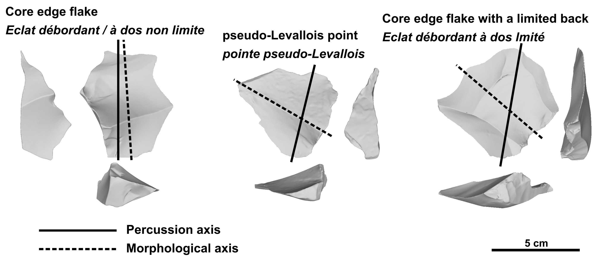
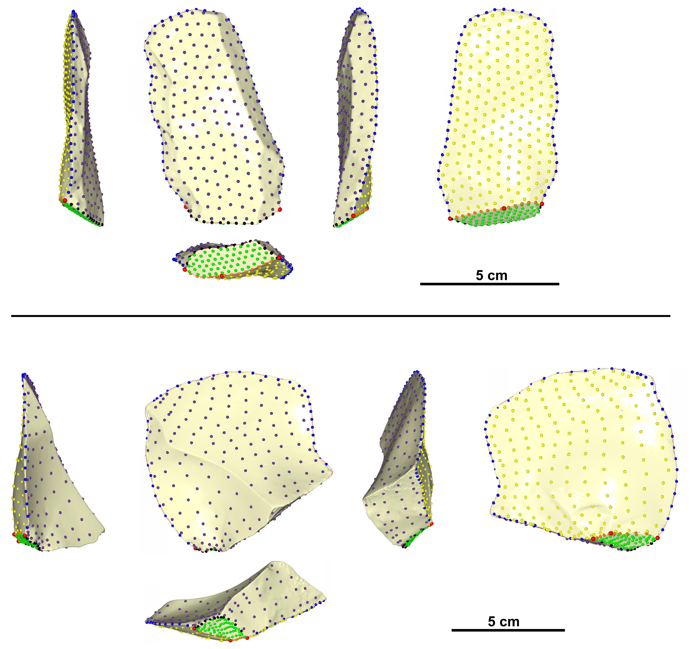
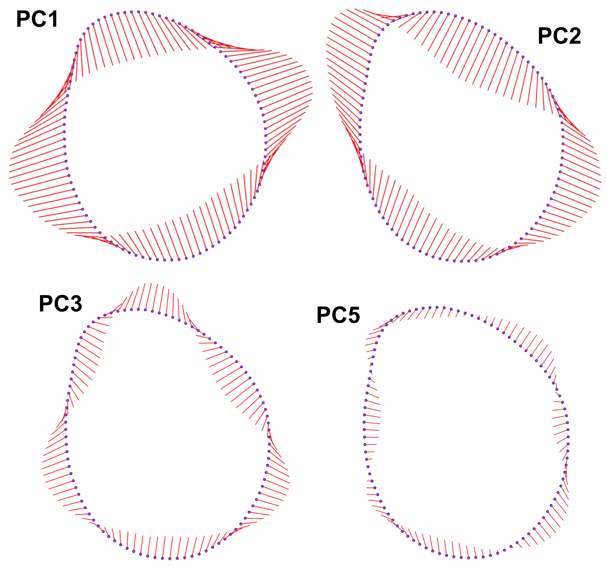

<div align="justify">  
```{r setup, include=FALSE}
knitr::opts_chunk$set(echo = TRUE)
```


# The contribution of 2D and 3D geometric morphometrics to lithic taxonomies: testing discrete categories of backed flakes from recurrent centripetal core reduction.      
Guillermo  Bustos-Pérez $^{(1)}$    
Brad Gravina $^{(2, 3)}$  
Michel Brenet $^{(3, 4)}$   
Francesca Romagnoli $^{(1)}$   

$^{(1)}$ Universidad Autónoma de Madrid. Departamento de Prehistoria y Arqueología, Campus de Cantoblanco, 28049 Madrid, Spain   
$^{(2)}$ Musée national de Préhistoire, MC, 1 rue du Musée, 24260 Les Eyzies de Tayac, France   
$^{(3)}$ UMR-5199 PACEA, Université de Bordeaux, Bâtiment B8, Allée Geoffroy Saint Hilaire, CS 50023, 33615 PESSAC CEDEX, France    
$^{(4)}$ INRAP Grand Sud-Ouest, Centre mixte de recherches archéologiques, Domaine de Campagne, 242460 Campagne, France    

**Abstract**   

Paleolithic lithic assemblages are usually dominated by flakes and display a high degree of morphological variability. When analyzing Paleolithic lithic assemblages, it is common to classify flakes into categories based on their morphological and technological features, which are linked to the position of the flake in the reduction sequence and how removals are organized in a given production method. For the analysis of Middle Paleolithic lithic assemblages, two categories of flakes are commonly identified: core-edge flakes and pseudo-Levallois points. A third type, core-edge flakes with a limited back, is also commonly found in the archaeological literature, providing an alternative category whose definition does not match the two previous types but shares many of their morphological and technological features. The present study addresses whether these three flakes constitute discrete categories based on their morphological and technological attributes. 2D and 3D geometric morphometrics are employed on an experimental set composed of the three categories of flakes to quantify morphological variation. Machine learning models and principal components biplots are used to test the discreteness of the categories. The results indicate that geometric morphometrics succeed in capturing the morphological and technological features that characterize each type of product. Pseudo-Levallois points have the highest discreteness of the three technological products, and while some degree of mixture exists between core edge flakes and core edge flakes with a limited back, they are also highly distinguishable. We conclude that the three categories are discrete and can be employed in technological lists of products for the analysis of lithic assemblages and that geometric morphometrics is useful for testing for the validity of categories. When testing these technological categories, we stress the need for well-defined and shared lithic analytical units to correctly identify and interpret the technical steps and decisions made by prehistoric knappers and to properly compare similarities and differences between stone tool assemblages. These are key aspects for current research in which open datasets are becoming more and more common and used to build interpretative techno-cultural models on large geographical scales. Now more than ever, lithic specialists are aware of the need to overcome differences in taxonomies between different school traditions.       

**Key words**: lithic analysis; lithic technology; geometric morphometrics; machine learning; Middle Paleolithic; Levallois; discoidal     

## 1. Introduction    

Lithic artifacts regularly constitute the most important and abundant remains found on Paleolithic sites. When analyzing lithic assemblages, in addition to taking metric measurements and noting attributes, it is common to classify unmodified flakes according to their morphologies and technological features. This is a crucial part of lithic analysis because it classifies flakes into technological categories in the sense that the retained features and morphology are indicative of the production method by which they were generated. These technological products usually reflect different knapping strategies, stages of reduction as well as variations in the organization of removals and surface exploitation. Well-known examples of technological classifications of flakes include bipolar/on anvil flakes [@callahan_bipolar_1996; @hayden_confusion_1980], overshot flakes [@cotterell_formation_1987], bifacial-thinning flakes [@raab_debitage_1979], byproducts of blade production, such as core tablets or crested blades [@pelegrin_technologie_1995; @shea_upper_2013], kombewa flakes [@tixier_prehistoire_1980; @tixier_kombewa_1999] and lateral tranchet blows [@bourguignon_analyse_1992]. While the use of technological categories is common and helps increase the resolution of lithic analysis, it is important to bear in mind that lithic artifacts are characterized by a high degree of morphological variability, which, in many cases, results in overlapping features. Consequently, several categories remain underused because of this high morphological variability, their overlapping features, and their similar roles in the volumetric management of the core along the reduction process.   
	
The Middle Paleolithic in Western Europe is characterized by the diversification of an increase in knapping methods, resulting in what are generally flake-dominated assemblages [@kuhn_roots_2013; @hovers_diversity_2006].For the analysis of Middle Paleolithic lithic assemblages, lists of technological products are common and generally reflect individual knapping methods, the organization of flake removals, and their morphology [@duran_mousterien_2004; @duran_variabilite_2006; @rigaud_les_1988; @shea_middle_2013]. These technological lists are usually dominated by categories of technological products related to Levallois and discoidal knapping methods [@dibble_levallois:_1995; @boeda_debitage_1993; @boeda_identification_1990], which constitute an important part of Middle Paleolithic lithic variability. Various discoidal and Levallois products have been identified and first appear approximately at 400 ka, in a vast area from eastern Asia to the Atlantic Coast of western Europe through Siberia and Central Asia, the Levant, eastern and central Europe [see bibliography in @romagnoli_neanderthal_2022], and Africa [@adler_early_2014; @blinkhorn_directional_2021]. The identification of discoidal and Levallois products therefore appears widespread in lithic analysis across various research schools and is designed to create a comparable dataset, explore specific technological adaptations in different ecological contexts, and discuss long-term techno-cultural traditions and technological change. One special category of such products is backed flakes that exhibit remnants of the core on one of their lateral edges. Backed flakes are usually classified into two technological categories: “core-edge flakes” (*éclat débordant à dos limité*), and “pseudo-Levallois points”. A third category, “core-edge flakes with a limited back” (éclats débordants à dos limité), has also been defined [@meignen_les_1993; @meignen_persistance_1996; @pasty_etude_2004], although its use is not widespread [@duran_mousterien_2004; @duran_variabilite_2006; @rigaud_les_1988; @shea_middle_2013]. One reason for this may be their overlapping features, including morphology, and a similar role in core reduction compared to classic core edge flakes. This usually results in their absorption into the group of core edge flakes when technological lists of products are employed.   

The present study aims to evaluate whether “core-edge flakes with a limited back” represent a discrete technological category that can be easily separated from classic core-edge flakes and pseudo-Levallois points based on their morphological features. While this may seem a pleonastic technical exercise, refining stone tool taxonomy allows researchers to better describe lithic technology, which is the basis for documenting patterns of tool production, transport, maintenance, use, discard, and reuse. This is equally important for exploring differences in how past human groups adapted their technical knowledge and skills to resource constraints, economic strategies, and social dynamics. Furthermore, an improved and comprehensive use of technological types and sub-types within core trimming elements is fundamental to generating reliable comparisons between archaeological assemblages. Finally, core-edge flakes are present in multiple Palaeolithic techno-complexes, particularly those based around centripetal and recurrent reduction strategies. As such, better classifying types and sub-types within this technological category will be of use in lithic studies for multiple periods and regions. In addition to evaluating the discreteness of this specific artifact type, the present study also explores a workflow for testing lithic categories and compares the effectiveness of using data derived from 2D and 3D geometric morphometrics.     

To test the discreteness of core-edge flakes categories, an experimental sample of backed flakes produced by discoidal and recurrent centripetal Levallois reduction is classified, following their technological definitions. Geometric morphometrics on 3D meshes are employed to quantify the morphological variability of the experimental assemblage. To test for the discreteness of these categories, machine learning algorithms are employed to classify the flakes according to their technological category. Our hypothesis is that, although some degree of overlap is expected due to the high degree of morphological variability among lithic artifacts, machine learning models should easily differentiate the above-mentioned categories. Testing this hypothesis would support the use of these backed flake categories in the classification of lithic assemblages. The creation of datasets based on the same analytical units and criteria will enable more accurate and reliable comparisons between stone tool assemblages, improving the definition of working hypotheses and interpretative models for technological, adaptive, and behavioral changes in prehistory [@romagnoli_neanderthal_2022].   

The following code loads attribute data from the experimental assemblage and packages employed for the analysis.   

```{r, message=FALSE, warning=FALSE}
# Load packages
list.of.packages <- c("tidyverse", "caret", "Morpho")
lapply(list.of.packages, library, character.only = TRUE)
rm(list.of.packages)

# Load attribute data
Att <- read.csv("Data/Attributes data.csv")
```


## 2. Methods   

### 2.1 Experimental assemblage   

The present study uses an experimental assemblage comprising eight knapping sequences. Seven cores were knapped on Bergerac flint [@fernandes_silex_2012] , and two cores were knapped on Miocene chert from south of Madrid [@bustillo_caracteristicas_2005; @bustillo_caracterizacion_2012]. 


Three cores were knapped following the discoid *“sensu stricto”* concept, which strongly corresponds to Boëda’s original technological definition of the knapping system [@boeda_debitage_1993; @boeda_concept_1994; @dibble_levallois:_1995], and five experimental cores were knapped following the Levallois recurrent centripetal system [@boeda_debitage_1993; @boeda_concept_1994; @dibble_levallois:_1995; @dibble_recurrent_1995].  

Six technological characteristics define the Levallois concept [@boeda_concept_1994; @boeda_debitage_1993]: (1) the volume of the core is conceived as two convex asymmetric surfaces; (2) these two surfaces are hierarchical and not interchangeable. They maintain their roles as striking platforms and debitage (or exploitation) surfaces, respectively, throughout the entire reduction process; (3) the distal and lateral convexities of the debitage surface are maintained to obtain predetermined flakes; (4) the fracture plane of the predetermined products is parallel to the intersection between both surfaces; (5) the striking platform is perpendicular to the overhang (the core edge, at the intersection between the two core surfaces); (6) the technique employed during the knapping process is direct hard-hammer percussion. Depending on the organization of the debitage surface Levallois cores are usually classified into the preferential method (where a single predetermined Levallois flake is obtained from the debitage surface) or recurrent methods (where several predetermined flakes are produced from the debitage surface), with removals being either unidirectional, bidirectional, or centripetal [@dibble_levallois:_1995; @boeda_identification_1990; @dibble_variability_1995; @hovers_diversity_2006].   

According to Boëda [-@boeda_debitage_1993; -@boeda_concept_1994; -@dibble_levallois:_1995],there are six technological criteria that define the discoid “sensu stricto” method: (1) the volume of the core is conceived as two oblique asymmetric convex surfaces delimited by an intersecting plane; (2) these two surfaces are not hierarchical, being possible to alternate between the roles of striking platforms and exploitation surfaces; (3) the peripheral convexity of the debitage surface is managed to control lateral and distal extractions, thus allowing for a degree of predetermination; (4) the surfaces of the striking platforms are oriented in such a way that the core edge is perpendicular to the predetermined products; (5) the fracture planes of the products are secant; (6) the technique employed is direct hard-hammer percussion.  
	
A total of 139 unretouched backed flakes (independent of the type of termination) were obtained from the different experimental reduction sequences, 70 from discoidal reduction sequences and 69 from Levallois recurrent centripetal reduction sequences. The following criteria were monitored for the classification of backed flakes:    

Core edge flakes / *eclat débordant* [@beyries_etude_1983; @boeda_debitage_1993; @boeda_identification_1990] have a cutting edge opposite and usually (although not always) parallel to an abrupt margin. This abrupt margin, or backed edge (*dos*), commonly results from the removal of a portion of the periphery of the core and can be plain, bear the scars from previous removals, be cortical, or present a mix of the three. Classic “core-edge flakes” [@boeda_debitage_1993; @boeda_identification_1990], which are sometimes referred as “core edge flakes with non-limited back” / *“éclat débordant à dos non limité”* [@duran_lindustrie_2005; @duran_variabilite_2006] have a morphological axis that follows the axis of percussion, although it may deviate slightly [@beyries_etude_1983].  
“Core edge flakes with a limited back” / *“éclat débordant à dos limité”* share with core-edge flakes the morphological feature of having a cutting edge opposite a back. However, the main difference resides in a morphological axis clearly offset in respect to the axis of percussion [@meignen_les_1993; @meignen_persistance_1996; @pasty_etude_2004]. Because of this deviation from the axis of percussion, the backed edge is usually not completely parallel, nor does it span the entire length of the sharp edge.    
Pseudo-Levallois points [@boeda_debitage_1993; @boeda_identification_1990; @bordes_notules_1953; @bordes_typologie_1961; @peresani_les_2003] are backed products in which the edge opposite to the back has a convergent morphology. This morphology is usually the result of the convergence of two or more previous removals. As with core-edge flakes, the back usually results from the removal of one of the lateral edges of the core and can be plain, retain the scars from previous removals, or more rarely be cortical. Pseudo-Levallois points share with core edge flakes with a limited back the deviation of symmetry from the axis of percussion, but they are clearly differentiable due to their triangular off-axis morphology.    


The following table presents the distribution of backed flake types, following the previously established definitions. Due to the centripetal character of the knapping methods employed to generate the experimental assemblage, most of the backed flakes fall within the definition of core-edge flakes with a limited back (66.91%). Cortex distribution according to backed flake category shows that slightly (~25%) or non-cortical products dominate among the three categories, adding up to more than 65% in the three groups (90% core-edge flakes, 68.82% core-edge flakes with a limited back, and 87.5% pseudo-Levallois points).   

```{r, message=FALSE, warning=FALSE}
Att %>% group_by(Strategy, ARTIFACTTYPE) %>% 
  summarise(
    Count = n(),
    Percent = (Count/139)*100)
```



```{r Cortex distribution per artefact type, fig.width=10, fig.height=4}
# Cortex per class
Att %>% group_by(ARTIFACTTYPE) %>% 
  count(CORTEX) %>% 
  mutate(Percentage = round(n/sum(n)*100, 2)) %>% 
  
  ggplot(aes(CORTEX, Percentage, fill = ARTIFACTTYPE)) +
  geom_col(position = "dodge") +
  ggsci::scale_fill_aaas(alpha = 0.95) +
  xlab(NULL) +
  geom_text(aes(label = paste0(Percentage, "%")), 
            vjust= -0.2, size = 2.65,
            position = position_dodge(.9)) +
  geom_text(aes(label = paste("n =", n)), 
            vjust= "top", size = 2.65,
            position = position_dodge(.9)) +
  labs(fill = NULL) +
  
  theme_classic() +
  theme(
    legend.position = "bottom",
    axis.text = element_text(color = "black", size = 8))
```


### 2.2 Geometric Morphometrics   

All flakes were scanned with an Academia 20 structured light surface scanner (Creaform 3D) at a 0.2 mm resolution. Flakes were scanned in two parts, automatically aligned (or manually aligned in the case automatic alignment failure), and exported in STL format. Cloudcompare 2.11.3 (https://www.danielgm.net/cc/) free software was employed to perform additional cleaning, mesh sampling, surface reconstruction and transformation into PLY files. Finally, all files were decimated to a quality of 50,000 faces using the Rvcg R package [@schlager_morpho_2017]. The present work compares the use of 2D and 3D geometric morphometrics to test the limits of their application.   

```{r eval=FALSE}
source("Scripts/21 Muggle 2D data.R")
```
```{r include=FALSE}
load("Data/2D data.RData")
```
```{r}
# Plot landmarks of first specimen and mean shape
ggpubr::ggarrange(
  (
    data.frame(Coord.2D$rotated[1:100, 1:2, 1]) %>% 
      ggplot(aes(X2, X1)) +
      geom_point() +
      xlab("y coord") +
      ylab("x coord") +
      coord_fixed() +
      theme_light() +
      scale_x_reverse() +
      ggtitle(label = "First specimen") +
      theme(
        axis.text = element_text(size = 6, color = "black"),
        axis.title = element_text(size = 8, color = "black"),
        plot.title = element_text(hjust = 0.5, vjust = 1, size = 9))
    ),
  
  (
    data.frame(Coord.2D$mshape) %>% 
      ggplot(aes(X2, X1)) +
      geom_point() +
      xlab("y coord") +
      ylab("x coord") +
      coord_fixed() +
      theme_light() +
      scale_x_reverse() +
      ggtitle(label = "Average shape of the sample") +
      theme(
        axis.text = element_text(size = 6, color = "black"),
        axis.title = element_text(size = 8, color = "black"),
        plot.title = element_text(hjust = 0.5, vjust = 1, size = 9))),
  ncol = 2)
```
\ 

2D geometric morphometrics were done using screenshots [@cignoni_meshlab_2008] of the upper view of each flake orientated along the technological axis. One thin-plate spline (tps) was generated using tpsUtil v.1.82, and the tpsDig v.2.32 [@rohlf_tps_2015] outline tool was employed to automatically trace the perimeter of each flake. Each outline was resampled to 100 equidistant landmarks (Figure 3) using Morpho v.2.11 [@schlager_morpho_2017]. 

The following code sources the [21 Muggle 2D data](Scripts/21 Muggle 2D data.R) code. This code has been written to import the [2D-Upper-view.tps](Data/2D-Upper-view.tps) file. The file contains a landmark per pixel that defines the perimeter of the flake. After reading the file, the perimeter of each specimen is resampled to have 100 landmarks, and procrustes alignment is performed. A *nosymproc* [@schlager_morpho_2017] object called **Coord.2D** is created, which contains the orientated coordinates, mean shape and results from PC analysis.  


The protocol for digitalizing 3D landmarks on flakes is based on previous studies [@archer_geometric_2018; @archer_quantifying_2021]. This included the positioning of a total of three fixed landmarks, 85 curve semi-landmarks, and 420 surface semi-landmarks  [@bookstein_landmark_1997; @bookstein_morphometric_1997; @gunz_semilandmarks_2005; @gunz_semilandmarks_2013; @mitteroecker_advances_2009]. This resulted in a total of 508 landmarks and semi-landmarks. The three fixed landmarks correspond to both laterals of the platform and the percussion point. The 85 curve semi-landmarks correspond to the internal and exterior curve outlines of the platform (15 semi-landmarks each) and the edge of the flake (55 semi-landmarks). Sixty surface semi-landmarks correspond to the platform surface. The dorsal and ventral surfaces of the flakes are defined by 180 semi-landmarks each. The workflow for digitalizing landmarks and semi-landmarks included the creation of a template/atlas on an arbitrary selected flake (Figure 4: top). After this, landmarks and semi-landmarks were positioned in each specimen and relaxed to minimize bending energy [@bookstein_landmark_1997; @bookstein_morphometric_1997]. A complete workflow of landmark and semi-landmark digitalization and relaxation to minimize bending energy was created in Viewbox Version 4.1.0.12 (http://www.dhal.com/viewbox.htm), and the resulting point coordinates were exported into .xlsx files.
\ 

\  

Procrustes superimposition [@kendall_shape_1984; @mitteroecker_advances_2009; @ohiggins_study_2000] was performed using the Morpho v.2.11 package  [@schlager_morpho_2017] on RStudio IDE [@rstudio_team_rstudio_2019; @r_core_team_r_2019]. Morpho package v.2.11 provides results from principal component analysis (PCA) allowing to reduce the dimensionality of the data [@james_introduction_2013; @pearson_lines_1901]. There are multiple reasons to use dimensionality reduction when dealing with high-dimension data on classification: to avoid having more predictors than observations (p > n), avoid collinearity of predictors, reduce the dimensions of the feature space, and avoid overfitting due to an excessive number of degrees of freedom (simple structure with lower number of variables). Principal component analysis achieves dimensionality reduction by identifying the linear combinations that best represent the predictors on an unsupervised manner. The principal components (PCs) of a PCA aim to capture as high a variance as possible for the complete data [@james_introduction_2013], and PCs that capture the highest variance need not necessarily be the best for classification.    

Debate exists on how many PCs from geometric morphometrics should be selected for classificatory analysis [@schlager_morpho_2017]. Including all PCs up to an arbitrary percentage of variance can result in non-meaningful (noise) PCs pulling the classificatory analysis. This can be considered as a type of overfitting since the classification is not being driven by meaningful morphological trends. An alternative is to select PCs capturing a minimum percentage of variance. However, stone tools are notorious for their wide morphological variability, and increasing sample size results in diminishing variance captured by each PC. Usually the first two to three PCs will reflect ratios of elongation and width to thickness, while other meaningful PCs for classification (such as the angle between the internal or external surface of a flake) might be concealed in lower ranking PCs.   

The problem of selecting a minimum variance is approached in two steps. A first round of models is trained using all PCs that represent up to 95% of variance. The threshold of 95% of variance is arbitrarily selected because it balances retaining most of the dataset variance with a reduced number of variables. This provides the most meaningful PCs for classification according to the best model. The effect on morphology of these meaningful PC was visually evaluated. PCs explaining little variance and with little effect on shape change are excluded. Based on this evaluation, the second and final round of models were trained using PCs which captured more than 3% of variance. 

The identification of best PCs for classification is performed automatically by the machine learning models using the caret v.6.0.92 package [@kuhn_building_2008]. Morpho package v.2.11 additionally provides visualization of shape change according to PC. A previous work on the same dataset [@bustos-perez_combining_2022] performed PCA using the package stats v.4.2.2 [@venables_modern_2002]. The present work uses the PCA integrated in the Morpho v.2.11 [@schlager_morpho_2017]. As a result of this, variance captured by PCs and their interpretation differs regarding previous analysis.   

#### 2.2.1 Performance of procrustes, PCA and model training      

The following code sources the [22 Muggle 2D data](Scripts/22 Muggle 3D data.R) script. The [22 Muggle 2D data](Scripts/22 Muggle 3D data.R) loads all *.csv* files containing 3D coordinates, performs procrustes alignment using Morpho [@schlager_morpho_2017], and renames each specimen using the name of the *.csv* file on which they were stored.    

A *nosymproc* [@schlager_morpho_2017] object called **Coord.3D** is created into the [Data](Data) folder. The *nosymproc* contains the orientated coordinates, mean shape and results from PC analysis.      


```{r eval=FALSE}
# Source over 3D data
source("Scripts/22 Muggle 3D data.R")
```


### 2.3	Machine learning and resampling techniques    

Different machine learning models treat the provided data differently. As a result, different models have different strengths and weaknesses. No universal model exists for all problems. Thus, testing several models is an important step in machine learning. It allows to compare the performance of different models, identify the best model for the given task, it provides a general overview of the difficulty or ease of the problem, and it can serve as indication of possible underlying problems with the data (such as overfitting, or unbalanced datasets). Machine learning is a quickly developing field were a high number of models exists. The present work tests ten machine learning models for the classification of flake categories. These models cover some of the most commonly employed algorithms [@jamal_machine_2018] and provide an extensive analysis for the classification of backed flake categories.    

  * **Linear discriminant analysis (LDA):** reduces dimensionality in an attempt to maximize the separation between classes, while decision boundaries divide the predictor range into regions [@fisher_use_1936; @james_introduction_2013].   
  * **K-nearest neighbor (KNN):** classifies cases by assigning the class of similar known cases. The “k” in KNN references the number of cases (neighbors) to consider when assigning a class, and it must be found by testing different values. Given that KNN uses distance metrics to compute nearest neighbors and that each variable is in different scales, it is necessary to scale and center the data prior to fitting the model [@cover_nearest_1967; @lantz_machine_2019].    
  * **Logistic regression:** essentially adapts the multiple linear regression by raising Euler’s constant to its output in the numerator (plus one in the case of the denominator). This results in probability values ranging from 0 to 1which allows obtaining predictions for categorical outcomes [@cramer_early_2004; @walker_estimation_1967].    
  * **Decision tree with C5.0 algorithm:** uses recursive partitioning to divide a dataset into homogeneous groups. The C5.0 algorithm uses entropy (measure of degree of mixture between classes) to determine feature values on which to perform the partitioning. The C5.0 algorithm is an improvement on decision trees for classification [@quinlan_improved_1996; @quinlan_c4_2014].    
  * **Random forest:** uses an ensemble of decision trees. Each tree is grown from a random sample of the variables, allowing for each tree to grow differently and better reflect the complexity of the data and provide additional diversity. Finally, the ensemble of trees casts a vote to generate predictions [@breiman_random_2001].  
  * **•	Gradient Boosting Machine (GBM):** uses a sequential ensemble of decision trees. After training an initial decision tree, GBM trains subsequent trees on a resampled dataset were the weight of observations difficult to classify is increased based in a gradient [@greenwell_package_2019; @ridgeway_generalized_2007] The subsequent trained trees complement decisions and allow for the detection of learning deficiencies and increase model accuracy [@friedman_greedy_2001; @friedman_stochastic_2002].        
  * **Supported vector machines (SVM):** fits hyperplanes into a multidimensional space with the objective of creating homogeneous partitions. The fitting of the hyperplanes is done in order to obtain the maximum margin of separation between classes. The maximum margin of separation is reached by minimizing the cost (value applied for each incorrect classification). SVM’s can use different kernels in order to transform data into linearly separable cases. The kernel selected for the transformations needs to be specified  and plays a key role in the training of a SVM model [@cortes_support-vector_1995; @frey_letter_1991]. The present study tests SVM's with linear, radial, and polynomial kernels. 
  * **Naïve Bayes:** computes class probabilities using Bayes’s rule [@weihs_klar_2005].   

As mentioned above, 66.91% of flakes fall into the definition of core edge flakes with a limited back, resulting in an unbalanced dataset. To counter the unbalanced nature of the experimental dataset, up-sampling was undertaken for the two minority classes, and down-sampling was undertaken for the majority class. Up-sampling categories in a dataset can be considered inappropriate for training machine learning models because it increases the overfit (samples used in the test set to evaluate the model are likely to have already been used in the training set). However, here, the up-sampling of the two minority groups increases the discreteness of these groups but does not affect the potential overlap with the majority class (core edge flakes with limited backs). On the other hand, down-sampling results in missing information because some of the data are removed.    

Random up- and down-sampling is conducted to obtain a balanced dataset and train the models. Because model performance metrics depend on random up- and down-sampling, this process is repeated 30 times, extracting model performance metrics each time and averaging the values. The model with the best performance metrics is then trained again with thirty cycles of up- and down-sampling. The reported variable importance and confusion matrix from which model metric performance are extracted are obtained from these additional cycles of down- and up-sampling.    

3D meshes and data from landmark positioning and Procrustes alignment are already publicly available through the repository of a previous publication using the same experimental collection [@bustos-perez_research_2022; @bustos-perez_combining_2022]. 

#### 2.3.1 Trainign of Machine Learning models       

As mentioned previously, this is a unbalanced data set. Balancing to train the models correctly is done using the `groupdata2` v2.0.2 package using the parameter **"mean"** for size. This means that each group will be up or down sampled to the result of dividing data set size between number of groups. 

  * A `tibble()` called `All_Results` is set to store the results from each model training.  

Each loop works in the following steps:   

  1. The original data set is randomly up and down sampled for each target category.    
  2. Model is trained following the provided hyperparameters and data pre-processing.   
  3. Results from the trained model are extracted and binned to the `All_Results` tibble.       
  4. Steps 1 to 3 are repeated 30 times per model.   

```{r eval=FALSE}
source("Report/Scripts/31 Models on 2D data.R")
source("Report/Scripts/31 Models on 3D data.R")
```

Models trained are exported to their respective [2D Results Up and Down sampling](Report/Data/2D Results Up and Down sampling.RData) and [3D Results Up and Down sampling](Report/Data/3D Results Up and Down sampling.RData) files.   

```{r include=FALSE, eval=FALSE}
load("Data/Results Up and Down sampling.RData")
load("Data/SVM Poly Results.RData")
```

After determining the best model for each type of data, another loop is repeated in order to extract variable importance and predictions in order to construct the confusion matrix. The following code sources the R files that train and extract the necessary information.       

```{r eval=FALSE}
source("33 Loop over best model of 2D data.R")
source("34 Loop over best model of 3D data.R")
```


## 3. Results    

### 3.1 PCA and machine learning model performance       

Results from the PCA on the 2D data show that the nine first principal components account for 95% of the variance in the dataset, with PC1 accounting for 39.33% of variance and PC9 for 0.98% of variance. For the 3D data the 22 first principal components account for 95% of variance, with PC1 accounting for 31.32% and PC22 accounting for 0.3% of variance. This represents a substantial reduction in dimensionality from the original number of variables of the 2D data (200 original variables) and the 3D data (1,524 original variables) and is lower than the sample size (139).    

```{r}
load("Data/2D Data.RData")
load("Data/3D Data.RData")

ggpubr::ggarrange(
  (as.data.frame(Coord.2D$Variance) %>% 
    mutate(PC = paste("PC", rownames(as.data.frame(Coord.2D$Variance)))) %>%
    filter(`Cumulative %` <= 96) %>% 
    
    ggplot(aes(`% Variance`, reorder(PC, `% Variance`))) +
    geom_col(fill = "blue", alpha = 0.65) +
    geom_text(aes(label = round(`% Variance`, 2)), hjust = "bottom",  size = 2.25) +
    theme_bw() +
    scale_x_continuous(breaks = seq(0, 45, 5), lim = c(0, 45)) +
    ylab(NULL) +
     ggtitle(label = "2D data") +
    theme(
      axis.title = element_text(size = 7, color = "black", face = "bold"),
      axis.text = element_text(size = 7, color = "black"),
      plot.title = element_text(hjust = 0.5, vjust = 1, size = 9))),
  
  (as.data.frame(Coord.3D$Variance) %>% 
    mutate(PC = paste("PC", rownames(as.data.frame(Coord.3D$Variance)))) %>%
    filter(`Cumulative %` <= 96) %>% 
    
    ggplot(aes(`% Variance`, reorder(PC, `% Variance`))) +
    geom_col(fill = "blue", alpha = 0.65) +
    geom_text(aes(label = round(`% Variance`, 2)), hjust = "bottom",  size = 2.25) +
    theme_bw() +
    scale_x_continuous(breaks = seq(0, 40, 5), lim = c(0, 40)) +
    ylab(NULL) +
     ggtitle(label = "3D data") +
    theme(
      axis.title = element_text(size = 7, color = "black", face = "bold"),
      axis.text = element_text(size = 7, color = "black"),
      plot.title = element_text(hjust = 0.5, vjust = 1, size = 9))),
  ncol = 2)
```


The following figure presents the accuracy values for each model after their respective 30 cycles of random up- and down-sampling. On general, models trained on 3D data presented higher overall precision metrics.     
In the case of the 2D data, the random forest model had the highest average value for general accuracy (0.779), closely followed by the decision tree (0.767) and the GBM (0.765). The LDA had the lowest average value for accuracy (0.511), followed by the logistic regression (0.522).    


For the 3D data, supported vector machines with a polynomial kernel had the highest average value for general accuracy (0.844), closely followed by the random forest model (0.840). The K-nearest neighbor model had the lowest average value for accuracy (0.676), followed by LDA model (0.694). The minimum accuracy value of SVM with a polynomial kernel is 0.807, indicating a high accuracy, even when up- and down-sampling result in different objects.   

```{r}
load("Data/2D Results Up and Down sampling.RData")
load("Data/3D Results Up and Down sampling.RData")

ggpubr::ggarrange(
  (
    Models.2D %>% 
      ggplot(aes(Model, Accuracy, fill = Model)) +
      geom_violin(position = position_dodge(1), width = 0.4, alpha = 0.5) +
      geom_boxplot(width = 0.4,
                   outlier.shape = NA, alpha = 0.5) +
      geom_jitter(width = 0.15, alpha = 0.9, size = 0.9, shape = 23, aes(fill = Model)) +
      scale_y_continuous(breaks = seq(0.4, 1, 0.2), lim = c(0.4, 1)) +
      theme_light() +
      ylab("Accuracy after each cycle of up and down sampling") +
      ggsci::scale_fill_aaas() +
      ggtitle(label = "2D data") +
      scale_x_discrete(labels = c(
        "LDA", "KNN", "Log. Reg.",
        "C5.0\nTree", "Random\nForest", "GBM",
        "SVM\nLinear", "SVM\nRadial",
        "SVM\nPoly",
        "Naïve\nBayes")) +
      xlab(NULL) +
      theme(
        legend.position = "none",
        axis.text = element_text(color = "black", size = 8),
        axis.title = element_text(color = "black", size = 8.5),
        plot.title = element_text(hjust = 0, vjust = 1, size = 9))
  ),
  (
    Models.3D %>% 
      ggplot(aes(Model, Accuracy, fill = Model)) +
      geom_violin(position = position_dodge(1), width = 0.4, alpha = 0.5) +
      geom_boxplot(width = 0.4,
                   outlier.shape = NA, alpha = 0.5) +
      geom_jitter(width = 0.15, alpha = 0.9, size = 0.9, shape = 23, aes(fill = Model)) +
      scale_y_continuous(breaks = seq(0.4, 1, 0.2), lim = c(0.4, 1)) +
      theme_light() +
      ylab("Accuracy after each cycle of up and down sampling") +
      ggtitle(label = "3D data") +
      ggsci::scale_fill_aaas() +
      scale_x_discrete(labels = c(
        "LDA", "KNN", "Log. Reg.",
        "C5.0\nTree", "Random\nForest", "GBM",
        "SVM\nLinear", "SVM\nRadial",
        "SVM\nPoly",
        "Naïve\nBayes")) +
      xlab(NULL) +
      theme(
        legend.position = "none",
        axis.text = element_text(color = "black", size = 8),
        axis.title = element_text(color = "black", size = 8.5),
        plot.title = element_text(hjust = 0, vjust = 1, size = 9))
        ),
  nrow = 2)
```

The following tables present performance metrics of the random forest model (on 2D data) and SVM with a polynomial kernel (on 3D data) for the classification of the three products. The prevalence/no information ratio was kept constant at 0.33 for all three categories as a result of random up- and down-sampling to obtain balanced datasets. General performance metrics values (F1 and balance accuracy) of pseudo-Levallois points and core edge flakes were similar for models trained on the 2D and 3D data. General performance metrics for the identification of core edge flakes with a limited back did increase when 3D data was employed instead of 2D data. 

```{r}
load("Data/Best model 2D varimp and cm.RData")
load("Data/Best model 3D varimp and cm.RData")

# Performance metrics of RF on 2D data
confusionMatrix(RF.Predictions$pred, RF.Predictions$obs)[[4]]

# Performance metrics of SVMP on 3D data
confusionMatrix(SVMP.Predictions$pred, SVMP.Predictions$obs)[[4]]
```

### 3.2 Feature importance    

The following figure presents average variable importance for the three products after 30 cycles of up- and down-sampling and k-fold cross-validation. The random forest trained on 2D data consider four sets of principal components important in terms of classification. The SVM with polynomial kernel trained on 3D data considers five sets of principal components in terms of classification.       

```{r}
# Variable importance 
SVMP.varImport$Mean.Imp <- rowMeans(SVMP.varImport[,2:4])

SVMP.varImport <- SVMP.varImport %>% group_by(PCs) %>% 
  summarise(Importance = mean(Mean.Imp)) 

ggpubr::ggarrange(
  (
    RF.varImport %>% group_by(PCs) %>% 
      summarise(
        Importance = mean(Overall)) %>% 
      top_n(15, Importance) %>% 
      ggplot(aes(Importance, reorder(PCs, Importance), fill = Importance)) +
      geom_bar(stat= "identity", position = "dodge") +
      geom_text(aes(label = round(Importance, 2)), 
                position = position_stack(vjust = 0.5), size = 2) +
      scale_fill_gradient(low = "red", high = "blue") +
      guides(fill = "none") +
      ylab(NULL) +
      theme_light() +
      labs(title = "2D data") +
      theme(
        axis.text.y = element_text(color = "black", size = 7),
        axis.text.x = element_text(color = "black", size = 7),
        axis.title.x = element_text(color = "black", size = 7),
        plot.title = element_text(color = "black", size = 7))
  ),
  (
    SVMP.varImport %>% select(Importance, PCs) %>% 
      top_n(15, Importance) %>% 
      ggplot(aes(Importance, reorder(PCs, Importance), fill = Importance)) +
      geom_bar(stat = "identity", position = "dodge") +
      geom_text(aes(label = round(Importance, 2)), 
                position = position_stack(vjust = 0.5), size = 2) +
      scale_fill_gradient(low = "red", high = "blue") +
      guides(fill = "none") +
      ylab(NULL) +
      theme_light() +
      labs(title = "3D data") +
      theme(
        axis.text.y = element_text(color = "black", size = 7),
        axis.text.x = element_text(color = "black", size = 7),
        axis.title.x = element_text(color = "black", size = 7),
        plot.title = element_text(color = "black", size = 7))
  ),
  ncol = 2)
```

PC2 (29.38% of variance) is considered the most important variable for discrimination when using the 2D data, followed by PC1 (39.33% of variance), PC5 (3.38% of variance) and PC3 (9.12% of variance). The following figure presents shape change according to these PCs. PC1 and PC2 capture the elongation of flakes along an asymmetric axis, but with different orientation. Positive values of PC1 or PC2 result in wider flakes. PC3 captures variance of flakes were the proximal part is much wider than the distal portion of the flake. PC5 appears to capture pointed extremes resulting from concave delineations of the middle portion of the laterals. This might be representing the presence of convergent extremes at either end of the flake.   



In the case of 3D data, PC5 (5.5% of variance) is considered the most important variable for discrimination, followed by PC1 (31.32% of variance), PC6 (5.06% of variance), PC11 (1.45% of variance) and PC3 (8.82% of variance). PC11 presented an average importance value of 59.68. However, the low variance captured by this PC (1.45), and visual evaluation of shape change, indicate that its effect is minimum and should be excluded from analysis.        
PC5 is driven by the interaction of platform depth and flake thickness. Increasing values of PC5 result in flakes with platforms much wider than deep, with the width of the platform finding their continuation in one of the abrupt laterals. Increasing PC5 values also result in thinner flakes. The negative space of PC5 captures flakes with platforms much more deep than wide and thicker flakes. PC1 largely captures elongation along with platform size and thickness. Positive PC1 values result in very wide flakes with a reduced length and bigger platforms. This increase in width is slightly accompanied with an increase in thickness. Negative space values result in thin elongated flakes with a distal convergent edge and small platforms. Positive values of PC6 represent the convergence of one of the distal laterals into a pointed end. The negative space of PC6 results in flakes with a wide proximal portion which becomes narrower in the towards the distal part of the flake. PC3 represents transversal flake morphology and the relationship between thickness, width and asymmetry. Increasing values of PC3 result in thicker and narrower flakes with a marked asymmetry which results from a thick back located at the left lateral.    


### 3.3 Group discreteness through confusion matrix and PCA biplots   

The confusion matrixes illustrate the directionality of confusion between the predicted and true values of classified technological products for the 2D and 3D data. In both types of data pseudo-Levallois points have the best identification, in accordance with the reported sensitivity and specificity. In general, it is very difficult to mistake pseudo-Levallois points for any of the two considered technological products. Wrongly considering a pseudo-Levallois point a core edge flake is very unlikely for the 2D data (2.39) and residual for the model on 3D data (0.21). Although mistaking a pseudo-Levallois point for a core edge flake with a limited back is slightly more common for both types of data, there is still a very low confusion value.     

Core edge flakes and core edge flakes with a limited back offer slightly higher frequencies of misidentifications, although they maintain high values for sensitivity and specificity for both types of data. For the Random Forest model based on the 2D data it is more common to mislabel core edge flakes with a limited back as core edge flakes (25.51) than the reverse (18.84).    

In the case of the SVM with polynomial kernel based on 3D data, the confusion between both categories diminishes lightly and it is balanced (17.61 and 16.27). On general, the 3D data identifies better core edge flakes with a limited back and core edge flakes than the model based on the 2D data. This greater precision is the result of a lower frequency in the incorrect identification of core edge flakes with a limited back as core edge flakes. The incorrect identification of backed flakes as pseudo-Levallois points is slightly more common when 2D data is employed. Their incorrect identification as pseudo-Levallois flakes is minimal in the case of the 3D data, although this incorrect identification has a higher frequency in core edge flakes with a limited back (6.63) than in core edge flakes (0.53).    


```{r}
#### Confusion Matrix 2D ####
CFM.2D <- confusionMatrix(RF.Predictions$pred, RF.Predictions$obs)$table
CFM.2D <- reshape2::melt(CFM.2D)

CFM.2D <- CFM.2D %>% mutate(
  Value = case_when(
    Reference == "ED" ~ (value/sum(confusionMatrix(RF.Predictions$pred, RF.Predictions$obs)$table[1:3]))*100,
    Reference == "EDlb" ~ (value/sum(confusionMatrix(RF.Predictions$pred, RF.Predictions$obs)$table[4:6]))*100,
    Reference == "p_Lp" ~ (value/sum(confusionMatrix(RF.Predictions$pred, RF.Predictions$obs)$table[7:9]))*100)
)

#### Confusion matrix 3D data ####
CFM <- confusionMatrix(SVMP.Predictions$pred, SVMP.Predictions$obs)$table
CFM <- reshape2::melt(CFM)

x <- data.frame(confusionMatrix(SVMP.Predictions$pred, SVMP.Predictions$obs)[[4]])
xlsx::write.xlsx(x,
                 file = "svmpoly results.xlsx")

# Normalize the confusion matrix
CFM <- CFM %>% mutate(
  Value = case_when(
    Reference == "ED" ~ (value/sum(confusionMatrix(SVMP.Predictions$pred, SVMP.Predictions$obs)$table[1:3]))*100,
    Reference == "EDlb" ~ (value/sum(confusionMatrix(SVMP.Predictions$pred, SVMP.Predictions$obs)$table[4:6]))*100,
    Reference == "p_Lp" ~ (value/sum(confusionMatrix(SVMP.Predictions$pred, SVMP.Predictions$obs)$table[7:9]))*100)
)

#### Plot both confusion matrixes ####
ggpubr::ggarrange(
  (
    CFM.2D %>% 
      ggplot(aes(Reference, Prediction, fill = Value)) + 
      geom_tile(alpha = 0.75) +
      geom_text(aes(label = round(Value, 2)), size = 3) +
      scale_fill_gradient(low = "white", high = "blue")  +
      scale_x_discrete(position = "top") +
      scale_y_discrete(limits=rev) +
      theme_bw() +
      coord_fixed() +
      ggtitle(label = "2D data") +
      theme(legend.position = "none",
            axis.title = element_text(size = 8, color = "black", face = "bold"),
            axis.text = element_text(size = 7.5, color = "black"),
            plot.title = element_text(hjust = 0, vjust = 1, size = 9))),
  
  (
    CFM %>% 
      ggplot(aes(Reference, Prediction, fill = Value)) + 
      geom_tile(alpha = 0.75) +
      geom_text(aes(label = round(Value, 2)), size = 3) +
      scale_fill_gradient(low = "white", high = "blue")  +
      scale_x_discrete(position = "top") +
      scale_y_discrete(limits=rev) +
      theme_bw() +
      ggtitle(label = "3D data") +
      coord_fixed() +
      theme(legend.position = "none",
            axis.title = element_text(size = 8, color = "black", face = "bold"),
            axis.text = element_text(size = 7.5, color = "black"),
            plot.title = element_text(hjust = 0, vjust = 1, size = 9))),
  ncol = 2)
```

The above interpretation of the PCs, biplot visualization, and descriptive statistics of PC values allow us to evaluate the morphological features captured by the 2D and 3D geometric morphometrics and the characterization of each type of technological backed flake. On general, biplots from 2D data show much more overlapping than biplots from 3D data. The higher overlapping observed on PC biplot from the 2D data is also observed when a group PCA is performed using the most important variables for classification. Visual analysis of group PCA biplot from variables of the 3D data shows much less overlap between the three categories. While core edge flakes and pseudo-Levallois points show little overlap between each other, core edge flakes are situated as an intermediate product, pointing out to their wide morphological variability.   

For the 2D data pseudo-Levallois points are characterized by having positive values of PC1 (mean = 0.53; SD = 0.116) and PC2 (mean = 0.168; SD = 0.128). These generally positive values are indicative of the low elongation of pseudo-Levallois points. The triangular morphology characteristic of pseudo-Levallois points remains elusive for the 2D data and is only slightly captured by PC5 (mean = 0.002; SD = 0.028). Features which characterize core edge flakes are much better captured by the 2D geometric morphometrics. In the 2D data core edge flakes are characterized by having low values of PC1 (mean = -0.052; SD = 0.111) and PC2 (mean = -0.043; SD = 0.092) which are indicative of being elongated products. Core edge flakes (mean = -0.014, SD = 0.055) and pseudo-Levallois points (mean = -0.014, SD = 0.079) tend to have negative values of PC3. This indicated that, on general, neither of the two products had a distal part narrower than the proximal part.  Core edge flakes with a limited back presented slightly positive values of PC1 (mean = 0.008; SD = 0.131) and PC2 (mean = 0.011; SD = 0.111) indicating that their elongation and asymmetry falls between core edge flakes and pseudo-Levallois points. Additional to this, core edge flakes with a limited back presented slightly positive values of PC3 (mean = 0.007; SD = 0.06), indicating that it is more common for these types of products to present a narrower distal part.    

```{r}
PC.scores.2D <- data.frame(Coord.2D$PCscores)
PC.scores.2D$ID <- rownames(PC.scores.2D)

PC.scores.2D <- left_join(PC.scores.2D, Att, by = "ID")

ggpubr::ggarrange(
  (
    PC.scores.2D %>% 
      ggplot(aes(PC2, PC1, fill = ARTIFACTTYPE)) +
      geom_vline(xintercept = 0, alpha = 0.7, linetype = "dashed") +
      geom_hline(yintercept = 0, alpha = 0.7, linetype = "dashed") +
      stat_ellipse(geom = "polygon", alpha = 0.2, aes(fill = ARTIFACTTYPE),
                   level = 0.8) +
      geom_point(aes(color = ARTIFACTTYPE), size = 1) +
      xlab(paste0("PC2 (", round(Coord.2D$Variance[2,2],2), "%)")) +
      ylab(paste0("PC1 (", round(Coord.2D$Variance[1,2],2), "%)")) +
      ggsci::scale_fill_lancet(name = "Backed flake type",
                               labels = c("Core edge flake", "Core edge flake with limited back", "pseudo-Levallois Point")) +
      ggsci::scale_color_lancet(name = "Backed flake type",
                                labels = c("Core edge flake", "Core edge flake with limited back", "pseudo-Levallois Point")) +
      theme_light() +
      guides(color = guide_legend(nrow = 1, title.position = "top"),
             fill = guide_legend(nrow = 1, title.position = "top")) +
      theme(
        axis.text.y = element_text(color = "black", size = 7),
        axis.text.x = element_text(color = "black", size = 7),
        axis.title.x = element_text(color = "black", size = 9),
        axis.title.y = element_text(color = "black", size = 9),
        legend.title = element_text(color = "black", size = 9),
        legend.text = element_text(color = "black", size = 9),
        legend.position = "bottom")
  ),
  (
    PC.scores.2D %>% 
      ggplot(aes(PC5, PC3, fill = ARTIFACTTYPE)) +
      geom_vline(xintercept = 0, alpha = 0.7, linetype = "dashed") +
      geom_hline(yintercept = 0, alpha = 0.7, linetype = "dashed") +
      stat_ellipse(geom = "polygon", alpha = 0.2, aes(fill = ARTIFACTTYPE),
                   level = 0.8) +
      geom_point(aes(color = ARTIFACTTYPE), size = 1) +
      xlab(paste0("PC5 (", round(Coord.2D$Variance[5,2],2), "%)")) +
      ylab(paste0("PC3 (", round(Coord.2D$Variance[3,2],2), "%)")) +
      ggsci::scale_fill_lancet(name = "Backed flake type",
                               labels = c("Core edge flake", "Core edge flake with limited back", "pseudo-Levallois Point")) +
      ggsci::scale_color_lancet(name = "Backed flake type",
                                labels = c("Core edge flake", "Core edge flake with limited back", "pseudo-Levallois Point")) +
      theme_light() +
      guides(color = guide_legend(nrow = 1, title.position = "top"),
             fill = guide_legend(nrow = 1, title.position = "top")) +
      theme(
        axis.text.y = element_text(color = "black", size = 7),
        axis.text.x = element_text(color = "black", size = 7),
        axis.title.x = element_text(color = "black", size = 9),
        axis.title.y = element_text(color = "black", size = 9),
        legend.title = element_text(color = "black", size = 9),
        legend.text = element_text(color = "black", size = 9),
        legend.position = "bottom")
    ),
  ncol = 2,
  common.legend = TRUE,
  legend = "bottom") %>% 
  ggpubr::annotate_figure(fig.lab = "2D data", fig.lab.pos = "top.left", 
                          fig.lab.size = 12, fig.lab.face = "bold")
```

For the 3D data pseudo-Levallois points were characterized by having high values of PC1 (mean = 0.031; SD = 0.055), low values of PC3 (mean = 0.024; SD = 0.09) and negative values of PC5 (mean = -0.046; SD = 0.059). Finally, pseudo-Levallois points also exhibit intermediate positive values of PC6 (mean = 0.018; SD = 0.05). The combination of these PC’s and their values indictes that the geometric morphometrics is capturing the low elongation (PC1), assymetry (PC3), and to some extent the triangular morphology resulting from the convergence of two edges (PC5 and PC6). Core edge flakes exhibited negative values of PC1 (mean = -0.078; SD = 0.136), positive values of PC5 (mean = 0.024; SD = 0.048) and PC6 (mean = 0.031; SD = 0.055). These PC’s capture the elongated nature (PC1) of core edge flakes (in comparisson to the other two categories), their lower ratio of legth compared to thickness (PC5) and the presence of a distal transversal edge which can result in distal pointed portions. Core edge flakes with a limited back are characterized by intermediate values of PC1 (mean = 0.012, SD = 0.142), PC3 (mean = -0.006, SD = 0.078) and PC5 (mean = 0.00; SD = 0.061) and slightly negative values of PC6 (mean = -0.013; SD = 0.058). The combination of values from these PC is indicative of the wide morphological variability of core edge flakes with a limited back were the main features are a low elongation (PC1), varing ratios of thickness and platform morphology (PC5) and strong variability of the plain view (PC6).     

```{r}
PC.scores.3D <- data.frame(Coord.3D$PCscores) %>% 
  mutate(ID = dimnames(Coord.3D$rotated)[[3]])

PC.scores.3D <- left_join(PC.scores.3D, Att, by = "ID")

ggpubr::ggarrange(
  (
    PC.scores.3D %>% 
      ggplot(aes(PC5, PC1, fill = ARTIFACTTYPE)) +
      geom_vline(xintercept = 0, alpha = 0.7, linetype = "dashed") +
      geom_hline(yintercept = 0, alpha = 0.7, linetype = "dashed") +
      stat_ellipse(geom = "polygon", alpha = 0.2, aes(fill = ARTIFACTTYPE),
                   level = 0.8) +
      geom_point(aes(color = ARTIFACTTYPE), size = 1) +
      xlab(paste0("PC5 (", round(Coord.3D$Variance[5,2],2), "%)")) +
      ylab(paste0("PC1 (", round(Coord.3D$Variance[1,2],2), "%)")) +
      ggsci::scale_fill_lancet(name = "Backed flake type",
                               labels = c("Core edge flake", "Core edge flake with limited back", "pseudo-Levallois Point")) +
      ggsci::scale_color_lancet(name = "Backed flake type",
                                labels = c("Core edge flake", "Core edge flake with limited back", "pseudo-Levallois Point")) +
      theme_light() +
      guides(color = guide_legend(nrow = 1, title.position = "top"),
             fill = guide_legend(nrow = 1, title.position = "top")) +
      theme(
        axis.text.y = element_text(color = "black", size = 7),
        axis.text.x = element_text(color = "black", size = 7),
        axis.title.x = element_text(color = "black", size = 9),
        axis.title.y = element_text(color = "black", size = 9),
        legend.title = element_text(color = "black", size = 9),
        legend.text = element_text(color = "black", size = 9),
        legend.position = "bottom")
  ),
  (
    PC.scores.3D %>% 
      ggplot(aes(PC6, PC11, fill = ARTIFACTTYPE)) +
      geom_vline(xintercept = 0, alpha = 0.7, linetype = "dashed") +
      geom_hline(yintercept = 0, alpha = 0.7, linetype = "dashed") +
      stat_ellipse(geom = "polygon", alpha = 0.2, aes(fill = ARTIFACTTYPE),
                   level = 0.8) +
      geom_point(aes(color = ARTIFACTTYPE), size = 1) +
      xlab(paste0("PC6 (", round(Coord.3D$Variance[6,2],2), "%)")) +
      ylab(paste0("PC11 (", round(Coord.3D$Variance[11,2],2), "%)")) +
      ggsci::scale_fill_lancet(name = "Backed flake type",
                               labels = c("Core edge flake", "Core edge flake with limited back", "pseudo-Levallois Point")) +
      ggsci::scale_color_lancet(name = "Backed flake type",
                                labels = c("Core edge flake", "Core edge flake with limited back", "pseudo-Levallois Point")) +
      theme_light() +
      guides(color = guide_legend(nrow = 1, title.position = "top"),
             fill = guide_legend(nrow = 1, title.position = "top")) +
      theme(
        axis.text.y = element_text(color = "black", size = 7),
        axis.text.x = element_text(color = "black", size = 7),
        axis.title.x = element_text(color = "black", size = 9),
        axis.title.y = element_text(color = "black", size = 9),
        legend.title = element_text(color = "black", size = 9),
        legend.text = element_text(color = "black", size = 9),
        legend.position = "bottom")
  ),
  ncol = 2,
  common.legend = TRUE,
  legend = "bottom") %>%  
  ggpubr::annotate_figure(fig.lab = "3D data", fig.lab.pos = "top.left", 
                          fig.lab.size = 12, fig.lab.face = "bold")
```

```{r}
### Group PCA ####

# Group PCA 2d data 
PCA.group.2D <- Morpho::groupPCA(
  PC.scores.2D[,c(1:9)],
  PC.scores.2D$ARTIFACTTYPE)

df.GPCA.2D <- data.frame(PCA.group.2D$Scores)
df.GPCA.2D$Class <- PCA.group.2D$groups

# Group PCA 3d data 
PCA.group.3D <- Morpho::groupPCA(
  PC.scores.3D[,1:22],
  PC.scores.3D$ARTIFACTTYPE)

df.GPCA.3D <- data.frame(PCA.group.3D$Scores)
df.GPCA.3D$Class <- PCA.group.3D$groups

#### Plot together ####
ggpubr::ggarrange(
  (
    df.GPCA.2D %>% 
      ggplot(aes(X1, X2, fill = Class)) +
      stat_ellipse(geom = "polygon", alpha = 0.2, aes(fill = Class),
                   level = 0.8) +
      geom_point(aes(color = Class), size = 1) +
      coord_fixed() +
      geom_vline(xintercept = 0, alpha = 0.7, linetype = "dashed") +
      geom_hline(yintercept = 0, alpha = 0.7, linetype = "dashed") +
      ggsci::scale_fill_lancet(name = "Backed flake type",
                               labels = c("Core edge flake", "Core edge flake with limited back", "pseudo-Levallois Point")) +
      ggsci::scale_color_lancet(name = "Backed flake type",
                                labels = c("Core edge flake", "Core edge flake with limited back", "pseudo-Levallois Point")) +
      theme_light() +
      xlab(paste0("GPC1 (", round((PCA.group.2D$Variance[1,2])*100,2), "%)")) +
      ylab(paste0("GPC2 (", round((PCA.group.2D$Variance[2,2])*100,2), "%)")) +
      guides(color = guide_legend(nrow = 1, title.position = "top"),
             fill = guide_legend(nrow = 1, title.position = "top")) +
      labs(title = "2D data") +
      theme(
        title = element_text(color = "black", size = 8),
        axis.text.y = element_text(color = "black", size = 7),
        axis.text.x = element_text(color = "black", size = 7),
        axis.title.x = element_text(color = "black", size = 9),
        axis.title.y = element_text(color = "black", size = 9),
        legend.title = element_text(color = "black", size = 9),
        legend.text = element_text(color = "black", size = 9),
        legend.position = "bottom")
  ),
  (
    df.GPCA.3D %>% 
      ggplot(aes(X1, X2, fill = Class)) +
      geom_vline(xintercept = 0, alpha = 0.7, linetype = "dashed") +
      geom_hline(yintercept = 0, alpha = 0.7, linetype = "dashed") +
      geom_point(aes(color = Class), size = 1) +
      stat_ellipse(geom = "polygon", alpha = 0.2, aes(fill = Class),
                   level = 0.8) +
      coord_fixed() +
      ggsci::scale_fill_lancet(name = "Backed flake type",
                               labels = c("Core edge flake", "Core edge flake with limited back", "pseudo-Levallois Point")) +
      ggsci::scale_color_lancet(name = "Backed flake type",
                                labels = c("Core edge flake", "Core edge flake with limited back", "pseudo-Levallois Point")) +
      theme_light() +
      xlab(paste0("GPC1 (", round((PCA.group.3D$Variance[1,2])*100,2), "%)")) +
      ylab(paste0("GPC2 (", round((PCA.group.3D$Variance[2,2])*100,2), "%)")) +
      guides(color = guide_legend(nrow = 1, title.position = "top"),
             fill = guide_legend(nrow = 1, title.position = "top")) +
      labs(title = "3D data") +
      theme(
        title = element_text(color = "black", size = 8),
        axis.text.y = element_text(color = "black", size = 7),
        axis.text.x = element_text(color = "black", size = 7),
        axis.title.x = element_text(color = "black", size = 9),
        axis.title.y = element_text(color = "black", size = 9),
        legend.title = element_text(color = "black", size = 9),
        legend.text = element_text(color = "black", size = 9),
        legend.position = "bottom")
  ),
  ncol = 2,
  common.legend = TRUE,
  legend = "bottom",
  align = "h"
  
)
```

```{r}
#### Violin and boxplots of PC values ####

ggpubr::ggarrange(
  
  (
    PC.scores.2D %>% select(ARTIFACTTYPE, PC1, PC2, PC3, PC5) %>% 
      pivot_longer(
        PC1:PC5,
        names_to = "PC",
        values_to = "Values") %>% 
      ggplot(aes(ARTIFACTTYPE, Values, fill = ARTIFACTTYPE)) +
      geom_violin(alpha = 0.4, width = 0.75) +
      geom_boxplot(alpha = 0.75,  width = 0.25, outlier.size = 0) +
      facet_grid(~ PC, scales = "free") +
      geom_jitter(width = 0.15, alpha = 1, size = 0.9, shape = 23, aes(fill = ARTIFACTTYPE)) +
      coord_flip() +
      theme_light() +
      scale_x_discrete(labels = c("Core Edge\nFlake",
                                  "Core edge with\nlimited back",
                                  "pseudo-Levallois\nPoint")) +
      xlab(NULL) +
      ylab("PC value") +
      ggsci::scale_fill_lancet() +
      ggtitle(label = "2D data") +
      theme(
        axis.title = element_text(size = 8, color = "black", face = "bold"),
        strip.text = element_text(color = "black", face = "bold", size = 8),
        strip.background = element_rect(fill = "white", colour = "black", size = 1),
        legend.position = "none",
        axis.text = element_text(color = "black", size = 7),
        plot.title = element_text(hjust = 0, vjust = 1, size = 9))
  ),
  
  (
    PC.scores.3D %>% select(ARTIFACTTYPE, PC1, PC3, PC5, PC6) %>% 
      pivot_longer(
        PC1:PC6,
        names_to = "PC",
        values_to = "Values") %>% 
      ggplot(aes(ARTIFACTTYPE, Values, fill = ARTIFACTTYPE)) +
      geom_violin(alpha = 0.4, width = 0.75) +
      geom_boxplot(alpha = 0.75,  width = 0.25, outlier.size = 0) +
      facet_grid(~ PC, scales = "free") +
      geom_jitter(width = 0.15, alpha = 1, size = 0.9, shape = 23, aes(fill = ARTIFACTTYPE)) +
      coord_flip() +
      theme_light() +
      scale_x_discrete(labels = c("Core Edge\nFlake",
                                  "Core edge with\nlimited back",
                                  "pseudo-Levallois\nPoint")) +
      xlab(NULL) +
      ylab("PC value") +
      ggsci::scale_fill_lancet() +
      ggtitle(label = "3D data") +
      theme(
        axis.title = element_text(size = 8, color = "black", face = "bold"),
        strip.text = element_text(color = "black", face = "bold", size = 8),
        strip.background = element_rect(fill = "white", colour = "black", size = 1),
        legend.position = "none",
        axis.text = element_text(color = "black", size = 7),
        plot.title = element_text(hjust = 0, vjust = 1, size = 9))
  ),
  legend = "none",
  common.legend = TRUE,
  ncol = 1
)
```


## 4. Discussion   

Our results show that geometric morphometrics, along with machine learning models, can easily differentiate between core edge flakes, core edge flakes with a limited back, and pseudo-Levallois points from discoidal and recurrent centripetal Levallois reduction sequences. The best model trained on the 2D data (random Forest) obtained a good general average precision value (0.779), while the best model trained on the 3D data (SVM with a polynomial kernel) obtained a high general average precision value (0.844). As expected, this indicates that when dealing with morphological objects which classification requires several views, more precise results will be obtained through the use of 3D data. Despite the differences in average precision values and performance measures for each of the categories, 2D geometric morphometrics were able to capture some of the morphological features which characterize the tree categories.     

Previous research has outlined the advantages of SVM’s when dealing with the classification of lithic products [@bustos-perez_combining_2022; @bustos-perez_what_2023]. Because of their features (hyperplane fitting, use of margins to find best separation, and use of a cost value for each misclassification), SVM’s seem to be well suited to deal with the classification of lithic categories and in the present study they outperformed other machine learning models. However, the random forest was selected as the best option when dealing with 2D data, and presented the second best performance metrics in the case of the 3D data. Random forest are common in lithic analysis for classification tasks [@archer_quantifying_2021; @gonzalez-molina_distinguishing_2020]. The results from model performance on the 2D and 3D data indicate that random forests along with SVM with polynomial kernel are good options for classification when dealing with the variability observed in lithic artifacts.    

When considering each technological product individually, pseudo-Levallois points stood out as the most clearly differentiable of the three categories considered, with performance metrics above 0.9 whether PC derived from the 2D or 3D data were used. Following pseudo-Levallois points, core edge flakes were the most clearly identifiable technological products, with a notable sensitivity value. The sensitivity value for the detection of core edge flakes were notably higher in the case of 3D data (81.86) than the ones obtained from the 2D data (76.16). The directionality of the confusion matrixes shows that the main drawback reduced the identification of core edge flakes is their identification as core edge flakes with a limited back in both types of data. Two underlying causes of confusion between core edge flakes and core edge flakes with a limited back can be considered: first, an increased deviation between the technological and morphological axes and, second, an increased angle between the platform and backed edge, which results in changing the morphological axis. These two factors of confusion can occur at the same time or individually, blurring the division between products in cases of similarity. This overlap is inherent in the morphological variability and defining features of both technological products. However, despite these overlapping features, a high degree of separation between both products is achieved by the machine learning model.   

This difference in the sensitivity values depending on the type of data is also observed in the case of core edge flakes with a limited back. The sensitivity value of the 3D data (77.11) was notably higher than the one obtained from the 2D data (65.17). In the present study core edge flakes with a limited back were the category of interest and on which down -sampling was applied, thus preventing overfitting. This indicates that geometric morphometrics are capturing the technological features defining each category and that they are discrete categories with little overlap. Thus, their use (and, more specifically, the use of the core edge flakes with a limited back as a category) for analysis in lists of technological products is justifiable.   

The present study included all backed flakes from a series of experimental recurrent centripetal cores. As a result, backed artifacts that fall within the definition of “core edge flakes with a limited back” were the overwhelming majority (n = 93, 66.91%). Consequently, it was necessary to use up- and down-sampling techniques to obtain balanced datasets [@ganganwar_overview_2012; @kumar_classification_2012]. The most up-sampled product (pseudo-Levallois) is also the one with the highest values for identification metrics irrespective of the type of data (2D or 3D), probably as a result of overfitting (the model is classifying repeated samples from the training set). This overfitting is noteworthy in the case of the 2D data were the high level of sensitivity contrasts with the visual analysis of biplots obtained from PCA or group PCA were a high level of overlap can be observed. Unbalanced data is common in archaeological analysis and sampling approaches to overcome this drawback can result in overfitting when machine learning models are applied [@dominguez-rodrigo_distinguishing_2018; @mcpherron_machine_2022]. Providing visual evaluation through biplots can help determine the extent of overfitting and the reliability of performance metrics from machine learning models.    

Given the strict definition adopted to classify a backed artifact as either a core edge flake or a pseudo-Levallois point, their morphological variability is limited, and the likelihood of their overlapping is small. This is logical given their definitions and can be observed in the biplots from 3D data of most important PCs for the classification of backed products. In the two biplots and the group PCA biplot, there is little overlapping of confidence ellipses of core edge flakes and pseudo-Levallois flakes. Moreover, the confidence ellipsis of core edge flakes with a limited back does seem to be intermediate between those of other two categories. Thus, although up-sampling imposes some limitations, it does not seem to affect the overall results regarding backed flake classification. Core edge flakes with a limited back were not up-sampled, thus avoiding the risk of overfitting their classification (having an observation on the training set repeated in the test set). The results show a very limited misidentification of core edge flakes as pseudo-Levallois points and their moderate confusion with core edge flakes. This indicates that core edge flakes with a limited back are being correctly identified despite the probable overfitting in the identification of core edge flakes and pseudo-Levallois points.    

The present study has compared the use of 2D and 3D geometric morphometrics. 2D geometric morphometrics have the advantage of being less time consuming, requiring less equipment, and being barely affected by camera positioning [@cardini_how_2020; @macdonald_evaluating_2020]. Our research showed that the 2D dataset was not sufficiently useful to discriminate between the lithic backed categories and, therefore, not reasonably informative, at least for the three technological categories analyzed. Some authors considered 2D geometric a useful tool for lithic analysis when performing lithic taxonomic or comparative studies. Previous studies using 2D geometric morphometrics were aimed at analyzing formal retouched tools (large tanged points; and Clovis, Folsom, and Plainview projectile points; @buchanan_geometric_2010;@serwatka_2d_2016) testing the relationship between shape and function in informal flakes [@borel_stone_2017], and compare similarity of bone and stone Acheulean bifaces [@costa_geometric_2010. The cited 2D studies were not comparing between 2D and 3D datasets when analyzing the same sample, while the present study is aimed at testing methodological aspects to improve lithic taxonomic analysis and refine stone tool technological description and interpretation. Furthermore, the cited papers were mainly quantitatively analyzing morphological aspects. It seems reasonable that, when dealing with bidimensional surfaces, 2D geometric morphometrics should be valuable. The present research has addressed a volumetric problem. Thus, the better performance of 3D geometric morphometrics falls within what was expected. In the same line, previous works have outlined how, when working with volumetric structures, the use of 2D geometric morphometrics can result in a lower resolution of the analysis [@buser_2d_2018; @cardini_missing_2014]. The present results indicate the preferable application of 3D techniques for the identification of technological backed categories related to core reduction strategies, suggesting that more studies are needed to test the best approach when dealing with different research questions and technological categories, including cores, retouched tool-types, unretouched items, and shaped elements.        

@sullivan_debitage_1985 previously called attention to the use of technological categories of flakes. Their critique focuses on the lack of consistency in defining and using technological categories of flakes, along with a lack of consistency regarding the attributes employed to define them. Although their critique concerns flakes from bifacial retouch, it represents an important word of caution. The present study has shown that the three categories are well defined in terms of morphological and technological features [see also @faivre_late_2017]. These morphological and technological features can be captured by geometric morphometrics and employed for accurate classifications. Thus, little ambiguity exists in the categories employed to classify backed flakes, which are connected to two of the main Middle Paleolithic flaking strategies (discoidal and recurrent centripetal Levallois). These morphological and technological features can be captured by geometric morphometrics and employed for accurate classifications. Thus, little ambiguity exists in the categories employed to classify backed flakes, which are connected to two of the main Middle Paleolithic flaking strategies (discoidal and recurrent centripetal Levallois).   

Meignen [-@meignen_les_1993; -@meignen_persistance_1996] first proposed the category “core edge flake with a limited back” because better individualized and characterized the predominant centripetal debitage present at the site of Les Canalettes (Aveyron, France). The term has, however, seen limited use since, mainly employed when characterizing lithic assemblages produced via recurrent centripetal methods [@bernard-guelle_site_2004; @bourguignon_ioton_2010; @duran_lindustrie_2005; @duran_mousterien_2004; @duran_variabilite_2006]. The use of the “core edge flake with a limited back” category is usually overlooked (or merged into the core edge flake category) when lists of technological products are employed for the analysis of Middle Paleolithic lithic assemblages [@debenath_handbook_1994; @rigaud_les_1988; @shea_middle_2013]. Although their merger into the core edge flake category is perfectly valid for analyzing lithic assemblages, differentiating between classic core edge flakes and core edge flakes with a limited back in lists of technological products can increase the resolution of and enrich the analysis of lithic assemblages. This, of course, results in a better understanding of the technical choices and constraints faced by past groups and may allow for better understanding of the relationships between technology and raw material, as well as volumetric core management, and could contribute to improving comparisons between assemblages to avoid simple and overly generic technological definitions and to avoid merging what are clearly different reduction concepts. Such generic definitions are often used to discuss human behaviors and cultural traditions and even human migrations [@blinkhorn_directional_2021], but they remain difficult to interpret [@romagnoli_neanderthal_2022]. ThThey do not always reflect the diversity and specificity of the technological choices and constraints past human groups faced. A more in-depth analysis of variability in the techno-morphological characteristics of stone artifacts, in association with other approaches, such as refitting and taphonomic analysis [see references in @romagnoli_time_2018 and @romagnoli_challenges_2019], could also allow archaeologists to better understand the processes of assemblage formation.   

Previous researchers have pointed out the morphological and technological differences between classic core edge flakes and core edge flakes with a limited back. @beyries_etude_1983 originally defined classic core edge flakes as having very similar morphological and percussion axes. Meignen [-@meignen_les_1993; -@meignen_persistance_1996] used the “core edge flake with a limited back” category to classify core edge flakes in which the morphological and percussion axes were not aligned. Additionally, most of the examples presented [@meignen_persistance_1996] had the flake back offset from the percussion axis. @peresani_les_2003 also points out that, as a morphological feature, the flake back of core edge flakes with a limited back will be offset in regards the axis of percussion. These features of alignment between the flake back and percussion axis are captured by PC1 and PC3, with pseudo-Levallois and core edge flakes with a limited back having similar values, indicative of an offset backed edge and lower elongation.        

@peresani_les_2003 also indicates that classic core edge flakes will be elongated as a result of percussion running parallel to the core edge. Following @peresani_les_2003, core edge flakes with a limited back will have length/width ratios close to 1 as a result of percussion encountering ridges perpendicular to its direction. Although in the 3D data PC1 is the second most important variable for discrimination between backed products in the present study, it is clearly capturing the feature of elongation for the differentiation of classic core edge flakes. Classical core edge flakes have, on average, negative PC1 values (both on the 2D and 3D data), which are indicative of elongation. On the other hand, core edge flakes with a limited back and pseudo-Levallois points are characterized by, on average, positive PC1 values, which are indicative of their having similar values for width and length or even being wider than they are long.     

Ambiguity and overlap between some technological categories of flakes are common. Combining quantitative methods and techniques has showed to be a useful approach to distinguish between backed products extracted during Discoid and recurrent centripetal Levallois knapping strategies. The present research shows that geometric morphometrics along with machine learning models is an effective way also to test for the discreteness of categories, the possible directionality of confusions between categories and to quantify the features which best characterize and define each category.   

## 5. Conclusions   

The present work was aimed to evaluate whether “core edge flakes with a limited back” are a discrete category that can be separated from classical core edge flakes and pseudo-Levallois points. These products are defined by a series of morphological and technological features (overall shape morphology, morphological symmetry, axis of percussion, and position and angle of the backed edge). These features and their variability can be quantitatively captured by geometric morphometrics and employed in machine learning models to test for the discreteness of the categories. The results indicate that, while some overlap exists between classical core edge flakes and core edge flakes with a limited back (pseudo-Levallois points are clearly differentiated), in general, they are easily distinguishable. Additionally, geometric morphometrics and machine learning also succeed in capturing the PC’s directly associated with morphological and technological features employed to define each technological category. As expected, 3D geometric morphometrics better capture the features which characterize volumetric implements and better classify them. Core edge flakes with a limited back are therefore clearly distinguishable from classic core edge flakes and that geometric morphometrics can be employed to test for the validity of defined technological categories, the directionality of confusions, and the features characterizing these categories.      

## 6. Acknowledgments   

This research has been supported by the project SI1/PJI/2019-00488 funded by Comunidad Autónoma de Madrid and Universidad Autónoma de Madrid.   


## 7. References  

</div>   