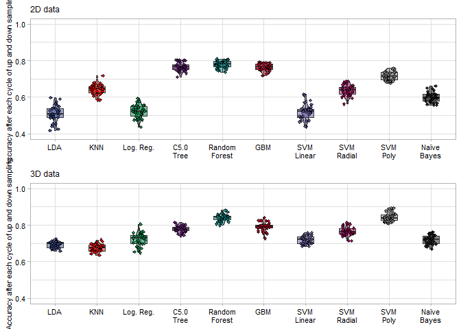
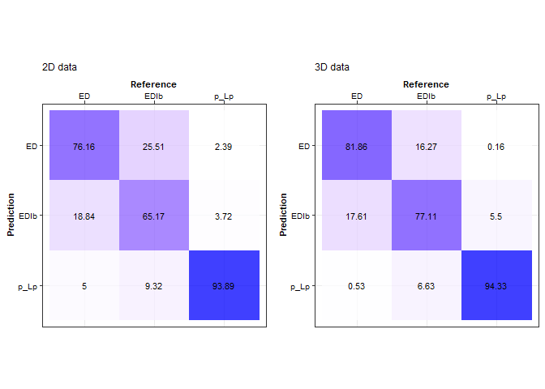
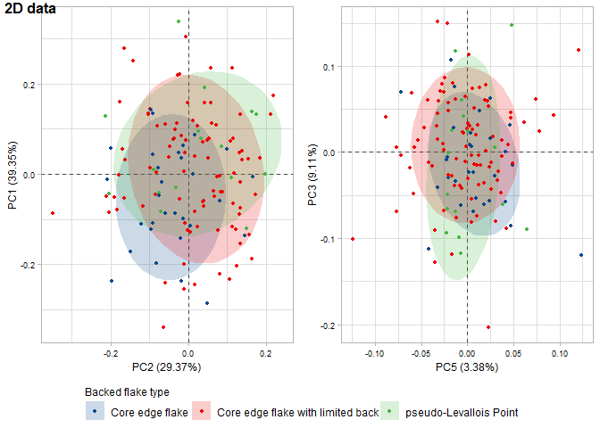
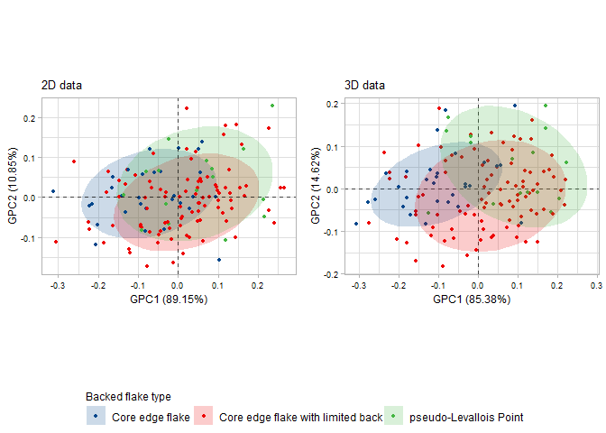

<div align="justify">

# A geometric morphometric approach to testing discrete categories of backed flakes from recurrent centripetal core reduction.

Guillermo Bustos-Pérez $^{(1)}$  
Brad Gravina $^{(2, 3)}$  
Michel Brenet $^{(3, 4)}$  
Francesca Romagnoli $^{(1)}$

$^{(1)}$ Universidad Autónoma de Madrid. Departamento de Prehistoria y
Arqueología, Campus de Cantoblanco, 28049 Madrid, Spain  
$^{(2)}$ Musée national de Préhistoire, MC, 1 rue du Musée, 24260 Les
Eyzies de Tayac, France  
$^{(3)}$ UMR-5199 PACEA, Université de Bordeaux, Bâtiment B8, Allée
Geoffroy Saint Hilaire, CS 50023, 33615 PESSAC CEDEX, France  
$^{(4)}$ INRAP Grand Sud-Ouest, Centre mixte de recherches
archéologiques, Domaine de Campagne, 242460 Campagne, France

**Abstract**

Paleolithic lithic assemblages are usually dominated by flakes, which
display a high degree of morphological variability. When analyzing
Paleolithic lithic assemblages, it is common to classify flakes into
categories based on their morphological and technological features,
which are linked to the position of the flake in a reduction sequence
and how removals are organized in a given production method. For the
analysis of Middle Paleolithic lithic assemblages, two categories of
flakes are commonly used: core edge flakes and pseudo-Levallois points.
A third type, core edge flakes with a limited back, is also commonly
found in the archaeological literature, providing an alternative
category with a definition that does not match the two previous types
but shares many of their morphological and technological features. The
present study addresses whether these three flakes constitute discrete
categories based on their morphological and technological attributes.
Geometric morphometrics are employed on an experimental set composed of
the three categories of flakes to quantify morphological variation.
Machine learning models and principal components biplots are used to
test the discreteness of the categories. The results indicate that
geometric morphometrics succeed in capturing the morphological and
technological features that characterize each type of product.
Pseudo-Levallois points have the highest discreteness of the three
technological products, and while some degree of mixture exists between
core edge flakes and core edge flakes with a limited back, they are also
highly distinguishable. We conclude that the three categories are
discrete and can be employed in technological lists of products for the
analysis of lithic assemblages and that geometric morphometrics is
useful for testing for the validity of categories.

**Key words**: lithic analysis; lithic technology; geometric
morphometrics; machine learning; Middle Paleolithic; Levallois;
discoidal

## 1. Introduction

Lithic artifacts regularly constitute the most important and abundant
remains found on Paleolithic sites. When analyzing lithic assemblages,
in addition to taking metric measurements and noting attributes, it is
common to classify unmodified flakes according to their morphologies and
technological features. This is a crucial part of lithic analysis
because it classifies flakes into technological categories in the sense
that the retained features and morphology are indicative of the
production method by which they were generated. These technological
products usually reflect different knapping strategies, stages of
reduction as well as variations in the organization of removals and
surface exploitation. Well-known examples of technological
classifications of flakes include bipolar/on anvil flakes ([Callahan
1996](#ref-callahan_bipolar_1996); [Hayden
1980](#ref-hayden_confusion_1980)), overshot flakes ([Cotterell and
Kamminga 1987](#ref-cotterell_formation_1987)), bifacial-thinning flakes
([Raab et al. 1979](#ref-raab_debitage_1979)), byproducts of blade
production, such as core tablets or crested blades ([Pelegrin
1995](#ref-pelegrin_technologie_1995); [Shea
2013a](#ref-shea_upper_2013)), kombewa flakes ([Tixier et al.
1980](#ref-tixier_prehistoire_1980); [Tixier and Turq
1999](#ref-tixier_kombewa_1999)) and lateral tranchet blows
([Bourguignon 1992](#ref-bourguignon_analyse_1992)). While the use of
technological categories is common and helps increase the resolution of
lithic analysis, it is important to bear in mind that lithic artifacts
are characterized by a high degree of morphological variability, which,
in many cases, results in overlapping features. Consequently, several
categories remain underused because of this high morphological
variability, their overlapping features, and their similar roles in the
volumetric management of the core along the reduction process.

The Middle Paleolithic in Western Europe is characterized by the
diversification of an increase in knapping methods, resulting in what
are generally flake-dominated assemblages ([Delagnes and Meignen
2006](#ref-hovers_diversity_2006); [S. L. Kuhn
2013](#ref-kuhn_roots_2013)). For the analysis of Middle Paleolithic
lithic assemblages, lists of technological products are common and tend
to reflect individual knapping methods, the organization of flake
removals, and their morphology ([Duran and Abelanet
2004](#ref-duran_mousterien_2004); [Duran and Soler
2006](#ref-duran_variabilite_2006); [Geneste
1988](#ref-rigaud_les_1988); [Shea 2013b](#ref-shea_middle_2013)). These
technological lists are usually dominated by categories of technological
products related to Levallois and discoidal knapping methods ([Boëda et
al. 1990](#ref-boeda_identification_1990); [Boëda
1993](#ref-boeda_debitage_1993), [1995](#ref-dibble_levallois:_1995)),
which constitute an important part of Middle Paleolithic lithic
variability. Various discoidal and Levallois products have been
identified and first appear approximately at 400,000 ka, in a vast area
from eastern Asia to the Atlantic coast of Western Europe through
Siberia and Central Asia, the Levant, Eastern and Central Europe (see
bibliography in [Romagnoli et al.
2022](#ref-romagnoli_neanderthal_2022)), and Africa ([Adler et al.
2014](#ref-adler_early_2014); [Blinkhorn et al.
2021](#ref-blinkhorn_directional_2021)). The identification of discoidal
and Levallois products therefore appears widespread in lithic analysis
across various traditions of lithic studies and is designed to create a
comparable dataset, explore specific technological adaptations in
different ecological contexts, and discuss long-term techno-cultural
traditions and technological change. One special category of such
products are backed flakes that exhibit remnants of the core on one of
their lateral edges. Backed flakes are usually classified into two
technological categories: “core edge flakes” (*eclat débordant*) and
“pseudo-Levallois points”. A third category, “core edge flakes with a
limited back” (*éclat débordant à dos limité*), has also been defined
([Liliane Meignen 1993](#ref-meignen_les_1993); [Lilliane Meignen
1996](#ref-meignen_persistance_1996); [Pasty et al.
2004](#ref-pasty_etude_2004)), although its use is not widespread
([Duran and Abelanet 2004](#ref-duran_mousterien_2004); [Duran and Soler
2006](#ref-duran_variabilite_2006); [Geneste
1988](#ref-rigaud_les_1988); [Shea 2013b](#ref-shea_middle_2013)). One
reason for this may be their overlapping features, morphology, and
having a similar role in core reduction compared to classic core edge
flakes. This usually results in their absorption into the group of core
edge flakes when technological lists of products are employed.

The present study seeks to evaluate whether “core edge flakes with a
limited back” are a discrete category that can be easily separated from
classic core edge flakes and pseudo-Levallois points based on their
morphological features. While it may seem a pleonastic technical
exercise, a refined lithic taxonomy allows researchers to achieve an
improved understanding of lithic technology. The detailed lithic
classification, far to be a redundant and self-seeking exercise, is a
basic step to understand patterns of tool production, transport,
maintenance, use, discard, and reuse. The importance of itemizing lithic
technological classification lies in understanding the differences by
which human groups in the past adapted their technical knowledge and
skills to resource constraints, economic strategies, and social
dynamics. Ultimately, the importance lies in enable researchers to go
from description of lithic items to interpretation of human behaviors.
Furthermore, an improved and comprehensive use of technological types
and sub-types within core trimming elements is mandatory to facilitate
comparisons between archaeological assemblages and guarantee a proper
communal understanding of past technologies. Finally, core edge flakes
are attested during much of prehistoric era being directly related to
centripetal and recurrent core knapping. It means that the proper
definition and classification of types and sub-types within this
technological category will be of use in lithic studies beyond limited
chronological and geographical limits.

To test the discreteness of these categories, an experimental sample of
backed flakes produced by discoidal and recurrent centripetal Levallois
reduction is classified, following their technological definitions.
Geometric morphometrics on 3D meshes are employed to quantify the
morphological variability of the experimental assemblage. To test for
the discreteness of these categories, machine learning algorithms are
employed to classify the flakes according to their technological
category. Our hypothesis is that, although some degree of overlap is
expected due to the high degree of morphological variability among
lithic artifacts, machine learning models should easily differentiate
the above-mentioned categories from one another. Testing this hypothesis
would support the use of these backed flakes categories in the
classification of lithic assemblages.

The following code loads attribute data from the experimental assemblage
and packages employed for the analysis.

``` r
# Load packages
list.of.packages <- c("tidyverse", "caret", "Morpho")
lapply(list.of.packages, library, character.only = TRUE)
```

    ## [[1]]
    ##  [1] "lubridate" "forcats"   "stringr"   "dplyr"     "purrr"     "readr"    
    ##  [7] "tidyr"     "tibble"    "ggplot2"   "tidyverse" "stats"     "graphics" 
    ## [13] "grDevices" "utils"     "datasets"  "methods"   "base"     
    ## 
    ## [[2]]
    ##  [1] "caret"     "lattice"   "lubridate" "forcats"   "stringr"   "dplyr"    
    ##  [7] "purrr"     "readr"     "tidyr"     "tibble"    "ggplot2"   "tidyverse"
    ## [13] "stats"     "graphics"  "grDevices" "utils"     "datasets"  "methods"  
    ## [19] "base"     
    ## 
    ## [[3]]
    ##  [1] "Morpho"    "caret"     "lattice"   "lubridate" "forcats"   "stringr"  
    ##  [7] "dplyr"     "purrr"     "readr"     "tidyr"     "tibble"    "ggplot2"  
    ## [13] "tidyverse" "stats"     "graphics"  "grDevices" "utils"     "datasets" 
    ## [19] "methods"   "base"

``` r
rm(list.of.packages)

# Load attribute data
Att <- read.csv("Data/Attributes data.csv")
```

## 2. Methods

### 2.1 Experimental assemblage

The present study uses an experimental assemblage that was the result of
nine knapping sequences. Seven cores were knapped on Bergerac flint
([Fernandes et al. 2012](#ref-fernandes_silex_2012)) and two cores were
knapped on Miocene flint from South of Madrid ([M. Á. Bustillo et al.
2012](#ref-bustillo_caracterizacion_2012); [M. A. Bustillo and
Pérez-Jiménez 2005](#ref-bustillo_caracteristicas_2005)). Five cores
were knapped following the Discoid “sensu stricto” concept, which
strongly corresponds to Boëda’s original technological definition of the
knapping system ([Boëda 1993](#ref-boeda_debitage_1993),
[1994](#ref-boeda_concept_1994), [1995](#ref-dibble_levallois:_1995)),
and five experimental cores were knapped following the Levallois
recurrent centripetal system ([Boëda 1993](#ref-boeda_debitage_1993),
[1994](#ref-boeda_concept_1994), [1995](#ref-dibble_levallois:_1995);
[Lenoir and Turq 1995](#ref-dibble_recurrent_1995)).

Six technological characteristics define the Levallois concept ([Boëda
1993](#ref-boeda_debitage_1993), [1994](#ref-boeda_concept_1994)): (1)
the volume of the core is conceived as two convex asymmetric surfaces;
(2) these two surfaces are hierarchical and not interchangeable. They
maintain their roles as striking platforms and debitage (or
exploitation) surfaces, respectively, throughout the entire reduction
process; (3) the distal and lateral convexities of the debitage surface
are maintained to obtain predetermined flakes; (4) the fracture plane of
the predetermined products is parallel to the intersection between both
surfaces; (5) the striking platform is perpendicular to the overhang
(the core edge, at the intersection between the two core surfaces); (6)
the technique employed during the knapping process is direct hard-hammer
percussion. Depending on the organization of the debitage surface
Levallois cores are usually classified into the preferential method
(where a single predetermined Levallois flake is obtained from the
debitage surface) or recurrent methods (where several predetermined
flakes are produced from the debitage surface), with removals being
either unidirectional, bidirectional, or centripetal ([Boëda et al.
1990](#ref-boeda_identification_1990); [Boëda
1995](#ref-dibble_levallois:_1995); [Delagnes
1995](#ref-dibble_variability_1995); [Delagnes and Meignen
2006](#ref-hovers_diversity_2006)).

According to Boëda ([1993](#ref-boeda_debitage_1993),
[1994](#ref-boeda_concept_1994), [1995](#ref-dibble_levallois:_1995)),
there are six technological criteria that define the Discoid “sensu
stricto” method: (1) the volume of the core is conceived as two oblique
asymmetric convex surfaces delimited by an intersecting plane; (2) these
two surfaces are not hierarchical, with it being possible to alternate
between the roles of striking platforms and exploitation surfaces; (3)
the peripheral convexity of the debitage surface is managed to control
lateral and distal extractions, thus allowing for a degree of
predetermination; (4) the surfaces of the striking platforms are
oriented in such a way that the core edge is perpendicular to the
predetermined products; (5) the fracture planes of the products are
secant; (6) the technique employed is direct hard-hammer percussion.

A total of 139 unretouched backed flakes (independent of the type of
termination) were obtained from the different experimental reduction
sequences, 70 from discoidal reduction sequences and 69 from Levallois
recurrent centripetal reduction sequences. The following criteria were
followed for the classification of backed flakes:

Core edge flakes / *eclat débordant* ([Beyries and Boëda
1983](#ref-beyries_etude_1983); [Boëda et al.
1990](#ref-boeda_identification_1990); [Boëda
1993](#ref-boeda_debitage_1993)) have a cutting edge opposite and
usually (although not always) parallel to an abrupt margin. This abrupt
margin, or backed edge (dos), commonly results from the removal of a
portion of the periphery of the core and can be plain, bear the scars
from previous removals, be cortical, or present a mix of the three.
Classic “core edge flakes” ([Boëda et al.
1990](#ref-boeda_identification_1990); [Boëda
1993](#ref-boeda_debitage_1993)), which are sometimes referred as “core
edge flakes with non-limited back” / *“éclat débordant à dos non
limité”* ([Duran 2005](#ref-duran_lindustrie_2005); [Duran and Soler
2006](#ref-duran_variabilite_2006)) have a morphological axis that
follows the axis of percussion, although it may deviate slightly
([Beyries and Boëda 1983](#ref-beyries_etude_1983)).  
“Core edge flakes with a limited back” / *“éclat débordant à dos
limité”* share with core edge flakes the morphological feature of having
a cutting edge opposite a back. However, the main difference resides in
their having a morphological axis clearly offset in respect to the axis
of percussion ([Liliane Meignen 1993](#ref-meignen_les_1993); [Lilliane
Meignen 1996](#ref-meignen_persistance_1996); [Pasty et al.
2004](#ref-pasty_etude_2004)). Because of this deviation from the axis
of percussion, the backed edge is usually not completely parallel and
does not span the entire length of the sharp edge.  
Pseudo-Levallois points ([Boëda et al.
1990](#ref-boeda_identification_1990); [Boëda
1993](#ref-boeda_debitage_1993); [Bordes
1953](#ref-bordes_notules_1953), [1961](#ref-bordes_typologie_1961);
[Slimak 2003](#ref-peresani_les_2003)) are backed products in which the
edge opposite the back has a triangular morphology. This triangular
morphology is usually the result of the convergence of two or more
removals. As with core edge flakes, the back usually results from the
removal of one of the lateral edges of the core and can be plain, retain
the scars from previous removals, or more rarely be cortical.
Pseudo-Levallois points share with core edge flakes with a limited back
the deviation of symmetry from the axis of percussion, but they are
clearly differentiable due to their triangular off-axis morphology.

The following table presents the distribution of backed flakes types,
following the previously established definitions. Due to the centripetal
nature of the knapping methods employed to generate the experimental
assemblage, most of the backed flakes fall within the definition of core
edge flakes with a limited back (66.91%). Cortex distribution according
to backed flake category shows that slightly (\~25%) or non-cortical
products dominate among the three categories, adding up to more than 65%
in the three cases (90% core edge flakes, 68.82% core edge flakes with a
limited back, and 87.5% pseudo-Levallois points).

``` r
Att %>% group_by(Strategy, ARTIFACTTYPE) %>% 
  summarise(
    Count = n(),
    Percent = (Count/139)*100)
```

    ## # A tibble: 6 × 4
    ## # Groups:   Strategy [2]
    ##   Strategy  ARTIFACTTYPE                Count Percent
    ##   <chr>     <chr>                       <int>   <dbl>
    ## 1 Discoid   Core Edge Flake                11    7.91
    ## 2 Discoid   Core edge with limited back    47   33.8 
    ## 3 Discoid   pseudo-Levallois Point         12    8.63
    ## 4 Levallois Core Edge Flake                19   13.7 
    ## 5 Levallois Core edge with limited back    46   33.1 
    ## 6 Levallois pseudo-Levallois Point          4    2.88


``` r
# Cortex per class
Att %>% group_by(ARTIFACTTYPE) %>% 
  count(CORTEX) %>% 
  mutate(Percentage = round(n/sum(n)*100, 2)) %>% 
  
  ggplot(aes(CORTEX, Percentage, fill = ARTIFACTTYPE)) +
  geom_col(position = "dodge") +
  ggsci::scale_fill_aaas(alpha = 0.95) +
  xlab(NULL) +
  geom_text(aes(label = paste0(Percentage, "%")), 
            vjust= -0.2, size = 2.65,
            position = position_dodge(.9)) +
  geom_text(aes(label = paste("n =", n)), 
            vjust= "top", size = 2.65,
            position = position_dodge(.9)) +
  labs(fill = NULL) +
  
  theme_classic() +
  theme(
    legend.position = "bottom",
    axis.text = element_text(color = "black", size = 8))
```

<!-- -->

### 2.2 Geometric Morphometrics

All flakes were scanned with an Academia 20 structured light surface
scanner (Creaform 3D) at a 0.2 mm resolution. Flakes were scanned in two
parts, automatically aligned (or manually aligned in the case automatic
alignment failure), and exported in STL format. Cloudcompare 2.11.3
(<https://www.danielgm.net/cc/>) free software was employed to perform
additional cleaning, mesh sampling, surface reconstruction and
transformation into PLY files. Finally, all files were decimated to a
quality of 50,000 faces using the Rvcg R package ([Schlager
2017](#ref-schlager_morpho_2017)). The present work compares the use of
2D and 3D geometric morphometrics.

Performance of 2D geometric morphometrics was done using screenshots of
the upper view of each flake orientated along the technological axis and
using free software MeshLab ([Cignoni et al.
2008](#ref-cignoni_meshlab_2008)). One thin-plate spline (tps) was
generated using tpsUtil v.1.82, and the tpsDig v.2.32 ([Rohlf
2015](#ref-rohlf_tps_2015)) outline tool was employed to automatically
trace the perimeter of each flake. Each outline was resampled to 100
equidistant landmarks (Figure 3) using Morpho v.2.11 ([Schlager
2017](#ref-schlager_morpho_2017)).

The following code sources the [21 Muggle 2D
data](Scripts/21%20Muggle%202D%20data.R) code. This code has been
written to import the [2D-Upper-view.tps](Data/2D-Upper-view.tps) file.
The file contains a landmark per pixel that defines the perimeter of the
flake. After reading the file, the perimeter of each specimen is
resampled to have 100 landmarks, and procrustes alignment is performed.
A *nosymproc* ([Schlager 2017](#ref-schlager_morpho_2017)) object called
**Coord.2D** is created, which contains the orientated coordinates, mean
shape and results from PC analysis.

``` r
source("Scripts/21 Muggle 2D data.R")
```

``` r
# Plot landmarks of first specimen and mean shape
ggpubr::ggarrange(
  (
    data.frame(Coord.2D$rotated[1:100, 1:2, 1]) %>% 
      ggplot(aes(X2, X1)) +
      geom_point() +
      xlab("y coord") +
      ylab("x coord") +
      coord_fixed() +
      theme_light() +
      scale_x_reverse() +
      ggtitle(label = "First specimen") +
      theme(
        axis.text = element_text(size = 6, color = "black"),
        axis.title = element_text(size = 8, color = "black"),
        plot.title = element_text(hjust = 0.5, vjust = 1, size = 9))
    ),
  
  (
    data.frame(Coord.2D$mshape) %>% 
      ggplot(aes(X2, X1)) +
      geom_point() +
      xlab("y coord") +
      ylab("x coord") +
      coord_fixed() +
      theme_light() +
      scale_x_reverse() +
      ggtitle(label = "Average shape of the sample") +
      theme(
        axis.text = element_text(size = 6, color = "black"),
        axis.title = element_text(size = 8, color = "black"),
        plot.title = element_text(hjust = 0.5, vjust = 1, size = 9))),
  ncol = 2)
```

<!-- -->

The protocol for the digitalizing 3D landmarks on flakes is based on
previous studies ([Archer et al. 2018](#ref-archer_geometric_2018),
[2021](#ref-archer_quantifying_2021)). This included the positioning of
a total of three fixed landmarks, 85 curve semi-landmarks, and 420
surface semi-landmarks ([Bookstein 1997a](#ref-bookstein_landmark_1997),
[1997b](#ref-bookstein_morphometric_1997); [Gunz et al.
2005](#ref-gunz_semilandmarks_2005); [Gunz and Mitteroecker
2013](#ref-gunz_semilandmarks_2013); [Mitteroecker and Gunz
2009](#ref-mitteroecker_advances_2009)). This resulted in a total of 508
landmarks and semi-landmarks. The three fixed landmarks correspond to
both laterals of the platform and the percussion point. The 85 curve
semi-landmarks correspond to the internal and exterior curve outlines of
the platform (15 semi-landmarks each) and the edge of the flake (55
semi-landmarks). Sixty surface semi-landmarks correspond to the platform
surface. The dorsal and ventral surfaces of the flakes are defined by
180 semi-landmarks each. The workflow for digitalizing landmarks and
semi-landmarks included the creation of a template/atlas on an arbitrary
selected flake. After this, landmarks and semi-landmarks were positioned
in each specimen and relaxed to minimize bending energy ([Bookstein
1997a](#ref-bookstein_landmark_1997),
[1997b](#ref-bookstein_morphometric_1997)). A complete workflow of
landmark and semi-landmark digitalization and relaxation to minimize
bending energy was created in Viewbox Version 4.1.0.12
(<http://www.dhal.com/viewbox.htm>), and the resulting point coordinates
were exported into .xlsx files.

Procrustes superimposition ([Kendall 1984](#ref-kendall_shape_1984);
[Mitteroecker and Gunz 2009](#ref-mitteroecker_advances_2009);
[O’Higgins 2000](#ref-ohiggins_study_2000)) was performed using the
Morpho v.2.9 package ([Schlager 2017](#ref-schlager_morpho_2017)) on
RStudio IDE ([R. C. Team 2019](#ref-r_core_team_r_2019); [Rs. Team
2019](#ref-rstudio_team_rstudio_2019)). After performing Procrustes
superimposition and obtaining a new set of coordinates, principal
component analysis (PCA) was performed to reduce the dimensionality of
the data ([James et al. 2013](#ref-james_introduction_2013); [Pearson
1901](#ref-pearson_lines_1901)). There are multiple reasons to use
dimensionality reduction when dealing with high-dimension data on
classification: to avoid having more predictors than observations (p \>
n), avoid collinearity of predictors, reduce the dimensions of the
feature space, and avoid overfitting due to an excessive number of
degrees of freedom (simple structure with lower number of variables).
Principal component analysis achieves dimensionality reduction by
identifying the linear combinations that best represent the predictors
on an unsupervised manner. The principal components (PCs) of a PCA aim
to capture as high a variance as possible for the complete data ([James
et al. 2013](#ref-james_introduction_2013)), and PCs that capture the
highest variance need not necessarily be the best for classification.
For the present work, PCs that represent 95% of variance are selected as
predictors for training the machine learning models. The threshold of
95% of variance is arbitrarily selected because it balances retaining
most of the dataset variance with a reduced number of variables. The
identification of best PCs for classification is performed automatically
by the machine learning models using the caret v.6.0.92 package ([M.
Kuhn 2008](#ref-kuhn_building_2008)).


#### 2.2.1 Performance of procrustes, PCA and model training

The following code sources the [22 Muggle 2D
data](Scripts/22%20Muggle%203D%20data.R) script. The [22 Muggle 2D
data](Scripts/22%20Muggle%203D%20data.R) loads all *.csv* files
containing 3D coordinates, performs procrustes alignment using Morpho
([Schlager 2017](#ref-schlager_morpho_2017)), and renames each specimen
using the name of the *.csv* file on which they were stored.

A *nosymproc* ([Schlager 2017](#ref-schlager_morpho_2017)) object called
**Coord.3D** is created into the [Data](Data) folder. The *nosymproc*
contains the orientated coordinates, mean shape and results from PC
analysis.

``` r
# Source over 3D data
source("Scripts/22 Muggle 3D data.R")
```

### 2.3 Machine learning and resampling techniques

Different machine learning models treat the provided data differently.
As a result, different models have different strengths and weaknesses.
No universal model exists for all problems. Thus, testing several models
is an important step in machine learning. It allows to compare the
performance of different models, identify the best model for the given
task, it provides a general overview of the difficulty or ease of the
problem, and it can serve as indication of possible underlying problems
with the data (such as overfitting, or unbalanced datasets). Machine
learning is a quickly developing field were a high number of models
exists. The present work tests ten machine learning models for the
classification of flake categories. These models cover some of the most
commonly employed algorithms ([Jamal et al.
2018](#ref-jamal_machine_2018)) and provide an extensive analysis for
the classification of backed flake categories.

- **Linear discriminant analysis (LDA):** reduces dimensionality in an
  attempt to maximize the separation between classes, while decision
  boundaries divide the predictor range into regions ([Fisher
  1936](#ref-fisher_use_1936); [James et al.
  2013](#ref-james_introduction_2013)).  
- **K-nearest neighbor (KNN):** classifies cases by assigning the class
  of similar known cases. The “k” in KNN references the number of cases
  (neighbors) to consider when assigning a class, and it must be found
  by testing different values. Given that KNN uses distance metrics to
  compute nearest neighbors and that each variable is in different
  scales, it is necessary to scale and center the data prior to fitting
  the model ([Cover and Hart 1967](#ref-cover_nearest_1967); [Lantz
  2019](#ref-lantz_machine_2019)).  
- **Logistic regression:** essentially adapts the multiple linear
  regression by raising Euler’s constant to its output in the numerator
  (plus one in the case of the denominator). This results in probability
  values ranging from 0 to 1which allows obtaining predictions for
  categorical outcomes ([Cramer 2004](#ref-cramer_early_2004); [Walker
  and Duncan 1967](#ref-walker_estimation_1967)).  
- **Decision tree with C5.0 algorithm:** uses recursive partitioning to
  divide a dataset into homogeneous groups. The C5.0 algorithm uses
  entropy (measure of degree of mixture between classes) to determine
  feature values on which to perform the partitioning. The C5.0
  algorithm is an improvement on decision trees for classification
  ([J. R. Quinlan 1996](#ref-quinlan_improved_1996); [J. Ross Quinlan
  2014](#ref-quinlan_c4_2014)).  
- **Random forest:** uses an ensemble of decision trees. Each tree is
  grown from a random sample of the variables, allowing for each tree to
  grow differently and better reflect the complexity of the data and
  provide additional diversity. Finally, the ensemble of trees casts a
  vote to generate predictions ([Breiman
  2001](#ref-breiman_random_2001)).  
- **• Gradient Boosting Machine (GBM):** uses a sequential ensemble of
  decision trees. After training an initial decision tree, GBM trains
  subsequent trees on a resampled dataset were the weight of
  observations difficult to classify is increased based in a gradient
  ([Greenwell et al. 2019](#ref-greenwell_package_2019); [Ridgeway
  2007](#ref-ridgeway_generalized_2007)) The subsequent trained trees
  complement decisions and allow for the detection of learning
  deficiencies and increase model accuracy ([Friedman
  2001](#ref-friedman_greedy_2001),
  [2002](#ref-friedman_stochastic_2002)).  
- **Supported vector machines (SVM):** fits hyperplanes into a
  multidimensional space with the objective of creating homogeneous
  partitions. The fitting of the hyperplanes is done in order to obtain
  the maximum margin of separation between classes. The maximum margin
  of separation is reached by minimizing the cost (value applied for
  each incorrect classification). SVM’s can use different kernels in
  order to transform data into linearly separable cases. The kernel
  selected for the transformations needs to be specified and plays a key
  role in the training of a SVM model ([Cortes and Vapnik
  1995](#ref-cortes_support-vector_1995); [Frey and Slate
  1991](#ref-frey_letter_1991)). The present study tests SVM’s with
  linear, radial, and polynomial kernels.
- **Naïve Bayes:** computes class probabilities using Bayes’s rule
  ([Weihs et al. 2005](#ref-weihs_klar_2005)).

As mentioned above, 66.91% of flakes fall into the definition of core
edge flakes with a limited back, resulting in an unbalanced dataset. To
counter the unbalanced nature of the experimental dataset, up-sampling
was undertaken for the two minority classes, and down-sampling was
undertaken for the majority class. Up-sampling categories in a dataset
can be considered inappropriate for training machine learning models
because it increases the overfit (samples used in the test set to
evaluate the model are likely to have already been used in the training
set). However, here, the up-sampling of the two minority groups
increases the discreteness of these groups but does not affect the
potential overlap with the majority class (core edge flakes with limited
backs). On the other hand, down-sampling results in missing information
because some of the data are removed.

Random up- and down-sampling is conducted to obtain a balanced dataset
and train the models. Because model performance metrics depend on random
up- and down-sampling, this process is repeated 30 times, extracting
model performance metrics each time and averaging the values. The model
with the best performance metrics is then trained again with thirty
cycles of up- and down-sampling. The reported variable importance and
confusion matrix from which model metric performance are extracted are
obtained from these additional cycles of down- and up-sampling.

3D meshes and data from landmark positioning and Procrustes alignment
are already publicly available through the repository of a previous
publication using the same experimental collection ([Bustos-Pérez et al.
2022](#ref-bustos-perez_combining_2022);
[**bustos-perez_research_2022?**](#ref-bustos-perez_research_2022)).

#### 2.3.1 Trainign of Machine Learning models

As mentioned previously, this is a unbalanced data set. Balancing to
train the models correctly is done using the `groupdata2` v2.0.2 package
using the parameter **“mean”** for size. This means that each group will
be up or down sampled to the result of dividing data set size between
number of groups.

- A `tibble()` called `All_Results` is set to store the results from
  each model training.

Each loop works in the following steps:

1.  The original data set is randomly up and down sampled for each
    target category.  
2.  Model is trained following the provided hyperparameters and data
    pre-processing.  
3.  Results from the trained model are extracted and binned to the
    `All_Results` tibble.  
4.  Steps 1 to 3 are repeated 30 times per model.

``` r
source("Report/Scripts/31 Models on 2D data.R")
source("Report/Scripts/31 Models on 3D data.R")
```

Models trained are exported to their respective [2D Results Up and Down
sampling](Report/Data/2D%20Results%20Up%20and%20Down%20sampling.RData)
and [3D Results Up and Down
sampling](Report/Data/3D%20Results%20Up%20and%20Down%20sampling.RData)
files.

After determining the best model for each type of data, another loop is
repeated in order to extract variable importance and predictions in
order to construct the confusion matrix. The following code sources the
R files that train and extract the necessary information.

``` r
source("33 Loop over best model of 2D data.R")
source("34 Loop over best model of 3D data.R")
```

## 3. Results

### 3.1 PCA and machine learning model performance

Results from the PCA on the 2D data show that the nine first principal
components account for 95% of the variance in the dataset, with PC1
accounting for 39.33% of variance and PC9 for 0.98% of variance. For the
3D data the 22 first principal components account for 95% of variance,
with PC1 accounting for 31.32% and PC22 accounting for 0.3% of variance.
This represents a substantial reduction in dimensionality from the
original number of variables of the 2D data (200 original variables) and
the 3D data (1,524 original variables) and is lower than the sample size
(139).

``` r
load("Data/2D Data.RData")
load("Data/3D Data.RData")

ggpubr::ggarrange(
  (as.data.frame(Coord.2D$Variance) %>% 
    mutate(PC = paste("PC", rownames(as.data.frame(Coord.2D$Variance)))) %>%
    filter(`Cumulative %` <= 96) %>% 
    
    ggplot(aes(`% Variance`, reorder(PC, `% Variance`))) +
    geom_col(fill = "blue", alpha = 0.65) +
    geom_text(aes(label = round(`% Variance`, 2)), hjust = "bottom",  size = 2.25) +
    theme_bw() +
    scale_x_continuous(breaks = seq(0, 45, 5), lim = c(0, 45)) +
    ylab(NULL) +
     ggtitle(label = "2D data") +
    theme(
      axis.title = element_text(size = 7, color = "black", face = "bold"),
      axis.text = element_text(size = 7, color = "black"),
      plot.title = element_text(hjust = 0.5, vjust = 1, size = 9))),
  
  (as.data.frame(Coord.3D$Variance) %>% 
    mutate(PC = paste("PC", rownames(as.data.frame(Coord.3D$Variance)))) %>%
    filter(`Cumulative %` <= 96) %>% 
    
    ggplot(aes(`% Variance`, reorder(PC, `% Variance`))) +
    geom_col(fill = "blue", alpha = 0.65) +
    geom_text(aes(label = round(`% Variance`, 2)), hjust = "bottom",  size = 2.25) +
    theme_bw() +
    scale_x_continuous(breaks = seq(0, 40, 5), lim = c(0, 40)) +
    ylab(NULL) +
     ggtitle(label = "3D data") +
    theme(
      axis.title = element_text(size = 7, color = "black", face = "bold"),
      axis.text = element_text(size = 7, color = "black"),
      plot.title = element_text(hjust = 0.5, vjust = 1, size = 9))),
  ncol = 2)
```

<!-- -->

The following figure presents the accuracy values for each model after
their respective 30 cycles of random up- and down-sampling. On general,
models trained on 3D data presented higher overall precision metrics.  
In the case of the 2D data, the random forest model had the highest
average value for general accuracy (0.779), closely followed by the
decision tree (0.767) and the GBM (0.765). The LDA had the lowest
average value for accuracy (0.511), followed by the logistic regression
(0.522).

For the 3D data, supported vector machines with a polynomial kernel had
the highest average value for general accuracy (0.844), closely followed
by the random forest model (0.840). The K-nearest neighbor model had the
lowest average value for accuracy (0.676), followed by LDA model
(0.694). The minimum accuracy value of SVM with a polynomial kernel is
0.807, indicating a high accuracy, even when up- and down-sampling
result in different objects.

``` r
load("Data/2D Results Up and Down sampling.RData")
load("Data/3D Results Up and Down sampling.RData")

ggpubr::ggarrange(
  (
    Models.2D %>% 
      ggplot(aes(Model, Accuracy, fill = Model)) +
      geom_violin(position = position_dodge(1), width = 0.4, alpha = 0.5) +
      geom_boxplot(width = 0.4,
                   outlier.shape = NA, alpha = 0.5) +
      geom_jitter(width = 0.15, alpha = 0.9, size = 0.9, shape = 23, aes(fill = Model)) +
      scale_y_continuous(breaks = seq(0.4, 1, 0.2), lim = c(0.4, 1)) +
      theme_light() +
      ylab("Accuracy after each cycle of up and down sampling") +
      ggsci::scale_fill_aaas() +
      ggtitle(label = "2D data") +
      scale_x_discrete(labels = c(
        "LDA", "KNN", "Log. Reg.",
        "C5.0\nTree", "Random\nForest", "GBM",
        "SVM\nLinear", "SVM\nRadial",
        "SVM\nPoly",
        "Naïve\nBayes")) +
      xlab(NULL) +
      theme(
        legend.position = "none",
        axis.text = element_text(color = "black", size = 8),
        axis.title = element_text(color = "black", size = 8.5),
        plot.title = element_text(hjust = 0, vjust = 1, size = 9))
  ),
  (
    Models.3D %>% 
      ggplot(aes(Model, Accuracy, fill = Model)) +
      geom_violin(position = position_dodge(1), width = 0.4, alpha = 0.5) +
      geom_boxplot(width = 0.4,
                   outlier.shape = NA, alpha = 0.5) +
      geom_jitter(width = 0.15, alpha = 0.9, size = 0.9, shape = 23, aes(fill = Model)) +
      scale_y_continuous(breaks = seq(0.4, 1, 0.2), lim = c(0.4, 1)) +
      theme_light() +
      ylab("Accuracy after each cycle of up and down sampling") +
      ggtitle(label = "3D data") +
      ggsci::scale_fill_aaas() +
      scale_x_discrete(labels = c(
        "LDA", "KNN", "Log. Reg.",
        "C5.0\nTree", "Random\nForest", "GBM",
        "SVM\nLinear", "SVM\nRadial",
        "SVM\nPoly",
        "Naïve\nBayes")) +
      xlab(NULL) +
      theme(
        legend.position = "none",
        axis.text = element_text(color = "black", size = 8),
        axis.title = element_text(color = "black", size = 8.5),
        plot.title = element_text(hjust = 0, vjust = 1, size = 9))
        ),
  nrow = 2)
```

<!-- -->

The following tables present performance metrics of the random forest
model (on 2D data) and SVM with a polynomial kernel (on 3D data) for the
classification of the three products. The prevalence/no information
ratio was kept constant at 0.33 for all three categories as a result of
random up- and down-sampling to obtain balanced datasets. General
performance metrics values (F1 and balance accuracy) of pseudo-Levallois
points and core edge flakes were similar for models trained on the 2D
and 3D data. General performance metrics for the identification of core
edge flakes with a limited back did increase when 3D data was employed
instead of 2D data.

``` r
load("Data/Best model 2D varimp and cm.RData")
load("Data/Best model 3D varimp and cm.RData")

# Performance metrics of RF on 2D data
confusionMatrix(RF.Predictions$pred, RF.Predictions$obs)[[4]]
```

    ##             Sensitivity Specificity Pos Pred Value Neg Pred Value Precision
    ## Class: ED     0.7615797   0.8604710      0.7318395      0.8783174 0.7318395
    ## Class: EDlb   0.6516957   0.8872101      0.7428633      0.8359164 0.7428633
    ## Class: p_Lp   0.9388986   0.9284058      0.8676738      0.9681417 0.8676738
    ##                Recall        F1 Prevalence Detection Rate Detection Prevalence
    ## Class: ED   0.7615797 0.7464135  0.3333333      0.2538599            0.3468792
    ## Class: EDlb 0.6516957 0.6942995  0.3333333      0.2172319            0.2924251
    ## Class: p_Lp 0.9388986 0.9018822  0.3333333      0.3129662            0.3606957
    ##             Balanced Accuracy
    ## Class: ED           0.8110254
    ## Class: EDlb         0.7694529
    ## Class: p_Lp         0.9336522

``` r
# Performance metrics of SVMP on 3D data
confusionMatrix(SVMP.Predictions$pred, SVMP.Predictions$obs)[[4]]
```

    ##             Sensitivity Specificity Pos Pred Value Neg Pred Value Precision
    ## Class: ED     0.8185797   0.9178478      0.8328345      0.9100596 0.8328345
    ## Class: EDlb   0.7710580   0.8844130      0.7693409      0.8854011 0.7693409
    ## Class: p_Lp   0.9433188   0.9642174      0.9294843      0.9714469 0.9294843
    ##                Recall        F1 Prevalence Detection Rate Detection Prevalence
    ## Class: ED   0.8185797 0.8256456  0.3333333      0.2728599            0.3276280
    ## Class: EDlb 0.7710580 0.7701985  0.3333333      0.2570193            0.3340773
    ## Class: p_Lp 0.9433188 0.9363505  0.3333333      0.3144396            0.3382947
    ##             Balanced Accuracy
    ## Class: ED           0.8682138
    ## Class: EDlb         0.8277355
    ## Class: p_Lp         0.9537681

### 3.2 Feature importance

The following figure presents average variable importance for the three
products after 30 cycles of up- and down-sampling and k-fold
cross-validation. The random forest trained on 2D data consider four
sets of principal components important in terms of classification. The
SVM with polynomial kernel trained on 3D data considers five sets of
principal components in terms of classification.

``` r
# Variable importance 
SVMP.varImport$Mean.Imp <- rowMeans(SVMP.varImport[,2:4])

SVMP.varImport <- SVMP.varImport %>% group_by(PCs) %>% 
  summarise(Importance = mean(Mean.Imp)) 

ggpubr::ggarrange(
  (
    RF.varImport %>% group_by(PCs) %>% 
      summarise(
        Importance = mean(Overall)) %>% 
      top_n(15, Importance) %>% 
      ggplot(aes(Importance, reorder(PCs, Importance), fill = Importance)) +
      geom_bar(stat= "identity", position = "dodge") +
      geom_text(aes(label = round(Importance, 2)), 
                position = position_stack(vjust = 0.5), size = 2) +
      scale_fill_gradient(low = "red", high = "blue") +
      guides(fill = "none") +
      ylab(NULL) +
      theme_light() +
      labs(title = "2D data") +
      theme(
        axis.text.y = element_text(color = "black", size = 7),
        axis.text.x = element_text(color = "black", size = 7),
        axis.title.x = element_text(color = "black", size = 7),
        plot.title = element_text(color = "black", size = 7))
  ),
  (
    SVMP.varImport %>% select(Importance, PCs) %>% 
      top_n(15, Importance) %>% 
      ggplot(aes(Importance, reorder(PCs, Importance), fill = Importance)) +
      geom_bar(stat = "identity", position = "dodge") +
      geom_text(aes(label = round(Importance, 2)), 
                position = position_stack(vjust = 0.5), size = 2) +
      scale_fill_gradient(low = "red", high = "blue") +
      guides(fill = "none") +
      ylab(NULL) +
      theme_light() +
      labs(title = "3D data") +
      theme(
        axis.text.y = element_text(color = "black", size = 7),
        axis.text.x = element_text(color = "black", size = 7),
        axis.title.x = element_text(color = "black", size = 7),
        plot.title = element_text(color = "black", size = 7))
  ),
  ncol = 2)
```

<!-- -->

PC2 (29.38% of variance) is considered the most important variable for
discrimination when using the 2D data, followed by PC1 (39.33% of
variance), PC5 (3.38% of variance) and PC3 (9.12% of variance). The
following figure presents shape change according to these PCs. PC1 and
PC2 capture the elongation of flakes along an asymmetric axis, but with
different orientation. Positive values of PC1 or PC2 result in wider
flakes. PC3 captures variance of flakes were the proximal part is much
wider than the distal portion of the flake. PC5 appears to capture
pointed extremes resulting from concave delineations of the middle
portion of the laterals. This might be representing the presence of
convergent extremes at either end of the flake.


In the case of 3D data, PC5 (5.5% of variance) is considered the most
important variable for discrimination, followed by PC1 (31.32% of
variance), PC6 (5.06% of variance), PC11 (1.45% of variance) and PC3
(8.82% of variance).  
PC5 is driven by the interaction of platform depth and flake thickness.
Increasing values of PC5 result in flakes with platforms much wider than
deep, with the width of the platform finding their continuation in one
of the abrupt laterals. Increasing PC5 values also result in thinner
flakes. The negative space of PC5 captures flakes with platforms much
more deep than wide and thicker flakes. PC1 largely captures elongation
along with platform size and thickness. Positive PC1 values result in
very wide flakes with a reduced length and bigger platforms. This
increase in width is slightly accompanied with an increase in thickness.
Negative space values result in thin elongated flakes with a distal
convergent edge and small platforms. Positive values of PC6 represent
the convergence of one of the distal laterals into a pointed end. The
negative space of PC6 results in flakes with a wide proximal portion
which becomes narrower in the towards the distal part of the flake. PC3
represents transversal flake morphology and the relationship between
thickness, width and asymmetry. Increasing values of PC3 result in
thicker and narrower flakes with a marked asymmetry which results from a
thick back located at the left lateral.


### 3.3 Group discreteness through confusion matrix and PCA biplots

The confusion matrixes illustrate the directionality of confusion
between the predicted and true values of classified technological
products for the 2D and 3D data. In both types of data pseudo-Levallois
points have the best identification, in accordance with the reported
sensitivity and specificity. In general, it is very difficult to mistake
pseudo-Levallois points for any of the two considered technological
products. Wrongly considering a pseudo-Levallois point a core edge flake
is very unlikely for the 2D data (2.39) and residual for the model on 3D
data (0.21). Although mistaking a pseudo-Levallois point for a core edge
flake with a limited back is slightly more common for both types of
data, there is still a very low confusion value.

Core edge flakes and core edge flakes with a limited back offer slightly
higher frequencies of misidentifications, although they maintain high
values for sensitivity and specificity for both types of data. For the
Random Forest model based on the 2D data it is more common to mislabel
core edge flakes with a limited back as core edge flakes (25.51) than
the reverse (18.84).

In the case of the SVM with polynomial kernel based on 3D data, the
confusion between both categories diminishes lightly and it is balanced
(17.61 and 16.27). On general, the 3D data identifies better core edge
flakes with a limited back and core edge flakes than the model based on
the 2D data. This greater precision is the result of a lower frequency
in the incorrect identification of core edge flakes with a limited back
as core edge flakes. The incorrect identification of backed flakes as
pseudo-Levallois points is slightly more common when 2D data is
employed. Their incorrect identification as pseudo-Levallois flakes is
minimal in the case of the 3D data, although this incorrect
identification has a higher frequency in core edge flakes with a limited
back (6.63) than in core edge flakes (0.53).

``` r
#### Confusion Matrix 2D ####
CFM.2D <- confusionMatrix(RF.Predictions$pred, RF.Predictions$obs)$table
CFM.2D <- reshape2::melt(CFM.2D)

CFM.2D <- CFM.2D %>% mutate(
  Value = case_when(
    Reference == "ED" ~ (value/sum(confusionMatrix(RF.Predictions$pred, RF.Predictions$obs)$table[1:3]))*100,
    Reference == "EDlb" ~ (value/sum(confusionMatrix(RF.Predictions$pred, RF.Predictions$obs)$table[4:6]))*100,
    Reference == "p_Lp" ~ (value/sum(confusionMatrix(RF.Predictions$pred, RF.Predictions$obs)$table[7:9]))*100)
)

#### Confusion matrix 3D data ####
CFM <- confusionMatrix(SVMP.Predictions$pred, SVMP.Predictions$obs)$table
CFM <- reshape2::melt(CFM)

x <- data.frame(confusionMatrix(SVMP.Predictions$pred, SVMP.Predictions$obs)[[4]])
xlsx::write.xlsx(x,
                 file = "svmpoly results.xlsx")

# Normalize the confusion matrix
CFM <- CFM %>% mutate(
  Value = case_when(
    Reference == "ED" ~ (value/sum(confusionMatrix(SVMP.Predictions$pred, SVMP.Predictions$obs)$table[1:3]))*100,
    Reference == "EDlb" ~ (value/sum(confusionMatrix(SVMP.Predictions$pred, SVMP.Predictions$obs)$table[4:6]))*100,
    Reference == "p_Lp" ~ (value/sum(confusionMatrix(SVMP.Predictions$pred, SVMP.Predictions$obs)$table[7:9]))*100)
)

#### Plot both confusion matrixes ####
ggpubr::ggarrange(
  (
    CFM.2D %>% 
      ggplot(aes(Reference, Prediction, fill = Value)) + 
      geom_tile(alpha = 0.75) +
      geom_text(aes(label = round(Value, 2)), size = 3) +
      scale_fill_gradient(low = "white", high = "blue")  +
      scale_x_discrete(position = "top") +
      scale_y_discrete(limits=rev) +
      theme_bw() +
      coord_fixed() +
      ggtitle(label = "2D data") +
      theme(legend.position = "none",
            axis.title = element_text(size = 8, color = "black", face = "bold"),
            axis.text = element_text(size = 7.5, color = "black"),
            plot.title = element_text(hjust = 0, vjust = 1, size = 9))),
  
  (
    CFM %>% 
      ggplot(aes(Reference, Prediction, fill = Value)) + 
      geom_tile(alpha = 0.75) +
      geom_text(aes(label = round(Value, 2)), size = 3) +
      scale_fill_gradient(low = "white", high = "blue")  +
      scale_x_discrete(position = "top") +
      scale_y_discrete(limits=rev) +
      theme_bw() +
      ggtitle(label = "3D data") +
      coord_fixed() +
      theme(legend.position = "none",
            axis.title = element_text(size = 8, color = "black", face = "bold"),
            axis.text = element_text(size = 7.5, color = "black"),
            plot.title = element_text(hjust = 0, vjust = 1, size = 9))),
  ncol = 2)
```

<!-- -->

The above interpretation of the PCs, biplot visualization, and
descriptive statistics of PC values allow us to evaluate the
morphological features captured by the 2D and 3D geometric morphometrics
and the characterization of each type of technological backed flake. On
general, biplots from 2D data show much more overlapping than biplots
from 3D data. The higher overlapping observed on PC biplot from the 2D
data is also observed when a group PCA is performed using the most
important variables for classification. Visual analysis of group PCA
biplot from variables of the 3D data shows much less overlap between the
three categories. While core edge flakes and pseudo-Levallois points
show little overlap between each other, core edge flakes are situated as
an intermediate product, pointing out to their wide morphological
variability.

For the 2D data pseudo-Levallois points are characterized by having
positive values of PC1 (mean = 0.53; SD = 0.116) and PC2 (mean = 0.168;
SD = 0.128). These generally positive values are indicative of the low
elongation of pseudo-Levallois points. The triangular morphology
characteristic of pseudo-Levallois points remains elusive for the 2D
data and is only slightly captured by PC5 (mean = 0.002; SD = 0.028).
Features which characterize core edge flakes are much better captured by
the 2D geometric morphometrics. In the 2D data core edge flakes are
characterized by having low values of PC1 (mean = -0.052; SD = 0.111)
and PC2 (mean = -0.043; SD = 0.092) which are indicative of being
elongated products. Core edge flakes (mean = -0.014, SD = 0.055) and
pseudo-Levallois points (mean = -0.014, SD = 0.079) tend to have
negative values of PC3. This indicated that, on general, neither of the
two products had a distal part narrower than the proximal part. Core
edge flakes with a limited back presented slightly positive values of
PC1 (mean = 0.008; SD = 0.131) and PC2 (mean = 0.011; SD = 0.111)
indicating that their elongation and asymmetry falls between core edge
flakes and pseudo-Levallois points. Additional to this, core edge flakes
with a limited back presented slightly positive values of PC3 (mean =
0.007; SD = 0.06), indicating that it is more common for these types of
products to present a narrower distal part.

``` r
PC.scores.2D <- data.frame(Coord.2D$PCscores)
PC.scores.2D$ID <- rownames(PC.scores.2D)

PC.scores.2D <- left_join(PC.scores.2D, Att, by = "ID")

ggpubr::ggarrange(
  (
    PC.scores.2D %>% 
      ggplot(aes(PC2, PC1, fill = ARTIFACTTYPE)) +
      geom_vline(xintercept = 0, alpha = 0.7, linetype = "dashed") +
      geom_hline(yintercept = 0, alpha = 0.7, linetype = "dashed") +
      stat_ellipse(geom = "polygon", alpha = 0.2, aes(fill = ARTIFACTTYPE),
                   level = 0.8) +
      geom_point(aes(color = ARTIFACTTYPE), size = 1) +
      xlab(paste0("PC2 (", round(Coord.2D$Variance[2,2],2), "%)")) +
      ylab(paste0("PC1 (", round(Coord.2D$Variance[1,2],2), "%)")) +
      ggsci::scale_fill_lancet(name = "Backed flake type",
                               labels = c("Core edge flake", "Core edge flake with limited back", "pseudo-Levallois Point")) +
      ggsci::scale_color_lancet(name = "Backed flake type",
                                labels = c("Core edge flake", "Core edge flake with limited back", "pseudo-Levallois Point")) +
      theme_light() +
      guides(color = guide_legend(nrow = 1, title.position = "top"),
             fill = guide_legend(nrow = 1, title.position = "top")) +
      theme(
        axis.text.y = element_text(color = "black", size = 7),
        axis.text.x = element_text(color = "black", size = 7),
        axis.title.x = element_text(color = "black", size = 9),
        axis.title.y = element_text(color = "black", size = 9),
        legend.title = element_text(color = "black", size = 9),
        legend.text = element_text(color = "black", size = 9),
        legend.position = "bottom")
  ),
  (
    PC.scores.2D %>% 
      ggplot(aes(PC5, PC3, fill = ARTIFACTTYPE)) +
      geom_vline(xintercept = 0, alpha = 0.7, linetype = "dashed") +
      geom_hline(yintercept = 0, alpha = 0.7, linetype = "dashed") +
      stat_ellipse(geom = "polygon", alpha = 0.2, aes(fill = ARTIFACTTYPE),
                   level = 0.8) +
      geom_point(aes(color = ARTIFACTTYPE), size = 1) +
      xlab(paste0("PC5 (", round(Coord.2D$Variance[5,2],2), "%)")) +
      ylab(paste0("PC3 (", round(Coord.2D$Variance[3,2],2), "%)")) +
      ggsci::scale_fill_lancet(name = "Backed flake type",
                               labels = c("Core edge flake", "Core edge flake with limited back", "pseudo-Levallois Point")) +
      ggsci::scale_color_lancet(name = "Backed flake type",
                                labels = c("Core edge flake", "Core edge flake with limited back", "pseudo-Levallois Point")) +
      theme_light() +
      guides(color = guide_legend(nrow = 1, title.position = "top"),
             fill = guide_legend(nrow = 1, title.position = "top")) +
      theme(
        axis.text.y = element_text(color = "black", size = 7),
        axis.text.x = element_text(color = "black", size = 7),
        axis.title.x = element_text(color = "black", size = 9),
        axis.title.y = element_text(color = "black", size = 9),
        legend.title = element_text(color = "black", size = 9),
        legend.text = element_text(color = "black", size = 9),
        legend.position = "bottom")
    ),
  ncol = 2,
  common.legend = TRUE,
  legend = "bottom") %>% 
  ggpubr::annotate_figure(fig.lab = "2D data", fig.lab.pos = "top.left", 
                          fig.lab.size = 12, fig.lab.face = "bold")
```

<!-- -->

For the 3D data pseudo-Levallois points were characterized by having
high values of PC1 (mean = 0.031; SD = 0.055), low values of PC3 (mean =
0.024; SD = 0.09) and negative values of PC5 (mean = -0.046; SD =
0.059). Finally, pseudo-Levallois points also exhibit intermediate
positive values of PC6 (mean = 0.018; SD = 0.05). The combination of
these PC’s and their values indictes that the geometric morphometrics is
capturing the low elongation (PC1), assymetry (PC3), and to some extent
the triangular morphology resulting from the convergence of two edges
(PC5 and PC6). Core edge flakes exhibited negative values of PC1 (mean =
-0.078; SD = 0.136), positive values of PC5 (mean = 0.024; SD = 0.048)
and PC6 (mean = 0.031; SD = 0.055). These PC’s capture the elongated
nature (PC1) of core edge flakes (in comparisson to the other two
categories), their lower ratio of legth compared to thickness (PC5) and
the presence of a distal transversal edge which can result in distal
pointed portions. Core edge flakes with a limited back are characterized
by intermediate values of PC1 (mean = 0.012, SD = 0.142), PC3 (mean =
-0.006, SD = 0.078) and PC5 (mean = 0.00; SD = 0.061) and slightly
negative values of PC6 (mean = -0.013; SD = 0.058). The combination of
values from these PC is indicative of the wide morphological variability
of core edge flakes with a limited back were the main features are a low
elongation (PC1), varing ratios of thickness and platform morphology
(PC5) and strong variability of the plain view (PC6).

``` r
PC.scores.3D <- data.frame(Coord.3D$PCscores) %>% 
  mutate(ID = dimnames(Coord.3D$rotated)[[3]])

PC.scores.3D <- left_join(PC.scores.3D, Att, by = "ID")

ggpubr::ggarrange(
  (
    PC.scores.3D %>% 
      ggplot(aes(PC5, PC1, fill = ARTIFACTTYPE)) +
      geom_vline(xintercept = 0, alpha = 0.7, linetype = "dashed") +
      geom_hline(yintercept = 0, alpha = 0.7, linetype = "dashed") +
      stat_ellipse(geom = "polygon", alpha = 0.2, aes(fill = ARTIFACTTYPE),
                   level = 0.8) +
      geom_point(aes(color = ARTIFACTTYPE), size = 1) +
      xlab(paste0("PC5 (", round(Coord.3D$Variance[5,2],2), "%)")) +
      ylab(paste0("PC1 (", round(Coord.3D$Variance[1,2],2), "%)")) +
      ggsci::scale_fill_lancet(name = "Backed flake type",
                               labels = c("Core edge flake", "Core edge flake with limited back", "pseudo-Levallois Point")) +
      ggsci::scale_color_lancet(name = "Backed flake type",
                                labels = c("Core edge flake", "Core edge flake with limited back", "pseudo-Levallois Point")) +
      theme_light() +
      guides(color = guide_legend(nrow = 1, title.position = "top"),
             fill = guide_legend(nrow = 1, title.position = "top")) +
      theme(
        axis.text.y = element_text(color = "black", size = 7),
        axis.text.x = element_text(color = "black", size = 7),
        axis.title.x = element_text(color = "black", size = 9),
        axis.title.y = element_text(color = "black", size = 9),
        legend.title = element_text(color = "black", size = 9),
        legend.text = element_text(color = "black", size = 9),
        legend.position = "bottom")
  ),
  (
    PC.scores.3D %>% 
      ggplot(aes(PC6, PC11, fill = ARTIFACTTYPE)) +
      geom_vline(xintercept = 0, alpha = 0.7, linetype = "dashed") +
      geom_hline(yintercept = 0, alpha = 0.7, linetype = "dashed") +
      stat_ellipse(geom = "polygon", alpha = 0.2, aes(fill = ARTIFACTTYPE),
                   level = 0.8) +
      geom_point(aes(color = ARTIFACTTYPE), size = 1) +
      xlab(paste0("PC6 (", round(Coord.3D$Variance[6,2],2), "%)")) +
      ylab(paste0("PC11 (", round(Coord.3D$Variance[11,2],2), "%)")) +
      ggsci::scale_fill_lancet(name = "Backed flake type",
                               labels = c("Core edge flake", "Core edge flake with limited back", "pseudo-Levallois Point")) +
      ggsci::scale_color_lancet(name = "Backed flake type",
                                labels = c("Core edge flake", "Core edge flake with limited back", "pseudo-Levallois Point")) +
      theme_light() +
      guides(color = guide_legend(nrow = 1, title.position = "top"),
             fill = guide_legend(nrow = 1, title.position = "top")) +
      theme(
        axis.text.y = element_text(color = "black", size = 7),
        axis.text.x = element_text(color = "black", size = 7),
        axis.title.x = element_text(color = "black", size = 9),
        axis.title.y = element_text(color = "black", size = 9),
        legend.title = element_text(color = "black", size = 9),
        legend.text = element_text(color = "black", size = 9),
        legend.position = "bottom")
  ),
  ncol = 2,
  common.legend = TRUE,
  legend = "bottom") %>%  
  ggpubr::annotate_figure(fig.lab = "3D data", fig.lab.pos = "top.left", 
                          fig.lab.size = 12, fig.lab.face = "bold")
```

<!-- -->

``` r
### Group PCA ####

# Group PCA 2d data 
PCA.group.2D <- Morpho::groupPCA(
  PC.scores.2D[,c(1:9)],
  PC.scores.2D$ARTIFACTTYPE)

df.GPCA.2D <- data.frame(PCA.group.2D$Scores)
df.GPCA.2D$Class <- PCA.group.2D$groups

# Group PCA 3d data 
PCA.group.3D <- Morpho::groupPCA(
  PC.scores.3D[,1:22],
  PC.scores.3D$ARTIFACTTYPE)

df.GPCA.3D <- data.frame(PCA.group.3D$Scores)
df.GPCA.3D$Class <- PCA.group.3D$groups

#### Plot together ####
ggpubr::ggarrange(
  (
    df.GPCA.2D %>% 
      ggplot(aes(X1, X2, fill = Class)) +
      stat_ellipse(geom = "polygon", alpha = 0.2, aes(fill = Class),
                   level = 0.8) +
      geom_point(aes(color = Class), size = 1) +
      coord_fixed() +
      geom_vline(xintercept = 0, alpha = 0.7, linetype = "dashed") +
      geom_hline(yintercept = 0, alpha = 0.7, linetype = "dashed") +
      ggsci::scale_fill_lancet(name = "Backed flake type",
                               labels = c("Core edge flake", "Core edge flake with limited back", "pseudo-Levallois Point")) +
      ggsci::scale_color_lancet(name = "Backed flake type",
                                labels = c("Core edge flake", "Core edge flake with limited back", "pseudo-Levallois Point")) +
      theme_light() +
      xlab(paste0("GPC1 (", round((PCA.group.2D$Variance[1,2])*100,2), "%)")) +
      ylab(paste0("GPC2 (", round((PCA.group.2D$Variance[2,2])*100,2), "%)")) +
      guides(color = guide_legend(nrow = 1, title.position = "top"),
             fill = guide_legend(nrow = 1, title.position = "top")) +
      labs(title = "2D data") +
      theme(
        title = element_text(color = "black", size = 8),
        axis.text.y = element_text(color = "black", size = 7),
        axis.text.x = element_text(color = "black", size = 7),
        axis.title.x = element_text(color = "black", size = 9),
        axis.title.y = element_text(color = "black", size = 9),
        legend.title = element_text(color = "black", size = 9),
        legend.text = element_text(color = "black", size = 9),
        legend.position = "bottom")
  ),
  (
    df.GPCA.3D %>% 
      ggplot(aes(X1, X2, fill = Class)) +
      geom_vline(xintercept = 0, alpha = 0.7, linetype = "dashed") +
      geom_hline(yintercept = 0, alpha = 0.7, linetype = "dashed") +
      geom_point(aes(color = Class), size = 1) +
      stat_ellipse(geom = "polygon", alpha = 0.2, aes(fill = Class),
                   level = 0.8) +
      coord_fixed() +
      ggsci::scale_fill_lancet(name = "Backed flake type",
                               labels = c("Core edge flake", "Core edge flake with limited back", "pseudo-Levallois Point")) +
      ggsci::scale_color_lancet(name = "Backed flake type",
                                labels = c("Core edge flake", "Core edge flake with limited back", "pseudo-Levallois Point")) +
      theme_light() +
      xlab(paste0("GPC1 (", round((PCA.group.3D$Variance[1,2])*100,2), "%)")) +
      ylab(paste0("GPC2 (", round((PCA.group.3D$Variance[2,2])*100,2), "%)")) +
      guides(color = guide_legend(nrow = 1, title.position = "top"),
             fill = guide_legend(nrow = 1, title.position = "top")) +
      labs(title = "3D data") +
      theme(
        title = element_text(color = "black", size = 8),
        axis.text.y = element_text(color = "black", size = 7),
        axis.text.x = element_text(color = "black", size = 7),
        axis.title.x = element_text(color = "black", size = 9),
        axis.title.y = element_text(color = "black", size = 9),
        legend.title = element_text(color = "black", size = 9),
        legend.text = element_text(color = "black", size = 9),
        legend.position = "bottom")
  ),
  ncol = 2,
  common.legend = TRUE,
  legend = "bottom",
  align = "h"
  
)
```

<!-- -->

``` r
#### Violin and boxplots of PC values ####

ggpubr::ggarrange(
  
  (
    PC.scores.2D %>% select(ARTIFACTTYPE, PC1, PC2, PC3, PC5) %>% 
      pivot_longer(
        PC1:PC5,
        names_to = "PC",
        values_to = "Values") %>% 
      ggplot(aes(ARTIFACTTYPE, Values, fill = ARTIFACTTYPE)) +
      geom_violin(alpha = 0.4, width = 0.75) +
      geom_boxplot(alpha = 0.75,  width = 0.25, outlier.size = 0) +
      facet_grid(~ PC, scales = "free") +
      geom_jitter(width = 0.15, alpha = 1, size = 0.9, shape = 23, aes(fill = ARTIFACTTYPE)) +
      coord_flip() +
      theme_light() +
      scale_x_discrete(labels = c("Core Edge\nFlake",
                                  "Core edge with\nlimited back",
                                  "pseudo-Levallois\nPoint")) +
      xlab(NULL) +
      ylab("PC value") +
      ggsci::scale_fill_lancet() +
      ggtitle(label = "2D data") +
      theme(
        axis.title = element_text(size = 8, color = "black", face = "bold"),
        strip.text = element_text(color = "black", face = "bold", size = 8),
        strip.background = element_rect(fill = "white", colour = "black", size = 1),
        legend.position = "none",
        axis.text = element_text(color = "black", size = 7),
        plot.title = element_text(hjust = 0, vjust = 1, size = 9))
  ),
  
  (
    PC.scores.3D %>% select(ARTIFACTTYPE, PC1, PC3, PC5, PC6) %>% 
      pivot_longer(
        PC1:PC6,
        names_to = "PC",
        values_to = "Values") %>% 
      ggplot(aes(ARTIFACTTYPE, Values, fill = ARTIFACTTYPE)) +
      geom_violin(alpha = 0.4, width = 0.75) +
      geom_boxplot(alpha = 0.75,  width = 0.25, outlier.size = 0) +
      facet_grid(~ PC, scales = "free") +
      geom_jitter(width = 0.15, alpha = 1, size = 0.9, shape = 23, aes(fill = ARTIFACTTYPE)) +
      coord_flip() +
      theme_light() +
      scale_x_discrete(labels = c("Core Edge\nFlake",
                                  "Core edge with\nlimited back",
                                  "pseudo-Levallois\nPoint")) +
      xlab(NULL) +
      ylab("PC value") +
      ggsci::scale_fill_lancet() +
      ggtitle(label = "3D data") +
      theme(
        axis.title = element_text(size = 8, color = "black", face = "bold"),
        strip.text = element_text(color = "black", face = "bold", size = 8),
        strip.background = element_rect(fill = "white", colour = "black", size = 1),
        legend.position = "none",
        axis.text = element_text(color = "black", size = 7),
        plot.title = element_text(hjust = 0, vjust = 1, size = 9))
  ),
  legend = "none",
  common.legend = TRUE,
  ncol = 1
)
```

    ## Warning: The `size` argument of `element_rect()` is deprecated as of ggplot2 3.4.0.
    ## ℹ Please use the `linewidth` argument instead.
    ## This warning is displayed once every 8 hours.
    ## Call `lifecycle::last_lifecycle_warnings()` to see where this warning was
    ## generated.

<!-- -->

## 4. Discussion

Our results show that geometric morphometrics, along with machine
learning models, can easily differentiate between core edge flakes, core
edge flakes with a limited back, and pseudo-Levallois points from
discoidal and recurrent centripetal Levallois reduction sequences. The
best model trained on the 2D data (random Forest) obtained a good
general average precision value (0.779), while the best model trained on
the 3D data (SVM with a polynomial kernel) obtained a high general
average precision value (0.844). As expected, this indicates that when
dealing with morphological objects which classification requires several
views, more precise results will be obtained through the use of 3D data.
Despite the differences in average precision values and performance
measures for each of the categories, 2D geometric morphometrics were
able to capture some of the morphological features which characterize
the tree categories.

Previous research has outlined the advantages of SVM’s when dealing with
the classification of lithic products ([Bustos-Pérez et al.
2022](#ref-bustos-perez_combining_2022),
[2023](#ref-bustos-perez_what_2023)). Because of their features
(hyperplane fitting, use of margins to find best separation, and use of
a cost value for each misclassification), SVM’s seem to be well suited
to deal with the classification of lithic categories and in the present
study they outperformed other machine learning models. However, the
random forest was selected as the best option when dealing with 2D data,
and presented the second best performance metrics in the case of the 3D
data. Random forest are common in lithic analysis for classification
tasks ([Archer et al. 2021](#ref-archer_quantifying_2021);
[González-Molina et al.
2020](#ref-gonzalez-molina_distinguishing_2020)). The results from model
performance on the 2D and 3D data indicate that random forests along
with SVM with polynomial kernel are good options for classification when
dealing with the variability observed in lithic artifacts.

When considering each technological product individually,
pseudo-Levallois points stood out as the most clearly differentiable of
the three categories considered, with performance metrics above 0.9
whether PC derived from the 2D or 3D data were used. Following
pseudo-Levallois points, core edge flakes were the most clearly
identifiable technological products, with a notable sensitivity value.
The sensitivity value for the detection of core edge flakes were notably
higher in the case of 3D data (81.86) than the ones obtained from the 2D
data (76.16). The directionality of the confusion matrixes shows that
the main drawback reduced the identification of core edge flakes is
their identification as core edge flakes with a limited back in both
types of data. Two underlying causes of confusion between core edge
flakes and core edge flakes with a limited back can be considered:
first, an increased deviation between the technological and
morphological axes and, second, an increased angle between the platform
and backed edge, which results in changing the morphological axis. These
two factors of confusion can occur at the same time or individually,
blurring the division between products in cases of similarity. This
overlap is inherent in the morphological variability and defining
features of both technological products. However, despite these
overlapping features, a high degree of separation between both products
is achieved by the machine learning model.

This difference in the sensitivity values depending on the type of data
is also observed in the case of core edge flakes with a limited back.
The sensitivity value of the 3D data (77.11) was notably higher than the
one obtained from the 2D data (65.17). In the present study core edge
flakes with a limited back were the category of interest and on which
down -sampling was applied, thus preventing overfitting. This indicates
that geometric morphometrics are capturing the technological features
defining each category and that they are discrete categories with little
overlap. Thus, their use (and, more specifically, the use of the core
edge flakes with a limited back as a category) for analysis in lists of
technological products is justifiable.

The present study included all backed flakes from a series of
experimental recurrent centripetal cores. As a result, backed artifacts
that fall within the definition of “core edge flakes with a limited
back” were the overwhelming majority (n = 93, 66.91%). Consequently, it
was necessary to use up- and down-sampling techniques to obtain balanced
datasets ([Ganganwar 2012](#ref-ganganwar_overview_2012); [Kumar and
Sheshadri 2012](#ref-kumar_classification_2012)). The most up-sampled
product (pseudo-Levallois) is also the one with the highest values for
identification metrics irrespective of the type of data (2D or 3D),
probably as a result of overfitting (the model is classifying repeated
samples from the training set). This overfitting is noteworthy in the
case of the 2D data were the high level of sensitivity contrasts with
the visual analysis of biplots obtained from PCA or group PCA were a
high level of overlap can be observed. Unbalanced data is common in
archaeological analysis and sampling approaches to overcome this
drawback can result in overfitting when machine learning models are
applied ([Domínguez-Rodrigo and Baquedano
2018](#ref-dominguez-rodrigo_distinguishing_2018); [McPherron et al.
2022](#ref-mcpherron_machine_2022)). Providing visual evaluation through
biplots can help determine the extent of overfitting and the reliability
of performance metrics from machine learning models.

Given the strict definition adopted to classify a backed artifact as
either a core edge flake or a pseudo-Levallois point, their
morphological variability is limited, and the likelihood of their
overlapping is small. This is logical given their definitions and can be
observed in the biplots from 3D data of most important PCs for the
classification of backed products. In the two biplots and the group PCA
biplot, there is little overlapping of confidence ellipses of core edge
flakes and pseudo-Levallois flakes. Moreover, the confidence ellipsis of
core edge flakes with a limited back does seem to be intermediate
between those of other two categories. Thus, although up-sampling
imposes some limitations, it does not seem to affect the overall results
regarding backed flake classification. Core edge flakes with a limited
back were not up-sampled, thus avoiding the risk of overfitting their
classification (having an observation on the training set repeated in
the test set). The results show a very limited misidentification of core
edge flakes as pseudo-Levallois points and their moderate confusion with
core edge flakes. This indicates that core edge flakes with a limited
back are being correctly identified despite the probable overfitting in
the identification of core edge flakes and pseudo-Levallois points.

The present study has compared the use of 2D and 3D geometric
morphometrics. 2D geometric morphometrics have the advantage of being
less time consuming, require less equipment, and being barely affected
by camera positioning \[Cardini ([2014](#ref-cardini_missing_2014));
macdonald_evaluating_2020\]. However, previous works have outlined how,
when working with volumetric structures, the use of 2D geometric
morphometrics can result in a lower resolution of the analysis ([Buser
et al. 2018](#ref-buser_2d_2018); [Cardini
2014](#ref-cardini_missing_2014)). As previously mentioned, the best
model based on 2D geometric morphometrics presented lower performance
metrics than the best model based on the 3D data. However, despite
providing a lower resolution of analysis, 2D geometric can be considered
a highly useful tool for lithic analysis when performing lithic
taxonomic studies ([Serwatka and Riede 2016](#ref-serwatka_2d_2016)) or
comparative studies
([**costa_geometric_2010?**](#ref-costa_geometric_2010);
[**borel_stone_2017?**](#ref-borel_stone_2017);
[**buchanan_geometric_2010?**](#ref-buchanan_geometric_2010)).

Sullivan and Rozen ([1985](#ref-sullivan_debitage_1985)) previously
called attention to the use of technological categories of flakes. Their
critique focuses on the lack of consistency in defining and using
technological categories of flakes, along with a lack of consistency
regarding the attributes employed to define them. Although their
critique concerns flakes from bifacial retouch, it represents an
important word of caution. The present study has shown that the three
categories are well defined in terms of morphological and technological
features (see also [Faivre et al. 2017](#ref-faivre_late_2017)). These
morphological and technological features can be captured by geometric
morphometrics and employed for accurate classifications. Thus, little
ambiguity exists in the categories employed to classify backed flakes,
which are connected to two of the main Middle Paleolithic flaking
strategies (discoidal and recurrent centripetal Levallois). These
morphological and technological features can be captured by geometric
morphometrics and employed for accurate classifications. Thus, little
ambiguity exists in the categories employed to classify backed flakes,
which are connected to two of the main Middle Paleolithic flaking
strategies (discoidal and recurrent centripetal Levallois).

Meignen ([1993](#ref-meignen_les_1993);
[1996](#ref-meignen_persistance_1996)) first proposed the category “core
edge flake with a limited back” because better individualized and
characterized the predominant centripetal debitage present at the site
of Les Canalettes (Aveyron, France). The term has, however, seen limited
use since, mainly employed when characterizing lithic assemblages
produced via recurrent centripetal methods ([Bernard-Guelle
2004](#ref-bernard-guelle_site_2004); [Bourguignon and Meignen
2010](#ref-bourguignon_ioton_2010); [Duran
2005](#ref-duran_lindustrie_2005); [Duran and Abelanet
2004](#ref-duran_mousterien_2004); [Duran and Soler
2006](#ref-duran_variabilite_2006)). The use of the “core edge flake
with a limited back” category is usually overlooked (or merged into the
core edge flake category) when lists of technological products are
employed for the analysis of Middle Paleolithic lithic assemblages
([Debénath and Dibble 1994](#ref-debenath_handbook_1994); [Geneste
1988](#ref-rigaud_les_1988); [Shea 2013b](#ref-shea_middle_2013)).
Although their merger into the core edge flake category is perfectly
valid for analyzing lithic assemblages, differentiating between classic
core edge flakes and core edge flakes with a limited back in lists of
technological products can increase the resolution of and enrich the
analysis of lithic assemblages. This, of course, results in a better
understanding of the technical choices and constraints faced by past
groups and may allow for better understanding of the relationships
between technology and raw material, as well as volumetric core
management, and could contribute to improving comparisons between
assemblages so as to avoid simple and overly generic technological
definitions and to avoid merging what are clearly different reduction
concepts. Such generic definitions are often used to discuss human
behaviors and cultural traditions and even human migrations ([Blinkhorn
et al. 2021](#ref-blinkhorn_directional_2021)), but they remain
difficult to interpret ([Romagnoli et al.
2022](#ref-romagnoli_neanderthal_2022)). They do not always reflect the
diversity and specificity of the technological choices and constraints
past human groups faced. A more in-depth analysis of variability in the
techno-morphological characteristics of stone artifacts, in association
with other approaches, such as refitting and taphonomic analysis, could
also allow archaeologists to better understand the processes of
assemblage formation.

Previous researchers have pointed out the morphological and
technological differences between classic core edge flakes and core edge
flakes with a limited back. Beyries and Boëda
([1983](#ref-beyries_etude_1983)) originally defined classic core edge
flakes as having very similar morphological and percussion axes. Meignen
([1993](#ref-meignen_les_1993); [1996](#ref-meignen_persistance_1996))
used the “core edge flake with a limited back” category to classify core
edge flakes in which the morphological and percussion axes were not
aligned. Additionally, most of the examples presented ([Lilliane Meignen
1996](#ref-meignen_persistance_1996)) had the flake back offset from the
percussion axis. Slimak ([2003](#ref-peresani_les_2003)) also points out
that, as a morphological feature, the flake back of core edge flakes
with a limited back will be offset in regards the axis of percussion.
TThese features of alignment between the flake back and percussion axis
are captured by PC1 and PC3, with pseudo-Levallois and core edge flakes
with a limited back having similar values, indicative of an offset
backed edge and lower elongation.

Slimak ([2003](#ref-peresani_les_2003)) also indicates that classic core
edge flakes will be elongated as a result of percussion running parallel
to the core edge. Following Slimak ([2003](#ref-peresani_les_2003)),
core edge flakes with a limited back will have length/width ratios close
to 1 as a result of percussion encountering ridges perpendicular to its
direction. Although in the 3D data PC1 is the second most important
variable for discrimination between backed products in the present
study, it is clearly capturing the feature of elongation for the
differentiation of classic core edge flakes. Classical core edge flakes
have, on average, negative PC1 values (both on the 2D and 3D data),
which are indicative of elongation. On the other hand, core edge flakes
with a limited back and pseudo-Levallois points are characterized by, on
average, positive PC1 values, which are indicative of their having
similar values for width and length or even being wider than they are
long.

Ambiguity and overlap between some technological categories of flakes
are common. Combining quantitative methods and techniques has showed to
be a useful approach to distinguish between backed products extracted
during Discoid and recurrent centripetal Levallois knapping strategies.
The present research shows that geometric morphometrics along with
machine learning models is an effective way also to test for the
discreteness of categories, the possible directionality of confusions
between categories and to quantify the features which best characterize
and define each category.

## 5. Conclusions

The present work was aimed to evaluate whether “core edge flakes with a
limited back” are a discrete category that can be separated from
classical core edge flakes and pseudo-Levallois points. These products
are defined by a series of morphological and technological features
(overall shape morphology, morphological symmetry, axis of percussion,
and position and angle of the backed edge). These features and their
variability can be quantitatively captured by geometric morphometrics
and employed in machine learning models to test for the discreteness of
the categories. The results indicate that, while some overlap exists
between classical core edge flakes and core edge flakes with a limited
back (pseudo-Levallois points are clearly differentiated), in general,
they are easily distinguishable. Additionally, geometric morphometrics
and machine learning also succeed in capturing the PC’s directly
associated with morphological and technological features employed to
define each technological category. As expected, 3D geometric
morphometrics better capture the features which characterize volumetric
implements and better classify them. Core edge flakes with a limited
back are therefore clearly distinguishable from classic core edge flakes
and that geometric morphometrics can be employed to test for the
validity of defined technological categories, the directionality of
confusions, and the features characterizing these categories.

## 6. Acknowledgments

This research has been supported by the project SI1/PJI/2019-00488
funded by Comunidad Autónoma de Madrid and Universidad Autónoma de
Madrid.

## 7. References

</div>

<div id="refs" class="references csl-bib-body hanging-indent"
line-spacing="2">

<div id="ref-adler_early_2014" class="csl-entry">

Adler, D. S., Wilkinson, K. N., Blockley, S., Mark, D. F., Pinhasi, R.,
Schmidt-Magee, B. A., et al. (2014). Early Levallois technology and the
Lower to Middle Paleolithic transition in the Southern Caucasus.
*Science*, *345*(6204), 1609–1613.
<https://doi.org/10.1126/science.1256484>

</div>

<div id="ref-archer_quantifying_2021" class="csl-entry">

Archer, W., Djakovic, I., Brenet, M., Bourguignon, L., Presnyakova, D.,
Schlager, S., et al. (2021). Quantifying differences in hominin flaking
technologies with 3D shape analysis. *Journal of Human Evolution*,
*150*, 102912. <https://doi.org/10.1016/j.jhevol.2020.102912>

</div>

<div id="ref-archer_geometric_2018" class="csl-entry">

Archer, W., Pop, C. M., Rezek, Z., Schlager, S., Lin, S. C., Weiss, M.,
et al. (2018). A geometric morphometric relationship predicts stone
flake shape and size variability. *Archaeological and Anthropological
Sciences*, *10*(8), 1991–2003.
<https://doi.org/10.1007/s12520-017-0517-2>

</div>

<div id="ref-bernard-guelle_site_2004" class="csl-entry">

Bernard-Guelle, S. (2004). Un site moustérien dans le Jura suisse: La
grotte de Cotencher (Rochefort, Neuchâtel) revisitée. *Bulletin de la
Société préhistorique française*, *101*(4), 741–769.
https://doi.org/<https://doi.org/10.3406/bspf.2004.13066>

</div>

<div id="ref-beyries_etude_1983" class="csl-entry">

Beyries, S., & Boëda, E. (1983). Étude technoloogique et traces
d’utilisation des éclats débordants de Corbehem (Pas-de-Calais).
*Bulletin de la Société préhistorique française*, *80*(9), 275–279.
https://doi.org/<https://doi.org/10.3406/bspf.1983.5455>

</div>

<div id="ref-blinkhorn_directional_2021" class="csl-entry">

Blinkhorn, J., Groucutt, H. S., Scerri, E. M. L., Petraglia, M. D., &
Blockley, S. (2021). Directional changes in Levallois core technologies
between Eastern Africa, Arabia, and the Levant during MIS 5. *Scientific
Reports*, *11*(1), 11465. <https://doi.org/10.1038/s41598-021-90744-z>

</div>

<div id="ref-boeda_debitage_1993" class="csl-entry">

Boëda, E. (1993). Le débitage discoïde et le débitage Levallois
récurrent centripède. *Bulletin de la Société Préhistorique Française*,
*90*(6), 392–404. <https://doi.org/10.3406/bspf.1993.9669>

</div>

<div id="ref-boeda_concept_1994" class="csl-entry">

Boëda, E. (1994). *Le concept Levallois: Variabilité des méthodes* (Vol.
9). CNRS.

</div>

<div id="ref-dibble_levallois:_1995" class="csl-entry">

Boëda, E. (1995). Levallois: A Volumetric Construction, Methods, A
Technique. In H. L. Dibble & O. Bar-Yosef (Eds.), *The Definition and
Interpretation of Levallois Technology* (Vol. 23, pp. 41–68). Madison,
Wisconsin: Prehistory Press.

</div>

<div id="ref-boeda_identification_1990" class="csl-entry">

Boëda, E., Geneste, J.-M., & Meignen, L. (1990). Identification de
chaînes opératoires lithiques du Paléolithique ancien et moyen. *Paléo*,
*2*, 43–80.

</div>

<div id="ref-bookstein_landmark_1997" class="csl-entry">

Bookstein, F. L. (1997a). Landmark methods for forms without landmarks:
Morphometrics of group differences in outline shape. *Medical Image
Analysis*, *1*(3), 225–243.
<https://doi.org/10.1016/S1361-8415(97)85012-8>

</div>

<div id="ref-bookstein_morphometric_1997" class="csl-entry">

Bookstein, F. L. (1997b). *Morphometric tools for landmark data*.
Cambridge University Press.

</div>

<div id="ref-bordes_notules_1953" class="csl-entry">

Bordes, F. (1953). Notules de typologie paléolithique II : Pointes
Levalloisiennes et pointes pseudo-levalloisiennes. *Bulletin de la
Société préhistorique de France*, *50*(5), 311–313.
<https://doi.org/10.3406/bspf.1953.3057>

</div>

<div id="ref-bordes_typologie_1961" class="csl-entry">

Bordes, F. (1961). *Typologie du Paléolithique ancien et moyen*.
Bordeaux: CNRS Editions.

</div>

<div id="ref-bourguignon_analyse_1992" class="csl-entry">

Bourguignon, L. (1992). Analyse du processus opératoire des coups de
tranchet latéraux dans l’industrie moustérienne de l’abri du Musée (Les
Eyzies-de-Tayac, Dordogne). *Paléo*, *4*(1), 69–89.
<https://doi.org/10.3406/pal.1992.1195>

</div>

<div id="ref-bourguignon_ioton_2010" class="csl-entry">

Bourguignon, L., & Meignen, L. (2010). Ioton (Gard) 30 ans après :
Nouvelles considérations technologiques et techno-économiques sur
l’industrie moustérienne. *Bulletin de la Société préhistorique
française*, *107*(3), 433–451. <https://doi.org/10.3406/bspf.2010.13944>

</div>

<div id="ref-breiman_random_2001" class="csl-entry">

Breiman, L. (2001). Random Forests. *Machine Learning*, *45*(1), 5–32.
<https://doi.org/10.1023/A:1010933404324>

</div>

<div id="ref-buser_2d_2018" class="csl-entry">

Buser, T. J., Sidlauskas, B. L., & Summers, A. P. (2018). 2D or Not 2D?
Testing the Utility of 2D Vs. 3D Landmark Data in Geometric
Morphometrics of the Sculpin Subfamily Oligocottinae (Pisces;
Cottoidea). *The Anatomical Record*, *301*(5), 806–818.
<https://doi.org/10.1002/ar.23752>

</div>

<div id="ref-bustillo_caracteristicas_2005" class="csl-entry">

Bustillo, M. A., & Pérez-Jiménez, J. L. (2005). Características
diferenciales y génesis de los niveles silíceos explotados en el
yacimiento arqueológico de Casa Montero (Vicálvaro, Madrid).
*Geogaceta*, *38*, 243–246.

</div>

<div id="ref-bustillo_caracterizacion_2012" class="csl-entry">

Bustillo, M. Á., Pérez-Jiménez, J. L., & Bustillo, M. (2012).
Caracterización geoquímica de rocas sedimentarias formadas por
silicificación como fuentes de suministro de utensilios líticos
(Mioceno, cuenca de Madrid). *Revista Mexicana de Ciencias Geológicas*,
*29*(1), 233–247.

</div>

<div id="ref-bustos-perez_what_2023" class="csl-entry">

Bustos-Pérez, G., Baena, J., & Vaquero, M. (2023). What lies in between:
Levallois, discoid and intermediate methods. *Journal of Lithic
Studies*, *10*.

</div>

<div id="ref-bustos-perez_combining_2022" class="csl-entry">

Bustos-Pérez, G., Gravina, B., Brenet, M., & Romagnoli, F. (2022).
Combining quantitative approaches to differentiate between backed
products from discoidal and Levallois reduction sequences. *Journal of
Archaeological Science: Reports*, *46*, 103723.
<https://doi.org/10.1016/j.jasrep.2022.103723>

</div>

<div id="ref-callahan_bipolar_1996" class="csl-entry">

Callahan, E. (1996). The bipolar technique: The simplest way to make
stone tools for survival. *Bulletin of Primitive Technology*, *12*,
16–20.

</div>

<div id="ref-cardini_missing_2014" class="csl-entry">

Cardini, A. (2014). Missing the third dimension in geometric
morphometrics: How to assess if 2D images really are a good proxy for 3D
structures? *Hystrix, the Italian Journal of Mammalogy*, *25*(2).
<https://doi.org/10.4404/hystrix-25.2-10993>

</div>

<div id="ref-cignoni_meshlab_2008" class="csl-entry">

Cignoni, P., Callieri, M., Corsini, M., Dellepiane, M., Ganovelli, F., &
Ranzuglia, G. (2008). MeshLab: An Open-Source Mesh Processing Tool.
*Eurographics Italian Chapter Conference*, 129–136.

</div>

<div id="ref-cortes_support-vector_1995" class="csl-entry">

Cortes, C., & Vapnik, V. (1995). Support-vector networks. *Machine
learning*, *20*(3), 273–297.

</div>

<div id="ref-cotterell_formation_1987" class="csl-entry">

Cotterell, B., & Kamminga, J. (1987). The Formation of Flakes. *American
Antiquity*, *52*(4), 675–708.

</div>

<div id="ref-cover_nearest_1967" class="csl-entry">

Cover, T., & Hart, P. (1967). Nearest neighbor pattern classification.
*IEEE Transactions on Information Theory*, *13*(1), 21–27.
<https://doi.org/10.1109/TIT.1967.1053964>

</div>

<div id="ref-cramer_early_2004" class="csl-entry">

Cramer, J. S. (2004). The early origins of the logit model. *Studies in
History and Philosophy of Science Part C: Studies in History and
Philosophy of Biological and Biomedical Sciences*, *35*(4), 613–626.
<https://doi.org/10.1016/j.shpsc.2004.09.003>

</div>

<div id="ref-debenath_handbook_1994" class="csl-entry">

Debénath, A., & Dibble, H. L. (1994). *Handbook of Paleolithic Typology*
(Vol. 1). University of Pennsylvania Press.

</div>

<div id="ref-dibble_variability_1995" class="csl-entry">

Delagnes, A. (1995). Variability within Uniformity: Three Levels of
Variability within the Levallois System. In H. L. Dibble & O. Bar-Yosef
(Eds.), *The Definition and Interpretation of Levallois Technology*
(Vol. 23, pp. 201–211). Madison, Wisconsin: Prehistory Press.

</div>

<div id="ref-hovers_diversity_2006" class="csl-entry">

Delagnes, A., & Meignen, L. (2006). Diversity of Lithic Production
Systems During the Middle Paleolithic in France. Are There Any
Chronological Trends? In E. Hovers, S. L. Kuhn, & M. Jochim (Eds.),
*Transitions Before the Transition Evolution and Stability in the Middle
Paleolithic and Middle Stone Age* (pp. 85–107). Springer.

</div>

<div id="ref-dominguez-rodrigo_distinguishing_2018" class="csl-entry">

Domínguez-Rodrigo, M., & Baquedano, E. (2018). Distinguishing butchery
cut marks from crocodile bite marks through machine learning methods.
*Scientific Reports*, *8*(1), 5786.
<https://doi.org/10.1038/s41598-018-24071-1>

</div>

<div id="ref-duran_lindustrie_2005" class="csl-entry">

Duran, J.-P. (2005). L’industrie moustérienne des ànecs (Rodès,
Pyrénées-orientales, France). *PYRENAE*, *36*(2), 11–39.

</div>

<div id="ref-duran_mousterien_2004" class="csl-entry">

Duran, J.-P., & Abelanet, J. (2004). Un Moustérien Méditerranéen à
bifaces: Le gisement de Moutou-la-Joliette. *Préhistoire Anthropologie
Méditerranéennes*, *13*, 7–27.

</div>

<div id="ref-duran_variabilite_2006" class="csl-entry">

Duran, J.-P., & Soler, N. (2006). Variabilité des modalités de débitage
et des productions lithiques dans les industries moustériennes de la
grotte de l’Arbreda, secteur alpha (Serinyà, Espagne). *Bulletin de la
Société Préhistorique Française*, *103*(2), 241–262.

</div>

<div id="ref-faivre_late_2017" class="csl-entry">

Faivre, G.-P., Gravina, B., Bourguignon, L., Discamps, E., & Turq, A.
(2017). Late Middle Palaeolithic lithic technocomplexes (MIS 5-3) in the
northeastern Aquitaine Basin: Advances and challenges. *Quaternary
International*, *433*, 116–131.
<https://doi.org/10.1016/j.quaint.2016.02.060>

</div>

<div id="ref-fernandes_silex_2012" class="csl-entry">

Fernandes, P., Morala, A., Schmidt, P., Séronie-Vivien, M.-R., & Turq,
A. (2012). Le silex du Bergeracois: État de la question. *Quaternaire
Continental d’Aquitaine, excursion AFEQ, ASF 2012*, *2012*, 22–33.

</div>

<div id="ref-fisher_use_1936" class="csl-entry">

Fisher, R. A. (1936). The use of multiple measurements in taxonomic
problems. *Annals of Eugenics*, *7*, 179–188.

</div>

<div id="ref-frey_letter_1991" class="csl-entry">

Frey, P. W., & Slate, D. J. (1991). Letter recognition using
Holland-style adaptive classifiers. *Machine learning*, *6*(2), 161–182.

</div>

<div id="ref-friedman_greedy_2001" class="csl-entry">

Friedman, J. H. (2001). Greedy function approximation: A gradient
boosting machine. *Annals of statistics*, *29*(5), 1189–1232.
<https://www.jstor.org/stable/2699986>

</div>

<div id="ref-friedman_stochastic_2002" class="csl-entry">

Friedman, J. H. (2002). Stochastic gradient boosting. *Computational
Statistics & Data Analysis*, *38*(4), 367–378.
<https://doi.org/10.1016/S0167-9473(01)00065-2>

</div>

<div id="ref-ganganwar_overview_2012" class="csl-entry">

Ganganwar, V. (2012). An overview of classification algorithms for
imbalanced datasets. *International Journal of Emerging Technology and
Advanced Engineering*, *2*(4), 42–47.

</div>

<div id="ref-rigaud_les_1988" class="csl-entry">

Geneste, J.-M. (1988). Les Industries De La Grotte Vaufrey: Technologie
du debitage, economie et circulation de la matiere premiere lithique. In
J.-P. Rigaud (Ed.), *La grotte Vaufrey à Cenac et Saint-Julien
(Dordogne) : Paléoenvironnements, chronologie et activités humaines*
(pp. 441–517). Paris: Société préhistorique française.

</div>

<div id="ref-gonzalez-molina_distinguishing_2020" class="csl-entry">

González-Molina, I., Jiménez-García, B., Maíllo-Fernández, J.-M.,
Baquedano, E., & Domínguez-Rodrigo, M. (2020). Distinguishing Discoid
and Centripetal Levallois methods through machine learning. *PLOS ONE*,
*15*(12), e0244288. <https://doi.org/10.1371/journal.pone.0244288>

</div>

<div id="ref-greenwell_package_2019" class="csl-entry">

Greenwell, B., Boehmke, B., Cunningham, J., Developers, G. B. M., &
Greenwell, M. B. (2019). Package “gbm.” *R package version*, *2*(5).

</div>

<div id="ref-gunz_semilandmarks_2013" class="csl-entry">

Gunz, P., & Mitteroecker, P. (2013). Semilandmarks: A method for
quantifying curves and surfaces. *Hystrix*, *24*(1), 103–109.
<https://doi.org/10.4404/hystrix-24.1-6292>

</div>

<div id="ref-gunz_semilandmarks_2005" class="csl-entry">

Gunz, P., Mitteroecker, P., & Bookstein, F. L. (2005). Semilandmarks in
three dimensions. In *Modern morphometrics in physical anthropology*
(pp. 73–98). New York: Springer.

</div>

<div id="ref-hayden_confusion_1980" class="csl-entry">

Hayden, B. (1980). Confusion in the Bipolar World: Bashed Pebbles and
Splintered Pieces. *Lithic Technology*, *9*(1), 2–7.
<https://doi.org/10.1080/01977261.1980.11754456>

</div>

<div id="ref-jamal_machine_2018" class="csl-entry">

Jamal, S., Goyal, S., Grover, A., & Shanker, A. (2018). Machine
Learning: What, Why, and How? In A. Shanker (Ed.), *Bioinformatics:
Sequences, Structures, Phylogeny* (pp. 359–374). Singapore: Springer.
<https://doi.org/10.1007/978-981-13-1562-6_16>

</div>

<div id="ref-james_introduction_2013" class="csl-entry">

James, G., Witten, D., Hastie, T., & Tibshirani, R. (2013). *An
Introduction to Statistical Learning with Applications in R* (Second
Edition.). Springer.

</div>

<div id="ref-kendall_shape_1984" class="csl-entry">

Kendall, D. G. (1984). Shape Manifolds, Procrustean Metrics, and Complex
Projective Spaces. *Bulletin of the London Mathematical Society*,
*16*(2), 81–121. <https://doi.org/10.1112/blms/16.2.81>

</div>

<div id="ref-kuhn_building_2008" class="csl-entry">

Kuhn, M. (2008). Building Predictive Models in R using the caret
Package. *Journal of Statistical Software*, *28*(5).
<https://doi.org/10.18637/jss.v028.i05>

</div>

<div id="ref-kuhn_roots_2013" class="csl-entry">

Kuhn, S. L. (2013). Roots of the Middle Paleolithic in Eurasia. *Current
Anthropology*, *54*(S8), S255–S268. <https://doi.org/10.1086/673529>

</div>

<div id="ref-kumar_classification_2012" class="csl-entry">

Kumar, M., & Sheshadri, H. S. (2012). On the classification of
imbalanced datasets. *International Journal of Computer Applications*,
*44*(8), 1–7.

</div>

<div id="ref-lantz_machine_2019" class="csl-entry">

Lantz, B. (2019). *Machine learning with R: Expert techniques for
predictive modeling*. Packt publishing ltd.

</div>

<div id="ref-dibble_recurrent_1995" class="csl-entry">

Lenoir, M., & Turq, A. (1995). Recurrent Centripetal Debitage (Levallois
and Discoidal): Continuity or Discontinuity? In H. L. Dibble & O.
Bar-Yosef (Eds.), *The definition and interpretation of Levallois
Technology* (Vol. 23, pp. 249–256). Madison, Wisconsin: Prehistory
Press.

</div>

<div id="ref-mcpherron_machine_2022" class="csl-entry">

McPherron, S. P., Archer, W., Otárola-Castillo, E. R., Torquato, M. G.,
& Keevil, T. L. (2022). Machine learning, bootstrapping, null models,
and why we are still not 100% sure which bone surface modifications were
made by crocodiles. *Journal of Human Evolution*, *164*, 103071.
<https://doi.org/10.1016/j.jhevol.2021.103071>

</div>

<div id="ref-meignen_les_1993" class="csl-entry">

Meignen, Liliane. (1993). Les industries lithiques de l’abri des
Canalettes: Cuche 2. In Liliane Meignen (Ed.), *L’abri des Canalettes.
Un habitat moustérien sur les grands Causses (Nant-Aveyron)* (pp.
238–328). Paris: CNRS Ed.

</div>

<div id="ref-meignen_persistance_1996" class="csl-entry">

Meignen, Lilliane. (1996). Persistance des traditions techniques dans
l’abri des Canalettes (Nant-Aveyron). *Quaternaria Nova*, *6*, 449–64.

</div>

<div id="ref-mitteroecker_advances_2009" class="csl-entry">

Mitteroecker, P., & Gunz, P. (2009). Advances in Geometric
Morphometrics. *Evolutionary Biology*, *36*(2), 235–247.
<https://doi.org/10.1007/s11692-009-9055-x>

</div>

<div id="ref-ohiggins_study_2000" class="csl-entry">

O’Higgins, P. (2000). The study of morphological variation in the
hominid fossil record: Biology, landmarks and geometry. *Journal of
Anatomy*, *197*(1), 103–120.
<https://doi.org/10.1046/j.1469-7580.2000.19710103.x>

</div>

<div id="ref-pasty_etude_2004" class="csl-entry">

Pasty, J.-F., Liegard, S., & Alix, P. (2004). Étude de l’industrie
lithique du site paléolithique moyen des Fendeux (Coulanges, Allier).
*Bulletin de la Société préhistorique française*, *101*(1), 5–25.
<https://doi.org/10.3406/bspf.2004.12945>

</div>

<div id="ref-pearson_lines_1901" class="csl-entry">

Pearson, K. (1901). On lines and planes of closest fit to systems of
points in space. *The London, Edinburgh, and Dublin Philosophical
Magazine and Journal of Science*, *2*(11), 559–572.
<https://doi.org/10.1080/14786440109462720>

</div>

<div id="ref-pelegrin_technologie_1995" class="csl-entry">

Pelegrin, J. (1995). *Technologie lithique: Le Châtelperronien de
Roc-de-Combe (Lot) et de la Côte (Dordogne)*. Paris: CNRS.

</div>

<div id="ref-quinlan_improved_1996" class="csl-entry">

Quinlan, J. R. (1996). Improved Use of Continuous Attributes in C4.5.
*Journal of Artificial Intelligence Research*, *4*, 77–90.
<https://doi.org/10.1613/jair.279>

</div>

<div id="ref-quinlan_c4_2014" class="csl-entry">

Quinlan, J. Ross. (2014). *C4. 5: Programs for machine learning*.
Elsevier.

</div>

<div id="ref-raab_debitage_1979" class="csl-entry">

Raab, L. M., Cande, R. F., & Stahle, D. W. (1979). Debitage graphs and
archaic settlement patterns in the Arkansas Ozarks. *Midcontinental
Journal of Archaeology*, *4*(2), 167–182.
<http://www.jstor.org/stable/20707837.>

</div>

<div id="ref-ridgeway_generalized_2007" class="csl-entry">

Ridgeway, G. (2007). Generalized Boosted Models: A guide to the gbm
package. *R package vignette*, 2007.
<http://CRAN.R-project.org/package=gbm>

</div>

<div id="ref-rohlf_tps_2015" class="csl-entry">

Rohlf, F. (2015). The tps series of software. *Hystrix, the Italian
Journal of Mammalogy*, *26*(1).
<https://doi.org/10.4404/hystrix-26.1-11264>

</div>

<div id="ref-romagnoli_neanderthal_2022" class="csl-entry">

Romagnoli, F., Chabai, V., Hérisson, D., Hovers, E., Moncel, M.-H.,
Peresani, M., et al. (2022). Neanderthal technological variability: A
wide-range geographical perspective of the final Middle Palaeolithic. In
F. Romagnoli, F. Rivals, & S. Benazzi (Eds.), *Updating Neanderthals.
Understanding Behavioral Complexity in the Late Middle Paleolithic*.
Academic Press.

</div>

<div id="ref-schlager_morpho_2017" class="csl-entry">

Schlager, S. (2017). Morpho and Rvcg–Shape Analysis in R: R-Packages for
geometric morphometrics, shape analysis and surface manipulations. In
*Statistical shape and deformation analysis* (pp. 217–256). Elsevier.

</div>

<div id="ref-serwatka_2d_2016" class="csl-entry">

Serwatka, K., & Riede, F. (2016). 2D geometric morphometric analysis
casts doubt on the validity of large tanged points as cultural markers
in the European Final Palaeolithic. *Journal of Archaeological Science:
Reports*, *9*, 150–159. <https://doi.org/10.1016/j.jasrep.2016.07.018>

</div>

<div id="ref-shea_middle_2013" class="csl-entry">

Shea, J., J. (2013b). The Middle Paleolithic. In *Stone tools in the
Paleolithic and Neolithic near East : A guide* (pp. 82–116). New York:
Cambridge University Press.

</div>

<div id="ref-shea_upper_2013" class="csl-entry">

Shea, J., J. (2013a). The Upper Paleolithic. In *Stone tools in the
Paleolithic and Neolithic near East : A guide* (pp. 117–160). New York:
Cambridge University Press.

</div>

<div id="ref-peresani_les_2003" class="csl-entry">

Slimak, L. (2003). Les Debitages discoïdes mousteriens: Evaluation d’un
concept technologique. In M. Peresani (Ed.), *Discoid Lithic Technology.
Advances and Implications* (Vol. 1120, pp. 33–65). Oxford: Archaeopress.

</div>

<div id="ref-sullivan_debitage_1985" class="csl-entry">

Sullivan, A. P., & Rozen, K. C. (1985). Debitage Analysis and
Archaeological Interpretation. *American Antiquity*, *50*(4), 755–779.
<https://doi.org/10.2307/280165>

</div>

<div id="ref-r_core_team_r_2019" class="csl-entry">

Team, R. C. (2019). R: A language and environment for statistical
computing. Vienna, Austria: R Foundation for Statistical Computing.
<https://www.R-project.org/>

</div>

<div id="ref-rstudio_team_rstudio_2019" class="csl-entry">

Team, Rs. (2019). RStudio: Integrated Development for R. Boston, MA:
RStudio, Inc. <http://www.rstudio.com/>

</div>

<div id="ref-tixier_prehistoire_1980" class="csl-entry">

Tixier, J., Inizan, M.-L., & Roche, H. (1980). *Préhistoire de la pierre
taillée. 1.Terminologie et Technologie* (2nd ed.). Cercle de Recherches
et d’études Préhistoriques.

</div>

<div id="ref-tixier_kombewa_1999" class="csl-entry">

Tixier, J., & Turq, A. (1999). Kombewa et alii. *Paléo*, *11*, 135–143.
<https://doi.org/10.3406/pal.1999.1174>

</div>

<div id="ref-walker_estimation_1967" class="csl-entry">

Walker, S. H., & Duncan, D. B. (1967). Estimation of the Probability of
an Event as a Function of Several Independent Variables. *Biometrika*,
*54*(1/2), 167–179. <https://doi.org/10.2307/2333860>

</div>

<div id="ref-weihs_klar_2005" class="csl-entry">

Weihs, C., Ligges, U., Luebke, K., & Raabe, N. (2005). <span
class="nocase">klaR</span> analyzing German business cycles. In *Data
analysis and decision support* (pp. 335–343). Springer.

</div>

</div>
